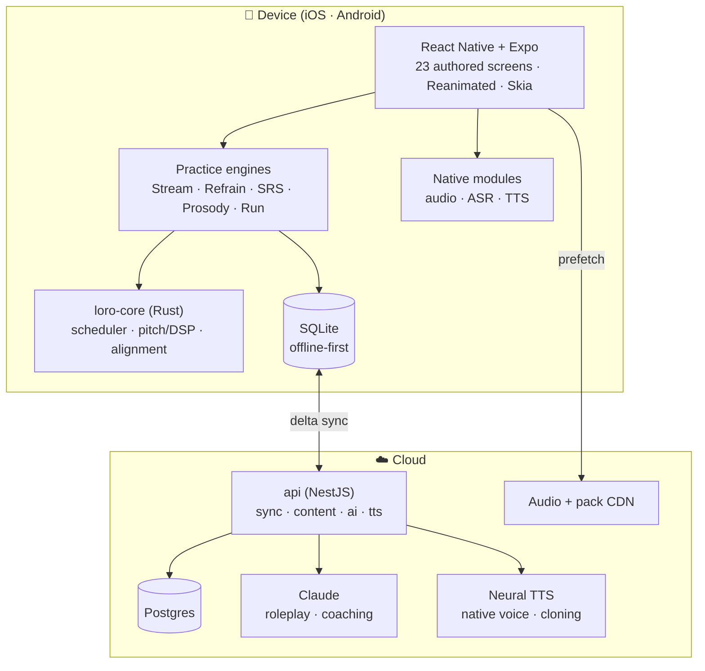

# Loro

**Learn Spanish by the phrase.** A mobile app (iOS + Android) that teaches Spanish through phrases
you collect yourself, tagged by _what's hard about them_ — and that tagging steers everything
downstream: what repeats, what comes back when, and what your progress screen shows.

This repository is the **project root**: architecture, product documentation, development process,
and every buildable artifact — a running app and a running API.

---

## Status

**A running web app and a running API.** Seven of the v1.1 design package's 23 learner screens, plus
the app shell, are built — the demonstrable core loop: onboard → add and tag a phrase → practise →
see progress. The remaining 16 learner screens include trips, labs, settings, chat, and alternative
loops.

```
pnpm bootstrap && pnpm check     →  23/23 tasks at the last green baseline
pnpm test:e2e                    →  61 browser tests across every implemented route and state
pnpm --filter @loro/mobile bundle →  production Expo/Metro export proof
pnpm --filter @loro/api start     →  10 endpoints on :3000/v1
```

| Area                   | Tests | State                                                                                                                                                                                           |
| ---------------------- | ----: | ----------------------------------------------------------------------------------------------------------------------------------------------------------------------------------------------- |
| Documentation          |     — | 65 substantive documents — 51 product, architecture, design, process, and decision docs, plus 14 ADRs                                                                                           |
| Toolchain              |     — | Installs, builds, lints, typechecks, and tests from a clean clone                                                                                                                               |
| **`loro-core`** (Rust) |   131 | Ranking, ASR matching, calendar, ladder, notification policy, HLC, and sync merge implemented. FSRS, Refrain selection, and DSP remain incomplete ([status](packages/core-rs/README.md#status)) |
| **JS/TS workspaces**   |   432 | Core engines/persistence, content validation, API seams, mobile state/UI, and design tokens                                                                                                     |
| **Browser E2E**        |    61 | Every current route and declared state, clock behavior, accessibility, text scale, and production-bundle smoke                                                                                  |

**What the build already caught:** eight colours in the blueprint's palette that fail WCAG AA (the
worst at 2.44:1, genuinely unreadable) plus one that only passes at a declared size floor; a drop
schedule referencing a pack that didn't exist; a conformance rule that had wrongly encoded one
engine's shape as a universal law; a phrase lookup joining on the wrong id space, caught by the
branded id types; and a container build that would have shipped the API with no merge engine while
reporting itself healthy. Details in
[`docs/decisions/open-questions.md`](docs/decisions/open-questions.md).

**Not built yet:** the on-device SQLite driver/integration (the reusable persistence layer exists),
durable API storage, auth, the live AI provider, native audio/ASR/widgets, and 16 learner screens.
See the refreshed [`plans/README.md`](plans/README.md).

Start at [`docs/process/onboarding.md`](docs/process/onboarding.md).

---

## The source of truth

The product design lives in an interactive blueprint authored outside this repo's code tree:

```
design/Language Learning by Phrases - V1.1/
├── Loro.dc.html          # 21 live, interactive screens
├── Loro Chat.dc.html     # 2 v1.1 conversation screens
├── Design System.dc.html # authored visual system
├── Navigation.dc.html    # authored navigation system
├── support.js            # blueprint runtime shim
└── screenshots/          # rendered stills
```

Open `Loro.dc.html` in a browser. Every phone in it is interactive and every card beside a phone
explains what that screen does and how it connects. **When a spec in `docs/` and the blueprint
disagree, the blueprint wins** — file an issue and fix the doc.

[`docs/design/screen-catalog.md`](docs/design/screen-catalog.md) maps the original 21 screens to
their blueprint ranges. Plan 79 owns the durable registration of the two v1.1 chat screens and the
new navigation/design-system artifacts.

---

## Reading order

Brand new to the project? Read these five, in order (~45 minutes):

1. [`docs/product/vision.md`](docs/product/vision.md) — what Loro is and the bet it makes
2. [`docs/product/learning-model.md`](docs/product/learning-model.md) — the pedagogy the whole app
   serves
3. [`docs/architecture/overview.md`](docs/architecture/overview.md) — the system, end to end
4. [`docs/product/practice-loops.md`](docs/product/practice-loops.md) — the three philosophies and
   how we keep all three viable
5. [`docs/process/onboarding.md`](docs/process/onboarding.md) — get a device running

Everything else is indexed in [`docs/README.md`](docs/README.md).

---

## Target system shape

The diagram below is the intended architecture, not the current inventory. Today the web app uses an
in-memory Zustand store, the API uses in-memory sync storage and a stub AI provider, and none of the
native modules or cloud data services shown here is wired. The [status](#status) above and
[`docs/architecture/overview.md`](docs/architecture/overview.md) distinguish the implemented seams
from their targets.



Full detail: [`docs/architecture/overview.md`](docs/architecture/overview.md).

---

## Repository layout

| Path                                          | What it is                                                            |
| --------------------------------------------- | --------------------------------------------------------------------- |
| `docs/`                                       | All documentation — product, architecture, design, process, decisions |
| `apps/mobile/`                                | The Expo / React Native app (iOS + Android)                           |
| `apps/api/`                                   | NestJS backend — sync/content, stub AI; TTS remains a target          |
| `packages/core/`                              | Shared TypeScript domain model and engine contracts                   |
| `packages/core-rs/`                           | Rust core — scheduler, pitch/DSP, phonetic alignment (via UniFFI)     |
| `packages/design-tokens/`                     | Design tokens extracted from the blueprint, and their build           |
| `packages/content/`                           | Phrase catalog, packs, scenarios — schema + validated data            |
| `scripts/`                                    | Repo automation                                                       |
| `design/Language Learning by Phrases - V1.1/` | **The design blueprint** (source of truth)                            |

---

## Key architectural decisions

Each links to its ADR — the reasoning, alternatives, and consequences.

| Decision                                                                                      | Why                                                                          |
| --------------------------------------------------------------------------------------------- | ---------------------------------------------------------------------------- |
| [React Native + Expo](docs/architecture/adr/0001-cross-platform-react-native-expo.md)         | One TS codebase for 21 screens; Expo Modules where we need real native audio |
| [A Rust core](docs/architecture/adr/0002-shared-rust-core.md)                                 | Scheduler and DSP must be bit-identical on iOS, Android, and the server      |
| [Offline-first SQLite + delta sync](docs/architecture/adr/0003-offline-first-sqlite-sync.md)  | Survival mode on a foreign SIM is a product requirement, not a nicety        |
| [FSRS for scheduling](docs/architecture/adr/0004-fsrs-scheduler.md)                           | The blueprint's forgetting-curve screen _is_ FSRS made visible               |
| [On-device ASR, cloud fallback](docs/architecture/adr/0005-on-device-asr-cloud-fallback.md)   | Speaking is the core loop; it cannot require a network                       |
| [Pluggable practice engines](docs/architecture/adr/0006-pluggable-practice-engines.md)        | The blueprint deliberately left three philosophies open; so do we            |
| [NestJS + Postgres](docs/architecture/adr/0008-backend-nestjs-postgres.md)                    | We own the sync protocol and the content pipeline                            |
| [Recorded audio never leaves the device](docs/architecture/adr/0011-analytics-and-privacy.md) | The prosody screen promises it in writing                                    |

---

## Contributing

- Process: [`docs/process/ways-of-working.md`](docs/process/ways-of-working.md)
- Branching and commits: [`docs/process/git-workflow.md`](docs/process/git-workflow.md)
- Definition of done: [`docs/process/definition-of-done.md`](docs/process/definition-of-done.md)
- Adding or changing phrases:
  [`docs/process/content-authoring.md`](docs/process/content-authoring.md)

Open questions that still need an owner:
[`docs/decisions/open-questions.md`](docs/decisions/open-questions.md).
