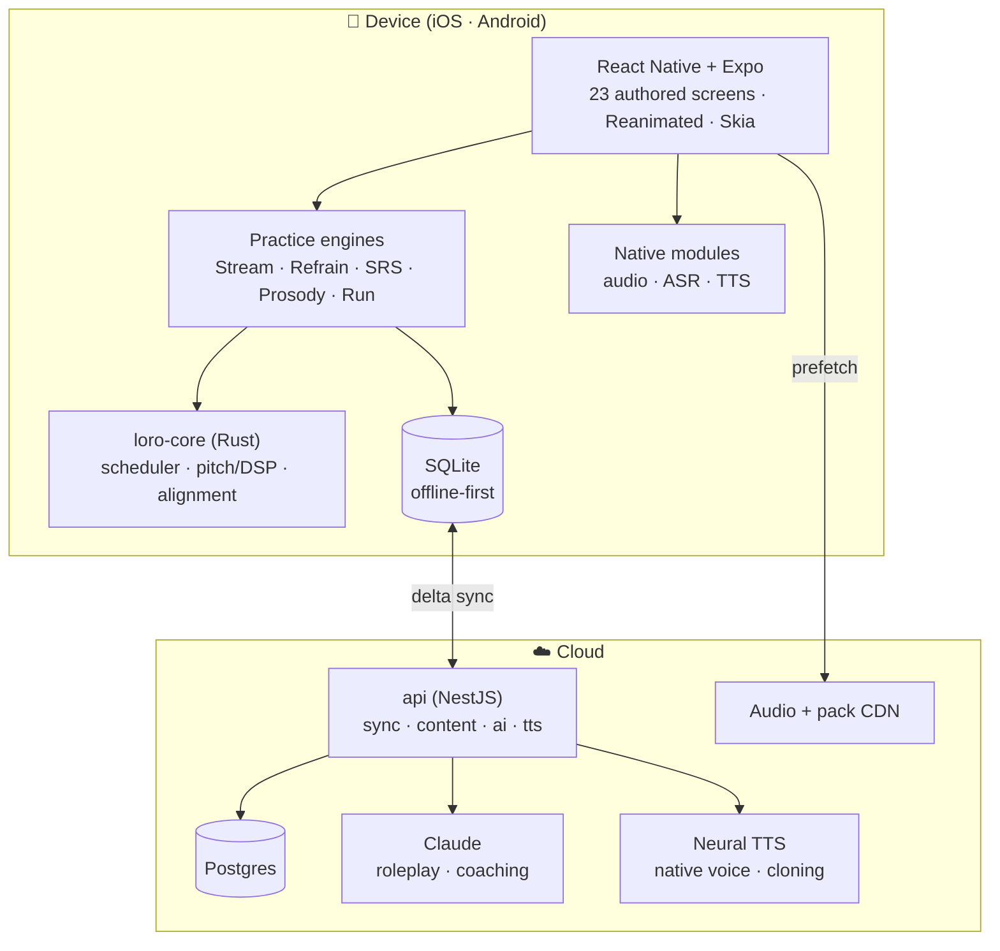

# Loro

**Learn languages by the phrase.** A mobile app (iOS + Android) that teaches Spanish, Bulgarian, and
Russian through phrases you collect yourself, tagged by _what's hard about them_ — and that tagging
steers everything downstream: what repeats, what comes back when, and what your progress screen
shows.

This repository is the **project root**: architecture, product documentation, development process,
and every buildable artifact — a running app and a running API.

---

## Status

**A running app with durable practice and optional account sync.** Eight of the v1.1 design
package's 23 learner screens, Languages and Account utilities and the shared shell are built:
onboard → add/tag a phrase → practise → see saved progress. Speak adds on-device recognition with an
offline reveal fallback. The remaining 15 learner screens include trips, labs, settings, chat and
alternative loops.

```bash
pnpm ci:local                       # full local CI; GitHub Actions stays disabled
pnpm check                          # fast lint/type/test/content/drift gate
pnpm test:e2e                       # every implemented learner route/state
pnpm test:e2e:workbench             # development workbench
pnpm --filter @loro/mobile bundle   # production Expo/Metro export
pnpm --filter @loro/api start       # configured PostgreSQL/auth API on :3000/v1
```

| Area                  | Implemented scope                                                                                                           |
| --------------------- | --------------------------------------------------------------------------------------------------------------------------- |
| **Local progress**    | Native OP-SQLite and browser SQLite; atomic progress, session and outbox writes; recovery preserves original data           |
| **Canonical core**    | Rust FSRS, ranking, selection, cloze, Unicode matching, clocks and merge through generated WASM/UniFFI boundaries           |
| **Native speech**     | Foreground device TTS and strictly on-device ASR; explicit unavailable states and offline word reveal                       |
| **Accounts and sync** | Optional Google/Apple/email sign-in, secure native refresh storage, PostgreSQL accounts and tenant-scoped cross-device sync |
| **Validation**        | Unit/integration suites, real SQLite/PostgreSQL, browser state/accessibility/text-scale checks and separate native evidence |

Exact validation scope and native limits are recorded in
[plan 94](plans/94-persistent-practice-and-account-integration.md) and the
[persistent practice guide](docs/process/persistent-practice.md).

**What the build already caught:** eight colours in the blueprint's palette that fail WCAG AA (the
worst at 2.44:1, genuinely unreadable) plus one that only passes at a declared size floor; a drop
schedule referencing a pack that didn't exist; a conformance rule that had wrongly encoded one
engine's shape as a universal law; a phrase lookup joining on the wrong id space, caught by the
branded id types; and a container build that would have shipped the API with no merge engine while
reporting itself healthy. Details in
[`docs/decisions/open-questions.md`](docs/decisions/open-questions.md).

Shared API schemas, current/target OpenAPI specifications and the
[backend integration inventory](docs/architecture/backend-integration-inventory.md) now exist.
[Contract usage and migration](docs/architecture/api-contracts.md) distinguish current behavior,
planned interfaces and gated drafts. Authentication and learning sync consume shared runtime
contracts and connect the Account utility to durable local progress.

**Remaining:** production recorded audio/cache, background/lock-screen playback, measured onset
latency and DSP, widgets, account export/erasure, live AI and 15 learner screens. Physical-device
speech/convergence, full iOS validation and bilingual review remain release gates. See
[`plans/README.md`](plans/README.md).

**Live connectivity:** the [AWS HTTPS gateway](docs/process/public-api.md) reaches the restricted
EC2 API. Account checks readiness independently of sign-in. Google development sign-in and guarded
sync now reach persistent PostgreSQL; live consent-to-device verification remains open. See the
[current deployment](docs/process/ec2-deployment.md). The
[2026-09-08 readiness review](docs/reviews/2026-09-08-readiness.md) is dated deployment evidence;
[plan 94](plans/94-persistent-practice-and-account-integration.md) records later implementation.

**Backend testing:** [plan 88](plans/88-low-cost-backend-infrastructure.md) selects Frankfurt EC2,
local PostgreSQL and private S3 at a $25–35/month target. Plan 91 records the restricted EC2
deployment. The narrower account deployment has passed readiness and an isolated restore; the full
backup/monitoring profile remains open. Start with [environments](docs/process/environments.md) and
the [testing operations runbook](docs/runbooks/backend-testing.md).

Start at [`docs/process/onboarding.md`](docs/process/onboarding.md).

For Docker: `pnpm local:up` starts the API and web app with a SOPS-encrypted environment. See
[local containers and secrets](docs/process/local-development.md) for age key setup and commands.

---

## The source of truth

The product design lives in four interactive artifacts authored outside this repo's code tree:

```
design/Language Learning by Phrases - V1.1/
├── Loro.dc.html          # original 21 learner screens
├── Loro Chat.dc.html     # Open chat + Message inspector (screens 22–23)
├── Navigation.dc.html    # shell, surface classes, spine, switcher, exit/resume/transport
├── Design System.dc.html # visual reference and specimen inventory
├── support.js            # blueprint runtime shim
└── screenshots/          # rendered stills
```

Open the artifact for the surface you are changing; every phone is interactive and its adjacent card
explains the intended behaviour. Precedence is scoped rather than a global file order:
`Loro.dc.html` owns screens 1–21, `Loro Chat.dc.html` owns screens 22–23, and `Navigation.dc.html`
owns shared app chrome and navigation laws across all screens. In particular, Navigation's spine
rule wins over Chat's earlier “no chrome” description; that phrase means no card/drill chrome inside
the conversation, not an exemption from the app shell. `Design System.dc.html` demonstrates the
visual language; reviewed runtime tokens may intentionally differ for accessibility, with the
deviation recorded and tested. When durable docs disagree with the applicable authored artifact, fix
the docs; do not edit the authored files.

[`docs/design/screen-catalog.md`](docs/design/screen-catalog.md) maps all 23 learner screens and
catalogs the navigation shell and developer workbench separately.

---

## Reading order

Brand new to the project? Read these five, in order (~45 minutes):

1. [`docs/product/vision.md`](docs/product/vision.md) — what Loro is and the bet it makes
2. [`docs/product/learning-model.md`](docs/product/learning-model.md) — the pedagogy the whole app
   serves
3. [`docs/architecture/overview.md`](docs/architecture/overview.md) — the system, end to end
4. [`docs/product/practice-loops.md`](docs/product/practice-loops.md) — the three philosophies and
   how we keep all three viable
5. [`docs/process/onboarding.md`](docs/process/onboarding.md) — get a device running

Everything else is indexed in [`docs/README.md`](docs/README.md).

---

## Target system shape

The diagram below includes future surfaces. Device/browser SQLite, the native Rust and speech
modules, PostgreSQL accounts and sync are wired. Zustand holds committed render projections and
ephemeral state. Recorded/background audio, widgets and live AI remain future integration. The
[status](#status) above and [`docs/architecture/overview.md`](docs/architecture/overview.md)
distinguish the implemented seams from their targets.



Full detail: [`docs/architecture/overview.md`](docs/architecture/overview.md).

---

## Repository layout

| Path                                          | What it is                                                            |
| --------------------------------------------- | --------------------------------------------------------------------- |
| `docs/`                                       | All documentation — product, architecture, design, process, decisions |
| `apps/mobile/`                                | The Expo / React Native app (iOS + Android)                           |
| `apps/api/`                                   | NestJS backend — sync/content, stub AI; TTS remains a target          |
| `packages/core/`                              | Shared TypeScript domain model and engine contracts                   |
| `packages/core-rs/`                           | Rust core — scheduler, pitch/DSP, phonetic alignment (via UniFFI)     |
| `packages/design-tokens/`                     | Design tokens extracted from the blueprint, and their build           |
| `packages/content/`                           | Phrase catalog, packs, scenarios — schema + validated data            |
| `scripts/`                                    | Repo automation                                                       |
| `design/Language Learning by Phrases - V1.1/` | **The design blueprint** (source of truth)                            |

---

## Key architectural decisions

Each links to its ADR — the reasoning, alternatives, and consequences.

| Decision                                                                                         | Why                                                                                  |
| ------------------------------------------------------------------------------------------------ | ------------------------------------------------------------------------------------ |
| [React Native + Expo](docs/architecture/adr/0001-cross-platform-react-native-expo.md)            | One TS codebase for 23 learner screens; Expo Modules where we need real native audio |
| [A Rust core](docs/architecture/adr/0002-shared-rust-core.md)                                    | Scheduler and DSP must be bit-identical on iOS, Android, and the server              |
| [Offline-first SQLite + delta sync](docs/architecture/adr/0003-offline-first-sqlite-sync.md)     | Survival mode on a foreign SIM is a product requirement, not a nicety                |
| [FSRS for scheduling](docs/architecture/adr/0004-fsrs-scheduler.md)                              | The blueprint's forgetting-curve screen _is_ FSRS made visible                       |
| [On-device ASR and offline fallback](docs/architecture/adr/0005-on-device-asr-cloud-fallback.md) | Speaking is the core loop; it cannot require a network                               |
| [Pluggable practice engines](docs/architecture/adr/0006-pluggable-practice-engines.md)           | The blueprint deliberately left three philosophies open; so do we                    |
| [NestJS + Postgres](docs/architecture/adr/0008-backend-nestjs-postgres.md)                       | We own the sync protocol and the content pipeline                                    |
| [Recorded audio never leaves the device](docs/architecture/adr/0011-analytics-and-privacy.md)    | The prosody screen promises it in writing                                            |

---

## Local CI

Run `pnpm ci:local` before merging. GitHub Actions is disabled; checks run on your machine. See
[local CI setup and gates](docs/process/ci-cd.md) for prerequisites and optional native/audit
checks. Do not dispatch or re-enable GitHub workflows without an explicit change of policy.

Build an Android testing APK with `pnpm apk:local`, or upload a verified draft GitHub prerelease
with `pnpm apk:github`. See [APK prerequisites and signing boundaries](docs/process/local-apk.md).

## Contributing

- Process: [`docs/process/ways-of-working.md`](docs/process/ways-of-working.md)
- Branching and commits: [`docs/process/git-workflow.md`](docs/process/git-workflow.md)
- Definition of done: [`docs/process/definition-of-done.md`](docs/process/definition-of-done.md)
- Adding or changing phrases:
  [`docs/process/content-authoring.md`](docs/process/content-authoring.md)

Open questions that still need an owner:
[`docs/decisions/open-questions.md`](docs/decisions/open-questions.md).

## Optional accounts (plans 67/89/94)

`/account` combines Google/Apple and email sign-in, independent API readiness and durable progress
sync. PostgreSQL stores accounts, refresh families and tenant-scoped data. Native refresh
credentials use SecureStore; browser credentials stay in page memory. Installation binding prevents
cross-account uploads, and sign-out retains local learning data. Account linking/export/erasure and
real provider/device acceptance remain separate work. See
[provider setup](docs/architecture/google-apple-auth.md) and
[persistent practice](docs/process/persistent-practice.md).
