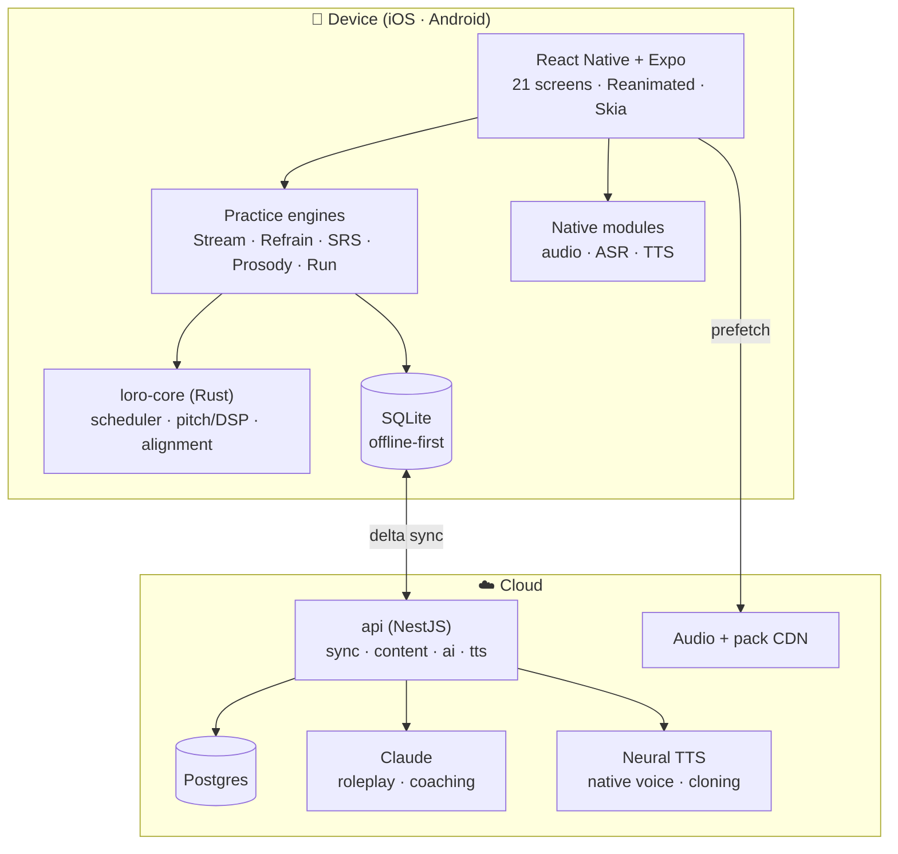

# Loro

**Learn Spanish by the phrase.** A mobile app (iOS + Android) that teaches Spanish through phrases
you collect yourself, tagged by _what's hard about them_ — and that tagging steers everything
downstream: what repeats, what comes back when, and what your progress screen shows.

This repository is the **project root**: architecture, product documentation, development process,
and every buildable artifact — a running app and a running API.

---

## Status

**A running app and a running API.** 8 of the blueprint's 21 screens are built — the whole core
loop: onboard → add a phrase and tag it → practise → see progress. The remaining 13 are labs,
settings, and the two alternative practice philosophies.

```
pnpm bootstrap && pnpm check     →  23/23 tasks, 249 tests, a11y + contrast gates
pnpm --filter @loro/mobile bundle →  999 modules, 2.6 MB Hermes bytecode
pnpm --filter @loro/api start     →  10 endpoints on :3000/v1
```

| Area                      | Tests | State                                                                                                                                                                                                     |
| ------------------------- | ----: | --------------------------------------------------------------------------------------------------------------------------------------------------------------------------------------------------------- |
| Documentation             |     — | 44 documents — product, architecture, design, process, decisions, and 14 ADRs                                                                                                                             |
| Toolchain                 |     — | Installs, builds, lints, typechecks, and tests from a clean clone. Cold `pnpm check` ≈ 6 s                                                                                                                |
| **`loro-core`** (Rust)    |    94 | Ranking, ASR matching, calendar, ladder + the draw, HLC, and sync merge implemented. FSRS `review()`, Refrain selection, and the DSP pipeline are skeletons ([status](packages/core-rs/README.md#status)) |
| **`@loro/core`**          |    77 | `StreamEngine` and `RefrainEngine`, both passing the conformance suite that enforces rule 5                                                                                                               |
| **`@loro/content`**       |    26 | 31-phrase seed catalog, 14 validation checks. 0 errors, 48 warnings that _are_ the authoring backlog                                                                                                      |
| **`@loro/api`**           |    26 | 10 endpoints, driven end-to-end over HTTP against a real Nest app — including sync running the same Rust merge the client runs                                                                            |
| **`@loro/design-tokens`** |    16 | Generates TS + Swift + Kotlin. 107 contrast pairings green across all four accent themes                                                                                                                  |
| **`@loro/mobile`**        |    10 | 8 screens, bundling to Hermes bytecode. Formatters and the three a11y gates                                                                                                                               |

**What the build already caught:** eight colours in the blueprint's palette that fail WCAG AA (the
worst at 2.44:1, genuinely unreadable) plus one that only passes at a declared size floor; a drop
schedule referencing a pack that didn't exist; a conformance rule that had wrongly encoded one
engine's shape as a universal law; a phrase lookup joining on the wrong id space, caught by the
branded id types; and a container build that would have shipped the API with no merge engine while
reporting itself healthy. Details in
[`docs/decisions/open-questions.md`](docs/decisions/open-questions.md).

**Not built yet:** persistence (the API's store is in-memory), auth, the live AI provider, on-device
ASR and the prosody DSP, and the 13 remaining screens. See
[`docs/product/roadmap.md`](docs/product/roadmap.md).

Start at [`docs/process/onboarding.md`](docs/process/onboarding.md).

---

## The source of truth

The product design lives in an interactive blueprint authored outside this repo's code tree:

```
Language Learning by Phrases/
├── Loro.dc.html      # 21 live, interactive screens across 5 phases + 3 practice philosophies
├── support.js        # the blueprint's runtime shim
└── screenshots/      # rendered stills of every screen
```

Open `Loro.dc.html` in a browser. Every phone in it is interactive and every card beside a phone
explains what that screen does and how it connects. **When a spec in `docs/` and the blueprint
disagree, the blueprint wins** — file an issue and fix the doc.

[`docs/design/screen-catalog.md`](docs/design/screen-catalog.md) maps all 21 screens to their line
ranges in the blueprint, their screenshots, and the docs that specify them.

---

## Reading order

Brand new to the project? Read these five, in order (~45 minutes):

1. [`docs/product/vision.md`](docs/product/vision.md) — what Loro is and the bet it makes
2. [`docs/product/learning-model.md`](docs/product/learning-model.md) — the pedagogy the whole app
   serves
3. [`docs/architecture/overview.md`](docs/architecture/overview.md) — the system, end to end
4. [`docs/product/practice-loops.md`](docs/product/practice-loops.md) — the three philosophies and
   how we keep all three viable
5. [`docs/process/onboarding.md`](docs/process/onboarding.md) — get a device running

Everything else is indexed in [`docs/README.md`](docs/README.md).

---

## The shape of the system



Full detail: [`docs/architecture/overview.md`](docs/architecture/overview.md).

---

## Repository layout

| Path                            | What it is                                                            |
| ------------------------------- | --------------------------------------------------------------------- |
| `docs/`                         | All documentation — product, architecture, design, process, decisions |
| `apps/mobile/`                  | The Expo / React Native app (iOS + Android)                           |
| `apps/api/`                     | NestJS backend — sync, content, AI proxy, TTS proxy                   |
| `packages/core/`                | Shared TypeScript domain model and engine contracts                   |
| `packages/core-rs/`             | Rust core — scheduler, pitch/DSP, phonetic alignment (via UniFFI)     |
| `packages/design-tokens/`       | Design tokens extracted from the blueprint, and their build           |
| `packages/content/`             | Phrase catalog, packs, scenarios — schema + validated data            |
| `scripts/`                      | Repo automation                                                       |
| `Language Learning by Phrases/` | **The design blueprint** (source of truth)                            |

---

## Key architectural decisions

Each links to its ADR — the reasoning, alternatives, and consequences.

| Decision                                                                                        | Why                                                                          |
| ----------------------------------------------------------------------------------------------- | ---------------------------------------------------------------------------- |
| [React Native + Expo](docs/architecture/adr/0001-cross-platform-react-native-expo.md)           | One TS codebase for 21 screens; Expo Modules where we need real native audio |
| [A Rust core](docs/architecture/adr/0002-shared-rust-core.md)                                   | Scheduler and DSP must be bit-identical on iOS, Android, and the server      |
| [Offline-first SQLite + delta sync](docs/architecture/adr/0003-offline-first-sqlite-sync.md)    | Survival mode on a foreign SIM is a product requirement, not a nicety        |
| [FSRS for scheduling](docs/architecture/adr/0004-fsrs-scheduler.md)                             | The blueprint's forgetting-curve screen _is_ FSRS made visible               |
| [On-device ASR, cloud fallback](docs/architecture/adr/0005-on-device-asr-cloud-fallback.md)     | Speaking is the core loop; it cannot require a network                       |
| [Pluggable practice engines](docs/architecture/adr/0006-pluggable-practice-engines.md)          | The blueprint deliberately left three philosophies open; so do we            |
| [NestJS + Postgres](docs/architecture/adr/0008-backend-nestjs-postgres.md)                      | We own the sync protocol and the content pipeline                            |
| [Audio never leaves the device by default](docs/architecture/adr/0011-analytics-and-privacy.md) | The prosody screen promises it in writing                                    |

---

## Contributing

- Process: [`docs/process/ways-of-working.md`](docs/process/ways-of-working.md)
- Branching and commits: [`docs/process/git-workflow.md`](docs/process/git-workflow.md)
- Definition of done: [`docs/process/definition-of-done.md`](docs/process/definition-of-done.md)
- Adding or changing phrases:
  [`docs/process/content-authoring.md`](docs/process/content-authoring.md)

Open questions that still need an owner:
[`docs/decisions/open-questions.md`](docs/decisions/open-questions.md).
