# UI/UX review — Loro rapid prototype

**Date:** 2026-09-24
**Scope:** `design/design-v2.0/rapid-ui-prototype`, reviewed in source and in the browser at iPhone size (390×844).
Review only — no changes were made to the prototype.
**Goal under review:** a phrase-based language-learning mobile app with a Spotify-like UI.

## Verdict

The Spotify model fits a phrase-learning app: phrases are tracks, sets are albums, and study is
listening. The prototype copies Spotify's look well, with a mini-player docked above the tabs, a
full-screen player, a queue, album-style pack pages and shelves. It copies the look more than the
workflow, though. Spotify is fast because it has **one obvious action per screen, very little text,
and no jargon**. This prototype has a large vocabulary (Circadian Waves, Cadence Run, Acoustic
Recall, Earworm Codex, Spaced Interval, Heavy Rotation, Archival Notebook…) and 3–5 competing
controls in most areas. A new learner won't know what to press.

The main idea of the app is that the user listens to the phrases and repeats them. The vocabulary should be structured as JSON objects stored separately and the state should be managed by a state machine so it can be easily copied and saved to the server. Also we need to simplify the workflow so the user and learner know where to press.

## What works

- **Mini-player placement and behaviour.** It sits right above the tab bar, you swipe it for the
  next or previous phrase, and tapping it opens the full player. This is the strongest Spotify
  pattern in the prototype, and it's executed well.
- **The full-screen player's structure.** Cover art, phrase title, speaker line, scrubber,
  transport controls, and pull-down to close are all familiar right away.
- **The pack page as an album page.** Artwork, meta line, action row, big play button, then the
  list of phrases.
- **Queue with Up Next and Previously Played.**
- **Visual style.** The warm paper palette, serif italic for Spanish and sans for English give it
  an editorial feel that isn't a Spotify clone. Keeping the two languages in different fonts is a
  good idea: Spanish always in serif italic, the translation in sans.
- **Tactile feedback.** Taps, chimes and haptics make it feel physical.

## The big problems

### 1. It's a music player, not yet a learning app

Nowhere does the learner speak, recall or produce anything. The only learning act is tapping
**Hard/Easy**, and it appears in three places: the player, a floating dock on the pack page, and
implied on the phrase cards. The player shows **Easy already selected** before you've heard
anything. Rating while passively listening measures nothing. Rating should come after a recall
moment (hide the translation → reveal → grade), not float beside the transport controls.

Right, hard and easy should indicate the learning curve and it points to the user's activity and to the pace of the learning curve. Also the player should not be selected before hearing anything.

I agree that a rating should come after a recall moment but hiding the translation, revealing, and grading is not necessary because a user should first hear the phrase in the native language and then try to say it while it plays silence. After that the learning language is repeated. The great buttons should always be shown above the player before the user clicks them and appear after the next phrase is played.

### 2. There is no single clear action on Home

At the top it shows the greeting, 3 stats, 3 wave cards, Jump Back In, Heavy Rotation and an
insight card. Spotify's Home has one idea: *play something now*. Here, "14 phrases due" and "Ride
Wave" should be one large main button above everything else, something like
**"Today · 14 phrases · 4 min ▶"**. Everything else is secondary.

Let's skip that for now.

### 3. Jargon and the number of names

Waves, Packs, Decks, Earworms, Cadences, Drills and Sets all mean roughly "a group of phrases."
Pick two terms, for example **Set** (album) and **Phrase** (track). The same goes for the stats:
"Cadence Run: 38 Reps Spaced", "Acoustic Recall", "1,480 Beats" and "4 Zones" don't tell a
learner anything useful.

Let's change the naming.

### 4. Invented numbers

Examples are "72% Recall", "94% Retention", "14,890 scholars", "100% Spontaneous recall", "Rank V",
the BPM figures and a 1:12 duration for a phrase that takes 1.5 seconds to say. This breaks a Loro
rule: every number a learner sees has to be real (see the root `CLAUDE.md`). The ones that are
clearly made up also make the whole UI feel less trustworthy.

Right every number should be real and it should come from the state machine.

### 5. Too many buttons for one job

- **Speed:** a 1.25× toggle in the mini-player, three speed chips in the player, and a speed chip
  on the pack page.
- **Play:** a big play button, a play button on each card, a speaker button on each phrase, the
  Re-drill link, the Slow drill link and the loop button.
- **Rating:** Hard/Easy appears in the dock and in the player.

Each job should have one control in one place.

Agree on this.

## Screen by screen

### Header (all tabs)

- It's mostly empty space: just the avatar and "38 pts".
- The fire icon means *streak*, but the label now says *pts*, so the icon and label say different
  things. Pick one meaning.
- On sub-pages the avatar and the back arrow sit next to each other, which makes the row
  cluttered.

Right we should change the icon from streak to points and points should be all the points across all the phrases the user created. For each listening phrase the user has to obtain 1 point for each card: obtain more points and for each obtain even more points. Keep the learning curve until the user learns the phrase and implement the forgetting curve.

### Home

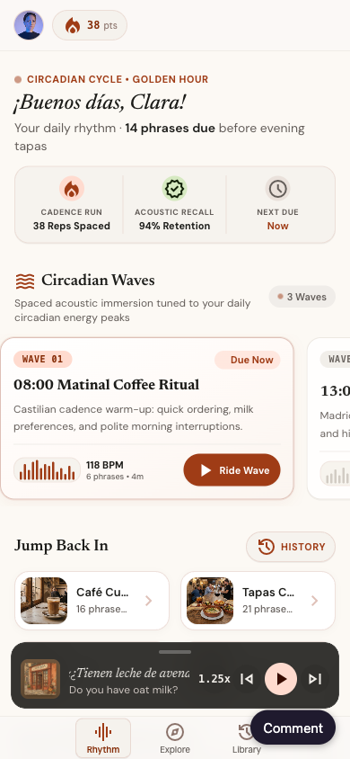

- The wave cards are 84% of the screen width, and the first one starts flush against the left
  edge.
- Two of the three wave cards are locked or unavailable, so the carousel mostly shows things you
  can't do. Show the next wave as one line, "Next: 13:00 · unlocks in 4h", instead of a card.
- The Jump Back In titles are cut off ("Café Cu…", "Tapas C…"), so the 2-column grid is too narrow
  at phone width.
- The insight card at the bottom is filler.

I agree. Implement this.

### Now Playing

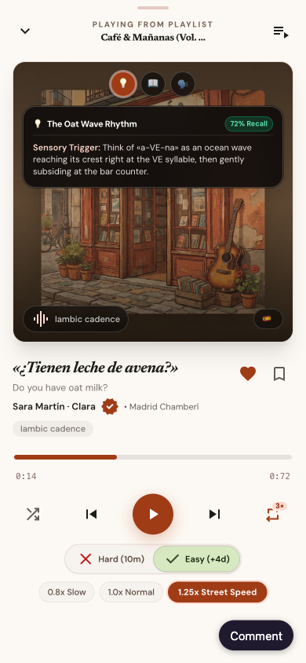

- The mnemonic panel opens by default and covers the cover art.
- The metre tag appears twice.
- The dialect badge is empty, showing only a flag, because `phrase.dialect` isn't in the data.
- The time shows as **"0:72"**.
- The progress bar ticks once a second, which doesn't match phrases that last a few seconds. For
  phrase audio, show "repetition 2 of 3" instead of a scrubber.
- The 💡📖🗣️ emoji buttons clash with the Material icons used everywhere else.
- The whole screen closes when you drag it down, and the content inside it also scrolls
  vertically, so dragging can close it by accident. Only the top handle should close it.

I agree. The mnemonic panel shouldn't be open by default. The meter tag should appear once. The dialect page should show only the phrase and the language.
The timing should show real time.
And right, it should be not ticks but repetitions.
Right, replace emoji buttons with icons.
And agree that only the top handle should close the screen.

### Pack page

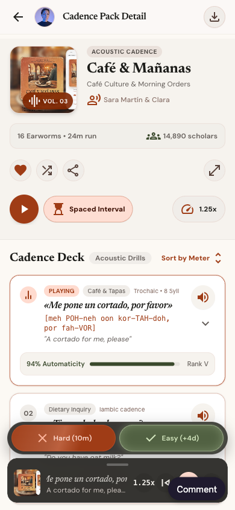

- The title reads "Cadence Pack Detail", a developer label.
- The bottom tab bar disappears; Spotify keeps it on album pages.
- The floating Hard/Easy dock plus the mini-player cover about 140px, a sixth of the screen,
  including the phrase list.
- Each phrase card holds a lot: category, metre, Spanish, a phonetic spelling, English, a
  retention bar, rank, a speaker button, a chevron and an expandable section. A Spotify track row
  is two lines. Put the rest in a phrase details sheet. // Agree, fix that.
- "Sort by Meter" does nothing.  agree. Adjust this
- The ↗ button labelled "More options" actually opens the player. Agree, fix this.
- "Spaced Interval" is a switch with no explanation. Agree, remove this.

### Queue

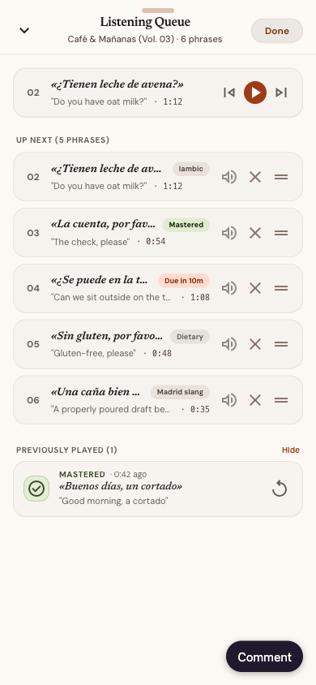

- The current phrase also appears in Up Next (02 is listed twice), and the header says 6 phrases
  when there are 5 unique ones. 
- Reordering uses the browser's drag-and-drop, which **doesn't work with touch**, so it's broken
  on phones.  right, fix this
- Each row has three small icons plus two swipe actions. On phones, keep the swipe actions and the
  drag handle, and remove the ✕ and the speaker icon. Right, fix this.

### Explore

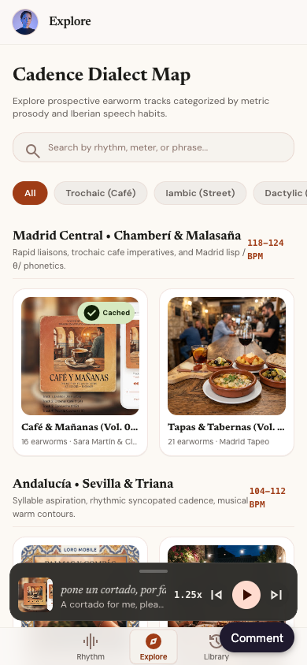

- There are two titles, "Explore" and "Cadence Dialect Map". Fix this
- The search box and the filter chips do nothing. Fix this 
- Every set opens the same "Café & Mañanas" page. Fix the right set
- Grouping by dialect region is interesting but advanced. Spotify's Search tab is a grid of
  colourful category tiles; for learners, topic tiles (Café, Travel, Work, Small talk) would be
  more approachable.  Right implement this 

### Library

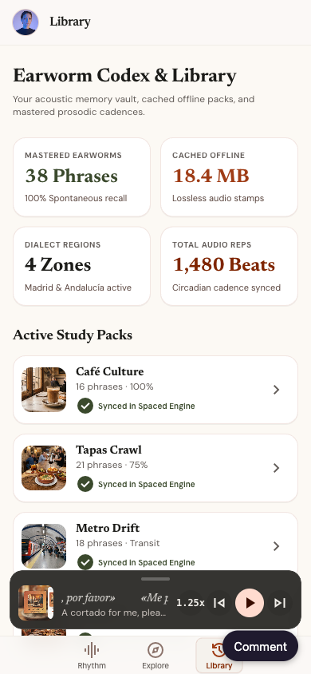

- The four stat cards are made up. Use the state machine to show real numbers.
- The Mastered section shows the first three phrases with "100% Retained". Use the state machine to show real retention.
- Spotify's Library is a filterable list (Playlists · Albums · Liked). Here the useful version
  would be **Saved phrases · My sets · Downloaded**. There's a heart and a bookmark ("Save to
  Codex") on the player, but nothing in Library lists what they saved. Fix this 

## Bugs found

| Where | Bug | Source |
|---|---|---|
| Player | The **shuffle** button goes to the previous phrase instead of shuffling | `src/screens/NowPlayingScreen.tsx:520-533` |
| Player | The **repeat 3×** button just speaks the phrase once; it's not a loop setting | `src/screens/NowPlayingScreen.tsx:589-605` |
| Player | Time shows as "0:72" | `src/screens/NowPlayingScreen.tsx:511-514` |
| Player | Empty dialect badge (`phrase.dialect` isn't in the data) | `src/screens/NowPlayingScreen.tsx:312-315` | - should be language instead of dialect and show the flag only 
| Player | Phonetics panel shows the same "[uŋ koɾˈta.ðo]" for every phrase | `src/screens/NowPlayingScreen.tsx:383` | - should be language flag
| Player | "Café & Mañanas (Vol. …" typed into the code, with "…" hard-coded | `src/screens/NowPlayingScreen.tsx:138-140` | - use json object for this 
| Player | Easy rating is selected before the learner has rated anything | `src/screens/NowPlayingScreen.tsx:37` | - fix that
| Pack page | The shuffle button also skips to the next phrase | `src/screens/CadencePackDetailScreen.tsx:228-245` |
| Pack page | "PLAYING" shows on the selected phrase even when playback is paused | `src/screens/CadencePackDetailScreen.tsx:428-432` |
| Pack page | "More options" button opens the player | `src/screens/CadencePackDetailScreen.tsx:262-269` |
| Queue | Current phrase is duplicated in Up Next; count is wrong | `src/App.tsx:21`, `src/screens/ListeningQueueScreen.tsx` |
| Queue | Drag-to-reorder uses the browser's drag-and-drop, which doesn't work with touch | `src/screens/ListeningQueueScreen.tsx` |
| Explore | Search and filter chips do nothing; every set opens the same page | `src/screens/ExploreScreen.tsx`, `src/App.tsx` (`handleOpenPack`) |

fix 

## Mobile-specific issues

- **Touch targets below 44pt:** the tab bar is 48px tall with small tab buttons, the mini-player
  controls are 32px, the speed chips and Hard/Easy buttons are about 26–30px, and the queue row
  icons are 28px.
- **No safe-area handling.** The fixed tab bar and header ignore the iPhone home indicator and
  notch areas (`env(safe-area-inset-*)`).
- **The tab bar is a narrow centred cluster.** Native tab bars spread their tabs across the full
  width.
- **Hover effects are used throughout,** but phones have no hover, so that feedback never appears.
- **Text too small to read:** 9–10px labels appear in many places. The minimum should be about
  11pt, and the layout should also work with the phone's larger-text settings.
- **Scrolling animations everywhere:** pulsing dots, pinging badges, scrolling titles and bouncing
  equalisers. On a phone they distract and use battery. Keep only the equaliser on the phrase
  that's playing, and respect the reduce-motion setting.
- **The player speaks phrases with the browser's built-in voice.** That's fine for a prototype,
  but the app must not ship with it.

## Accessibility

- Colour carries meaning on its own: green/orange/red retention bars and orange for "due".
- The Hard/Easy colours (red-orange vs. green) are hard to tell apart for colour-blind users, so
  add icons and text weight as well.
- The emoji buttons are read aloud by screen readers as "light bulb", "book", and so on.
- Several clickable areas are plain elements instead of buttons: pack cards, Library rows and the
  phrase card title area.

## What I'd prioritise

1. **Define the core loop first:** listen → try to recall (play the silence so user can repeat on his own) → play the learning languge phrase  → rate, then build the player
   around it. 
2. **Put one main "Today" action at the top of Home,** and reduce the rest of Home to 2–3 shelves.
3. **Reduce the vocabulary to Set and Phrase,** and remove every invented number. - Right
4. **Make each job one control:** speed lives in the player only;
5. **Simplify phrase rows to two lines,** with details in a sheet. 
6. **Fix the mobile basics:** 44pt targets, safe areas, a full-width tab bar, touch reordering, no
   hover-only feedback.
7. **Fix the bugs:** shuffle, repeat, "0:72", the duplicate in the queue, and the empty dialect
   badge.

## Implementation status — 2026-09-24

Every comment above is implemented in `rapid-ui-prototype`, except the Home "Today" action you
asked to skip. Checked at 390×844 in the browser; `npm test` (16 state-machine tests),
`npm run lint` and `npm run build` pass.

| Comment | What changed |
|---|---|
| Vocabulary as separate JSON | `src/content/{phrases,sets,topics,languages,profile}.json`, typed in `src/content/index.ts`. No progress numbers in content. |
| State machine, copyable, saveable | `src/state/machine.ts` — pure `transition(state, event)`; the whole `AppState` is JSON. Persisted on the device; Library → *Copy JSON*; `saveToServer()` in `src/state/persistence.ts` is the sync seam. |
| Listen → silence → repeat | Player loop per phrase: English prompt → pause sized to the measured Spanish audio → Spanish, repeated 1× or 3×. Steps and "Repetition 2 of 3" are shown instead of a scrubber. |
| Rating | Hard/Easy sit above the transport, never preselected, show the real next interval, hide once used and return on the next phrase. |
| Points + forgetting curve | +1 per repetition, +2 Hard, +3 Easy, +10 once when learned (`src/state/memory.ts`). FSRS power curve; due at 90 % recall; learned at ≥ 21 days stability; a lapse un-learns. Header chip shows total points with a points icon. |
| Real numbers only | Every figure comes from `src/state/selectors.ts`; elapsed time is measured. The invented metre tags were removed ("8 Syll" was also wrong). |
| Naming | Set and Phrase throughout; tabs are Home · Explore · Library. |
| One control per job | Speed only in the player; rating only in the player; one heart (save phrase) in the player. |
| Home | Waves replaced by a Review card and a one-line "Next: …"; Jump back in is one column; filler card removed. |
| Now Playing | Notes closed by default; metre tag gone; language flag only; icons instead of emoji; only the top handle drags to close; shuffle and repeat work. |
| Set page | Real title; tab bar stays; floating rating dock and Spaced Interval removed; two-line rows with a details sheet; working sort; *More* opens Add to queue / Share. |
| Queue | Up next never contains the current phrase; handle-drag reorder works with touch; swipe right plays, left removes; ✕ and speaker removed. |
| Explore | One title; topic tiles; accent-insensitive search over phrases and sets; each set opens its own page. |
| Library | Real stats; Saved phrases · Learned · My sets · Downloaded. |
| Mobile and accessibility | Safe areas; full-width tab bar; every control ≥ 44 px and all text ≥ 11 px (audited on each screen); no hover-only feedback; reduced motion respected; icon text hidden from screen readers; zoom allowed. |

Speech still uses the browser's voices, which the production app must replace with recorded audio.

---

# Round 2 — 2026-09-24

**Scope:** the same prototype after the round-1 changes. I reviewed it in the browser at 390×844
and read every source file. Before this round, `npm test` (16 tests) and `tsc` passed, and every
control was ≥ 44 px with all text ≥ 11 px. The problems were in **whether the loop teaches** and
in a few places where round-1 rules had slipped. Everything below is implemented; comment inline
as before.

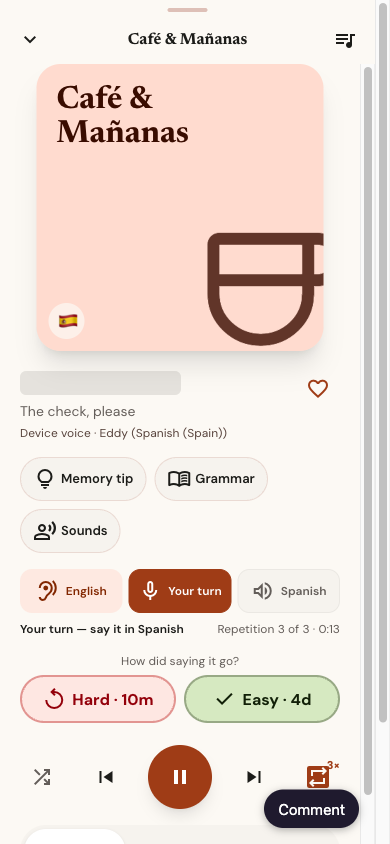

## What was wrong, and what changed

### The loop gave away the answer

During **English** and **Your turn**, the player and the mini-player both showed the Spanish text.
You could read the answer instead of recalling it.

→ Until the Spanish audio starts, the player shows a bar the length of the phrase, and the
mini-player shows the English. Screen readers hear "Spanish hidden until you hear it".

The queue's *Now playing* row still shows the Spanish. Should it follow the same rule?

### Ratings could be farmed

Rating Easy, pressing Previous and rating Easy again doubled stability each time, so four taps
made a phrase "learned" and paid +10 plus +3 per tap.

→ You can still rate once per play, and rate again after restarting, as you asked. Easy now grows
stability in proportion to how much you had forgotten, as FSRS does:
- ×2.3 when rated on time, at 90% recall;
- ×1 when rated again seconds later.

The +10 is paid once per phrase (tested through the state machine, not just the memory model).

### Points without audio

When the device had no Spanish voice, or speech failed, the loop ran through silence and still
paid +1 per repetition. It also saved the error time as the phrase's "measured" length.

→ Playback stops and the player says: *"This device has no Spanish voice, so the phrase can't
play…"*. No points are paid and no measurement is saved. Play tries again.

### Invented content was back

- **Cover art.** The Café cover had a phone mockup with "42 LESSONS — BEGINNER" and invented track
  times. All 32 images were hotlinked from expiring AI Studio URLs.
  → Covers are now drawn locally from content: the topic's colour plus a set icon (for example
  coffee, tapas, metro or taxi). The player's cover also shows the set title. Nothing loads over
  the network except the fonts.
- **Speaker credits.** "Sara Martín & Clara" credited speakers who don't exist, since the audio
  is the browser's voice, and "Clara" is also the learner's name.
  → The player shows the real device voice, for example *Device voice · Eddy (Spanish (Spain))*.
- **Avatar.** It was an Unsplash photo.
  → It's now the learner's initial, and tapping it opens settings.
- **Download.** It toggled a flag that pretended to download.
  → Removed, along with the Library "Downloaded" tab.
- **Hardcoded copy.** "90% recall" and "3 weeks" are now read from `TARGET_RETENTION` and
  `LEARNED_STABILITY_DAYS`. The wrong "recall it three weeks later" is now "expected to last
  21 days or more".
- **"1m ago".** Things that happened seconds ago showed as "1m ago".
  → They now show as "just now".

### Numbers that disagreed

- **Learned counts.** The Learned count and the Learned list used different rules: a learned
  phrase that was due again counted in one and not the other.
  → There's now one rule, `learnedPhraseIds`.
- **Points shown three times.** Points appeared in the header, the Home stats and a Library card.
  → Only the header chip shows them now. Home shows *Learned · Due now*. Library shows
  *Learned · Recall now · Started*. The "Repetitions" card, which repeated points, is gone.

### Home

"Start here" always opened the first set in the content, and only as "Open set".

→ The card now picks the most recent set you haven't finished, or the least-learned one. It plays
directly, for example **Play 6 phrases**.

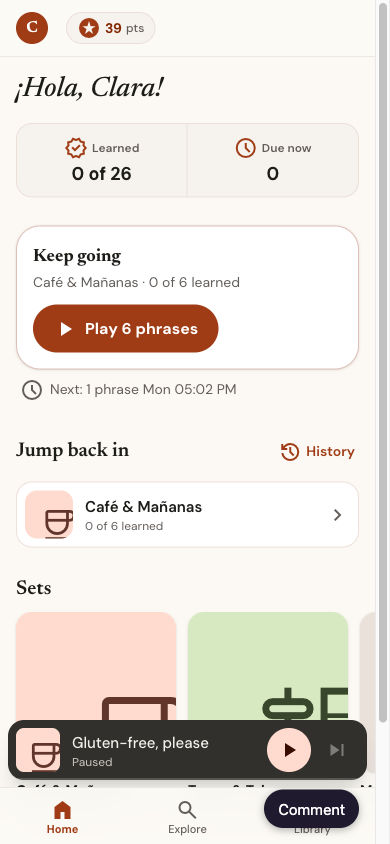

### Queue

- **Duplicates.** Re-adding a played phrase made *Play now* jump back to the old copy, and
  *Remove* deleted every copy.
  → Both now work by position.
- **Reordering.** Reorder accepted any list with the same ids, so duplicates got through.
  → It now needs the exact same items.
- **Mixed queues.** After adding another set, the queue still said it was playing from the
  first set.
  → A mixed queue is now titled *Queue · N phrases*.
- **Add to queue.** On an empty queue it started playing.
  → It now only queues.
- **Two close controls.** The chevron and *Done* both closed the queue.
  → Only the chevron is left.
- **Gestures only.** Swipe and drag had no keyboard or screen-reader route.
  → On the drag handle, the arrow keys move a phrase and Delete removes it.

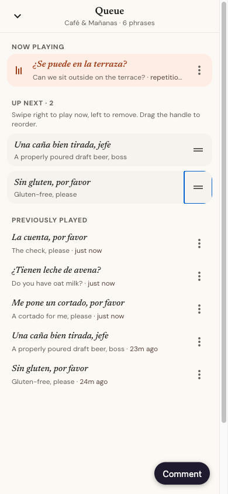

### Player

- **Speed.** Changing speed restarted the current step.
  → It now applies from the next step.
- **Replaying the last phrase.** At the end of the queue, pressing Play again kept the old timer
  and no rating.
  → It's now a fresh play.
- **Drag to close.** The drag area covered the Close and Queue buttons.
  → Only the grab bar and the title drag the player closed.
- **Notes.** Note buttons sat over the cover.
  → They're now labelled chips under the phrase, shown only when that phrase has notes.
- **Label styling.** The all-caps "PLAYING FROM SET" label is gone. The repetition counter now
  uses the body font instead of monospace.
- **Chime.** The celebration chime played on every Easy.
  → It now plays only when a phrase becomes learned. Easy gives a light haptic.

### Library and Explore

- **Filter chips.** The chips loaded scrolled, cutting off "Saved phrases".
  → There are three tabs now and they fit.
- **Developer tools.** *Copy JSON / Reset* were on the learner screen.
  → They're now under the avatar in settings, and Reset asks for confirmation.
- **Topic tiles.** Explore's fifth tile sat alone in its row.
  → It now spans the row, and every tile shows its set count.

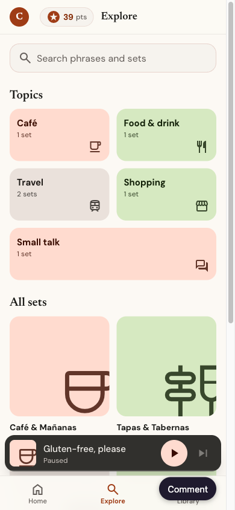 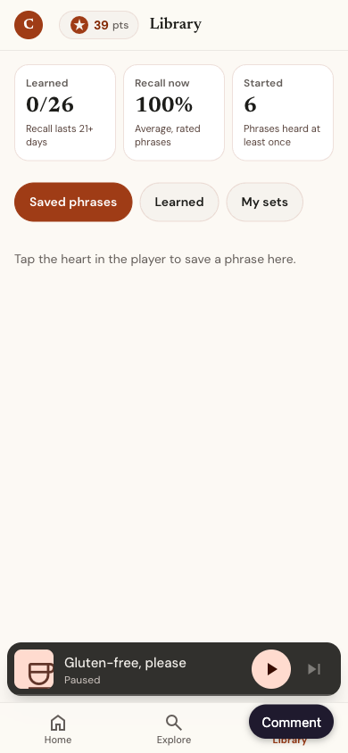 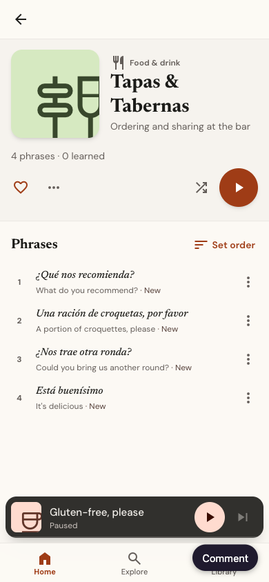

### Robustness

- **Saved state.** Old or damaged saved state could crash the app: a removed phrase made
  `getPhrase` throw on start. Saves are now:
  - versioned, with a v1 → v2 migration;
  - cleaned against the content, dropping unknown ids, clamping the index and back-filling
    fields.
- **Error boundary.** If something still fails, a screen offers *Reset progress*.
- **Stuck clicks.** A row removed in the middle of a swipe could leave every click blocked. The
  blocker now always clears.

### Accessibility

- **Focus.** The player, queue and sheets now:
  - move focus in when they open;
  - keep Tab inside;
  - close on Escape;
  - return focus to what opened them.

  The app behind them is `inert`.
- **Live region.** The live region announces step changes only, not the timer every second.
- **Confirmation chips.** Each one now goes through a single live region. With reduced motion
  it stays visible instead of fading out at once.
- **Tabs and radios.**
  - Library and note tabs have `tabpanel`, `aria-controls`, and arrow/Home/End keys.
  - Sort options are radios.
  - Home stats use `dt` before `dd`.
  - The sheet backdrop is no longer a second "Close" button in the tab order.

### Found while fixing: icon sizes never applied

Google's Material Symbols stylesheet sets `.material-symbols-outlined { font-size: 24px }` without
a layer, which overrides Tailwind's size classes. Every `text-[26px]` or `text-[34px]` on an icon
in the app has always rendered at 24 px. The covers now set their size inline. Tell me whether the
other icons should get the sizes their classes intended (bigger transport icons, for example) or
stay at 24 px.

### Cleanup

- **Dependencies.** Removed `@google/genai`, `express`, `dotenv`, `@types/express`,
  `autoprefixer`, `esbuild` and `lucide-react`. Build plugins moved to devDependencies.
- **AI Studio leftovers.** Removed `.env.example`, the Gemini capability in `metadata.json`, the
  README banner, and the `DISABLE_HMR`/`@` alias in `vite.config.ts`.
- **Audio file.** `utils/audioEngine.ts` became `audio/feedbackSounds.ts`, with only the cues
  that are used.
- **Notes content.** Removed the leftover "Wave" and "rhythmic surge" wording, fixed the phrase-1
  IPA so it includes "por favor", and renamed "Madrid Lisp" (Castilian [θ] isn't a lisp).

## Checks

- `npm test`: **36 tests** (was 16), with new `persistence.test.ts` and `selectors.test.ts`.
  Tests read phrase ids from the content, so editing phrases doesn't break them.
- `npm run lint` and `npm run build` pass.
- Browser at 390×844:
  - The Spanish is hidden during English and silence on every repetition.
  - A speed change mid-silence doesn't restart the step.
  - Hiding the Spanish voices stops playback with the message and pays 0 points.
  - Keyboard reorder works in the queue.
  - Escape closes the player and focus returns to the mini-player.
  - Every button is ≥ 44 px and all text is ≥ 11 px on Home, Explore, Library, the set page and
    the player.
  - No remote images load.

## Open questions

1. Should the queue's *Now playing* row also hide the Spanish during recall?
2. The drawn covers replace the photos. Do you want photos back, and if so, which photos? They
   should be stored locally and must not contain invented text.
3. Icon sizes: keep everything at 24 px, or apply the sizes the classes intended?

---

# Round 3 — 2026-09-24

**Scope:** the 150-point list in [`improvements-150.md`](improvements-150.md), implemented as you
commented each item. Items marked Skip or "backend" were left alone. Item 65 became a plan instead
of code: [plan 102](../../../plans/102-prototype-stress-fixture.md). The decisions that might reach
the app are recorded in
[`docs/design/v2-prototype-decisions.md`](../../../docs/design/v2-prototype-decisions.md).

The round-2 open questions are settled: the queue now hides the Spanish during recall (105), covers
stay drawn (141), and icons render at the sizes their classes ask for (135).

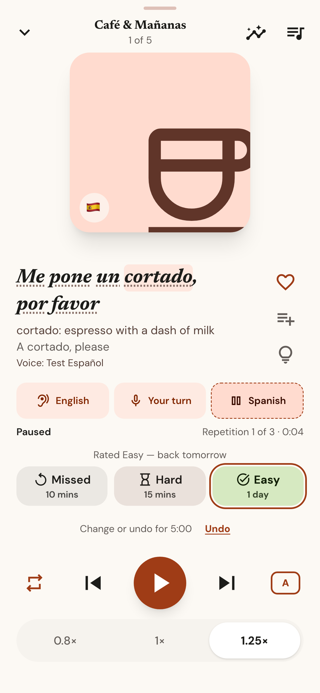 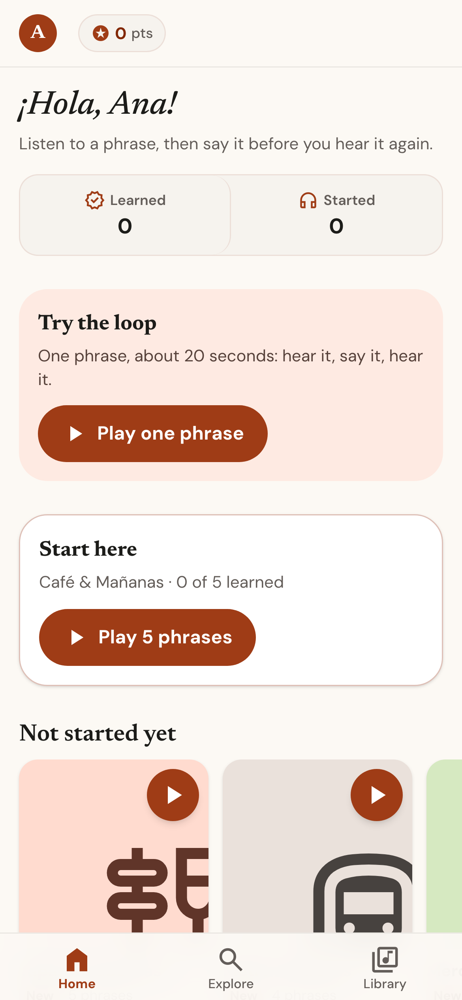 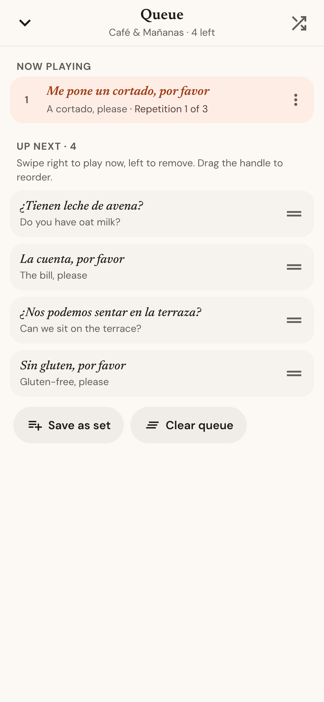

## What changed, by your comments

| Items | Your comment | What it does now |
| --- | --- | --- |
| 2 | 3 buttons | **Missed / Hard / Easy**, sent to Loro's real FSRS in `packages/core-rs` (WASM) as Again / Hard / Good. The prototype has no scheduling maths of its own any more. |
| 3 | Points per phrase listened, once per 5 minutes | +1 per phrase listened, at most once per phrase per 5 minutes. |
| 4, 21, 72 | Rating window of 5 minutes; change or undo | A rating waits 5 minutes, and you can change or undo it during that time ("Change or undo for 4:32 · Undo"). When the window closes it counts at its original time and pays its points. |
| 6 | Implement | Missed or Hard brings the phrase back 4 phrases later in the same queue. |
| 7, 8 | Implement | Per-phrase difficulty comes from FSRS. **Learned** = FSRS review state, stability of 21+ days, and 3+ successful recalls. |
| 9, 29 | A pause to rate; repeat the set or continue | After the last repetition of an unrated phrase, the player holds 4 s for a rating (rating ends the hold). At the end of the queue, the mode button chooses **play it again** or **continue** with the next set that has phrases to play. |
| 10, 11 | Implement | The review queue plays at most 10 phrases, most overdue first, and shows a duration only once it has been measured. Repetitions are **A**uto (3 while new or shaky, 1 under review), 1× or 3×. |
| 13, 43 | Median; fix timeouts | Speech is timed from its `start` to its `end` event, so engine start-up isn't counted, and the pause uses the median of recent measurements with outliers dropped. An unconfirmed utterance advances but records nothing and pays nothing. |
| 16, 19, 20 | Implement | "Recall now" states how many rated phrases it averages. The first Easy comes back within 1 day (phrase heard once) or 4 days (heard more). A session summary sits behind the ✦ button, and a toast offers it after each pass. |
| 22–36 | Implement | A sanitised `RESTORE`; an explicit statechart (below); an append-only review log with device-scoped ids from which memory and points are derived; memory keyed by language pair; shuffle reset on each load; one navigation rule; the timer in its own component; debounced saves; hash routing where Back closes overlays and sheets; zod-validated content; one source for a phrase's set; a navigation context; the content version stored in state. |
| 42, 44, 46–48, 50 | Implement | Media Session (lock screen, headset buttons); a clean pause when the page is hidden; 300 ms gaps; a soft two-note "your turn" cue; a neutral note for Hard and Missed; preload of the next phrase's clips. |
| 45 | Apply to both | Speed applies to both languages, unchanged. |
| 53–58, 63, 64, 69, 70 | Implement | Every phrase has short, plain notes. The caña moved to Tapas; ids are now `cafe-01`… (saved progress migrates); register, region, tags, word glosses and optional `audio`/`durationMs` fields; a small Bulgarian course; levels A1/A2; three topics with two sets each. |
| 59 | Implement | Tap an underlined word in the revealed phrase to see its meaning. |
| 60–62 | Implement | Your own phrases (Library → Mine → Add your phrase) and your own sets. The profile lives in state and can be edited in Settings. |
| 67, 68 | Implement | The UI follows your native language: English, Bulgarian or Russian. |
| 71–86 | As commented | The player fits 390×844 without scrolling. Shuffle moved to the set page and queue; notes open in a sheet; a paused step looks paused; the title appears once, with "1 of 5"; the heart likes the phrase and ≡+ adds it to a set; swiping the cover changes phrase; the time reads "0:04 / 0:18 at 1×" once measured; the redaction bar is as wide as the phrase really is. |
| 80, 102 | Like for phrases; album like or add to album | The heart likes phrases (Library → Liked) and sets (Liked sets). "Add to set…" puts a phrase into one of your sets. |
| 87–96 | As commented | Greeting in the language you're learning; Learned and Started; a "Today" line that never mentions a missed day; Review first, then Continue; "in 4 days"; no duplicate set; "Not started yet"; history lists the sets you played; a first-run demo. |
| 93 | History of played albums | History groups by set: "Café & Mañanas · 5 phrases · +12 · 2 hours ago". |
| 97–103 | Implement | "Plays in: Due first"; "Play due and new"; per-phrase Play next / Add to queue; sort remembered per set; share a link to the set; a real set duration. |
| 105–111 | Implement | Target hidden in the queue while you recall it; previously played → Play next; undo after remove and after clear; "4 left"; Save as set; described drag handles that announce their moves; Play next vs Add to queue. |
| 112–117 | Implement | Filters live in the URL (so Back keeps them); removable chips; topic tiles give way to results; level and tag filters; search covers notes and topics and highlights what matched; set cards show status and a play button. |
| 118–124 | Implement (123: no export) | Filters: Liked, Mine, Due, Learning, Missed recently, Learned, My sets, Liked sets. Play all; charts of predicted recall and learned per week; tapping a stat opens its list. No file export: sync will carry progress. |
| 125, 127–134 | Implement | Onboarding (language, name, course, voice check, the loop); Developer section; in-app reset confirmation; the error screen offers "Copy progress JSON" first; scroll kept per page; the set title appears in the header when you scroll; installable PWA; local fonts (Literata/Manrope carry Cyrillic) and a 9.5 KB icon subset; React toasts. |
| 135–142 | Implement (136: skip) | Icon sizes fixed; tokens only; a rem type scale (so 200% text works); a neutral Hard; instant tab switches and a sliding set page; two-column player on tablets and in landscape. |
| 143–146 | Implement | Quiet announcements by default ("Your turn" and the reveal), with a setting for every step; visible focus rings; `lang` on every prompt; axe checks at 100% and 200% text. |
| 147–150 | Implement | A merge (log union, last write per item) that `syncWithServer` and a second tab both use; commit, docs and core-rs as described. |

## The player as a statechart

`src/state/chart.ts` lists which events each status accepts. `transition` ignores any other event.

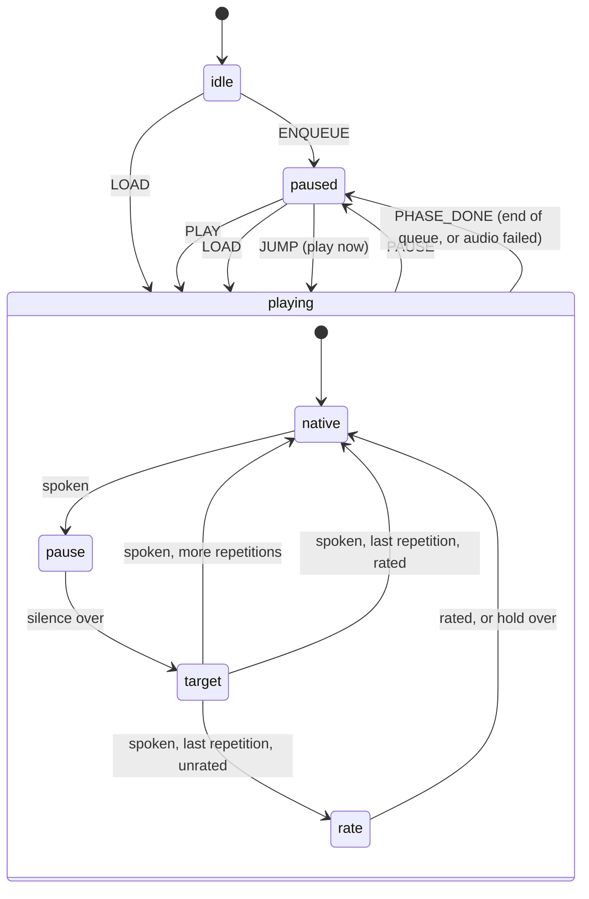

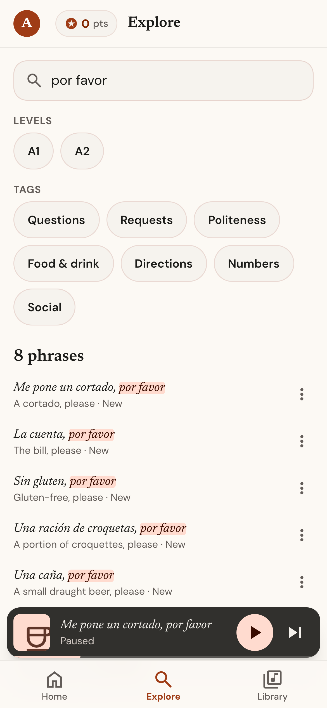 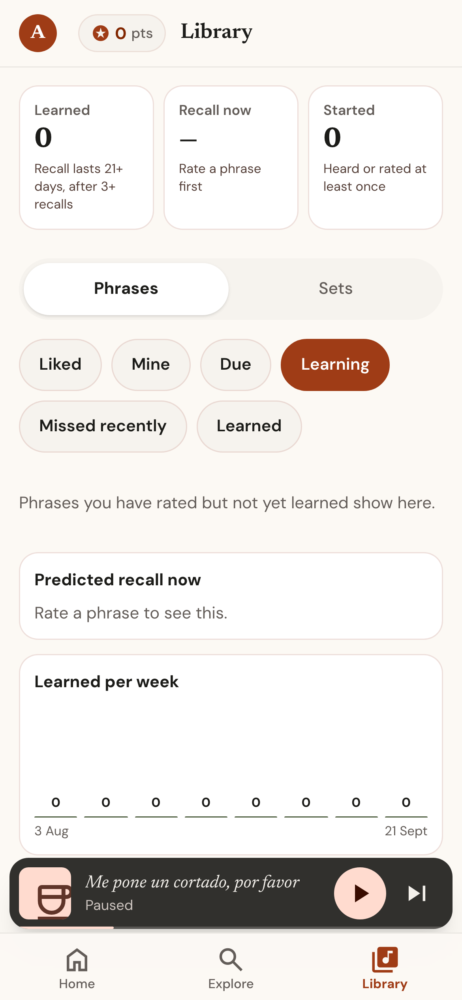 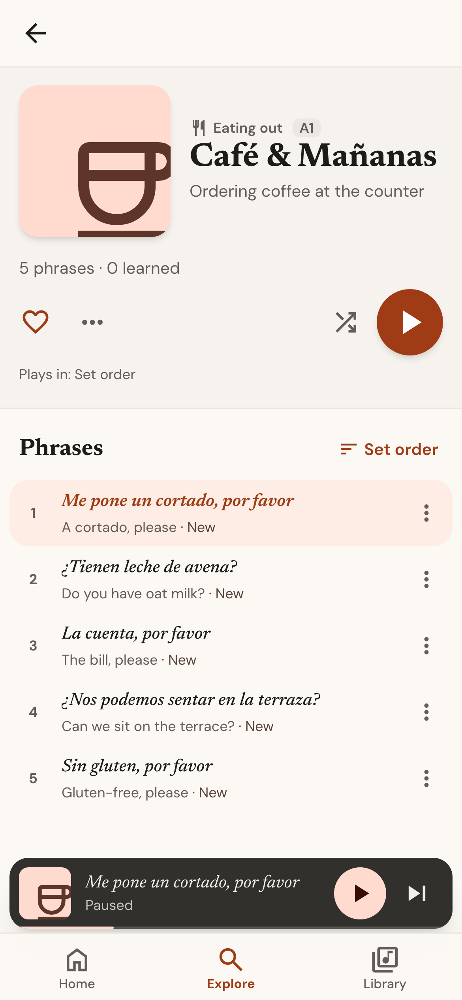 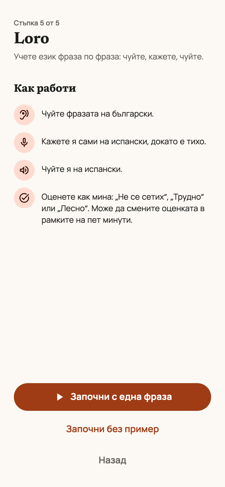

## Findings to decide

1. **Intervals got long fast — changed in the usability pass below.** At Loro's authored 50%
   retention a review falls due at about 90× stability, so the second on-time Easy landed years
   out. The prototype now reviews at 90% recall (after the stability in days); the app's own policy
   still needs a product decision (`docs/architecture/fsrs-model.md`).
2. **All new language needs a native reviewer:** revised Spanish phrases, notes, the Bulgarian
   course, bg/ru prompts and glosses, and the Bulgarian and Russian UI copy.
3. **Hidden pages pause.** You asked for a clean pause when the page is hidden (44), so lock-screen
   Play resumes only once the page is visible again. Continuous background playback would need
   recorded clips in an audio element.

## Checks

- `npm run check`: ESLint (react-hooks, jsx-a11y), `tsc --strict`, 57 node tests (including
  fast-check invariants over random event sequences) and the production build with its service
  worker.
- `npm run test:e2e`: 27 Playwright tests at 390×844 with fake speech — onboarding in English and
  Bulgarian, the recall rule, rating change/undo/commit with a fast-forwarded clock, Back closing
  overlays, the queue, Explore, Library, reload, axe at 100% and 200% text, and 44 px / 11 px audits.
  They also check that chart bars measure what their numbers say.

---

# Usability pass — 2026-09-24

Goal: make the prototype usable and smooth. I used it as a learner at 390×844, with a seeded
history, in all three UI languages, at 200% text, on a tablet and in landscape, and against the
production build offline. Each fix below is covered by a test.

| Found | Fix |
| --- | --- |
| "Easy · 2 yrs", "next in 3 years": the core's 50% retention made intervals unusable | Review at 90% recall (after the stability in days); the core's date stays the upper bound |
| iPhones block speech that doesn't start inside a tap; the loop speaks from an effect | The first tap unlocks speech and Web Audio |
| In real Chrome, a stalled speech service ends every utterance at once, unspoken — which would have paid points for silence | An instant end with no start is retried once, then playback stops with "Speech stopped — press Play" and pays nothing; a plausible start-less end counts, unmeasured |
| Toasts covered the player's transport | Over the player they sit at the top |
| At 200% text, lists widened the page to 509 px, pushing the tab bar and mini-player off screen | Single-column grids use `minmax(0,1fr)`; the suite checks this with real history |
| `<html lang>` stayed "en" in the Bulgarian and Russian UIs | It follows the UI language: correct speech and Bulgarian letterforms |
| Each save re-parsed ~2 MB of stored state after a year of history | Merges only when another tab actually wrote |
| The rating hold repeated "How did saying it go?" | "Rate it, or wait to go on" |
| "pasado" and "!" wrapped onto separate lines in glossed phrases | Punctuation stays with its word; the heading is named by the phrase |
| Hard and Easy both previewed "2 mths" | Days up to 100 |
| The session summary pointed 13 days ahead while 7 phrases were due | It says what is due now first |
| "Metro & Streets", "Taxi at Night" were English titles in the Spanish course | "Metro y Calles", "Taxi de Noche" |
| The first tap spent ~140 ms starting the audio device (profiled with a year of history) | The audio context is created while idle after load; the tap only resumes it. At 4× CPU throttling, tap-to-mini-player fell from 259 to 141 ms and the longest task from 197 to 50 ms |
| Deleting your own phrase from its details crashed the app | Fixed; the error screen now leads with Reload, which keeps progress |
| A full or blocked browser storage made saves fail silently | The learner is told once per session that progress isn't being saved |
| The review log was stored as plain objects: a heavy learner would fill the ~5 MB storage within months | Stored as compact rows: a year of daily practice takes 536 KB instead of 1,945 KB; plain saves still load |
| A new app version reloaded the page as soon as it arrived, cutting a lesson off | It waits; while nothing is playing the app offers "A new version of Loro is ready · Reload", and otherwise it takes over on the next launch |
| Russian "Не вспомнил" and "Сколько я вам должен?", and Bulgarian "Свободен ли сте?", assumed men | "Не помню", "Сколько с меня?", "Свободно ли е?" |
| Any render error, even in one sheet, took the whole app to the error screen | Screens and overlays have their own boundaries: a failing sheet closes, a failing screen shows a small card with Reload, and the player keeps playing |
| At 200% text, the session summary scrolled but a keyboard couldn't scroll it | Sheet bodies are focusable, labelled regions |
| A first-run Home had two equally prominent play buttons | The one-phrase demo is the single primary action |
| localStorage caps progress at ~5 MB and blocks the page on every save | Progress lives in IndexedDB (localStorage is the fallback), read before the first render and migrated automatically; a closing page leaves a synchronous copy that the next start merges in. With a year of history, playback now shows no long main-thread tasks at all |
| Bulgarian and Russian learners read every note in English | All 42 notes have Bulgarian and Russian versions (validated for completeness, awaiting native review); pronunciation notes compare with sounds those speakers know |
| A curved divider on Home stats, "24 hours ago", the queue count truncating at large text, the landscape player | Fixed |

Also new: player keyboard shortcuts (Space, ← →, 1 2 3), and `npm run test:e2e:preview`, which
runs the whole suite against the production build with its service worker, including offline use.

**Checks:** `npm run check` (lint, strict types, 62 unit tests including server sync, build) and 71
Playwright tests, on the dev server and against the production build (offline included). They cover
gestures, reduced motion, a full-storage warning, two open tabs, a silent speech engine, and a load
test that fails on any main-thread task over 200 ms with a year of history. Accessibility runs (axe,
44 px targets, 11 px text, no sideways scroll) cover every screen, sheet and onboarding step at
100% and 200% text, and the Bulgarian and Russian UIs. Every test fails on any page error.
`npm run test:monkey` taps at random through every screen; 14 seeded walks (2,100 steps) found one
crash, now fixed. The loop was also run in a real Chrome with system voices: phrases advanced and
were measured, and when that Chrome's speech service stalled, the app stopped and said so. One E2E run
had a single failure that did not recur in six further full runs (about 430 test runs); its cause is
unknown.

## Small phones, landscape and large text

I then used it on a 320×568 phone, a 360 px phone at 125–150% text, a phone in landscape
(568×320), and in the Russian and Bulgarian UIs on the small phone. `e2e/small.spec.ts` covers each
fix.

| Found | Fix |
| --- | --- |
| On a 320×568 phone, the player's Pause was below the fold | Short portrait screens hide the cover and put like/add/hint in a row |
| In phone landscape, the cover filled half the player and pushed Pause and the ratings off screen | Landscape drops the cover: phrase and steps on the left; transport, ratings and speed on the right. The tab bar puts labels beside icons |
| Library's Learned card cut its definition to "after 3+…" | Stat notes wrap, hyphenated in Bulgarian and Russian |
| At 150% text, "English"/"Spanish" spilled out of the step pills and the Missed icon out of its button | Container queries stack step icons above labels and drop rating icons when the row is under 15rem |
| Explore tiles read "Café & Ma…", "5 ph…"; lists and the queue cut the phrase being learned | Set titles wrap to two lines; the phrase being learned is never cut (phrases are capped at 120 characters); translations still truncate |
| Onboarding's Continue sat below the fold, and step 5's Start well below it | The action is pinned to the bottom with a fade; the welcome line shows on step 1 only |
| "· Neutral", "· 1:50 при 1×" and a lone "0" began wrapped lines | Separators end the line; each grade stays with its count |
| The player title read "Queu…" | An unnamed queue is titled "Queue" (the position line gives the count); set titles may wrap |

**Smoothness:** with a year of history and the CPU throttled 4×, the browser's event timing shows no
tap or keystroke of 100 ms or more across play, rate, skip, queue, search and Library filters. A test
now fails on any over 200 ms, in dev and production builds. 12 more monkey seeds (about 5 minutes)
found no crash.

**Checks:** 68 unit tests, the build, and Playwright: 91 passed on the dev server (12 skipped) and
93 against the production build (11 skipped).

## Behaviour fixes found while using it

| Found | Fix |
| --- | --- |
| Adding "la cuenta por favor" as your own phrase silently duplicated "La cuenta, por favor" | The form shows the existing phrase and its translation (case, accents and punctuation ignored); saving stays allowed |
| Search needed the query verbatim: "la cuenta por favor" (no comma) and "favor cuenta" found nothing | Every word must appear, in any order; each is highlighted |
| Deleting your own phrase or set was instant and final; "Remove from this set" gave no feedback | Each says what happened and offers Undo; a removal returns to its old position, and a restore wins a sync merge |
| Switching course emptied the queue silently, so the player vanished | "Now learning Bulgarian. The queue was cleared", in the new UI language |
| The snackbar's dismiss button was a second "Close" beside the sheet's | It is "Dismiss message" |
| After "Start without the demo", Home still led with the demo | A device preference records the skip; Home leads with Start here |
| Onboarding's voice test read "Проверить: испанский", squeezing voice names onto three lines at 320 px | A speaker icon and "Test"; the accessible name keeps the language |
| History rows said "+4" with no unit | "+4 pts" (т., очк.) |
| Add to set gave no sign of membership until a tap | Each set shows its count, or a tick and "Already in this set"; a same-named new set is noted |
| On a portrait tablet the player split into two ~350 px columns that wrapped | One column up to 1024 px, with a larger cover |
| On desktop the player header and the set page's Back sat outside their content column | Both share their page's column (`e2e/wide.spec.ts`) |
| With a mouse, nothing answered hover and buttons kept the arrow cursor; the shortcuts were invisible | Hand cursor and a light hover layer (fine pointers only); the player names Space, ← → and 1 2 3 |
| Tabbing on Home and Explore hid the focused control under the top bar or behind the tab bar and mini-player (WCAG 2.4.11) | Scroll padding matches the fixed bars (`e2e/focus.spec.ts`); axe also runs on a real desktop now |
| Tab left the phrase-details sheet from its Grammar tab: the trap wrapped at the unselected Sounds tab, which Tab never reaches | The trap counts only what Tab reaches; every dialog holds focus both ways |
| In high-contrast (forced colours) mode the hidden phrase vanished, buttons became bare text and the chosen step, grade and speed looked like the rest | Buttons keep an edge, chosen/current controls get the system Highlight outline, the hidden phrase is dashed boxes |
| Reordering or removing a queued phrase needed a drag, a swipe or a keyboard (WCAG 2.5.7) | A tap on the handle opens Move up, Move down and Remove from queue; every other gesture already had a button |
| Half an hour of hands-free playback added ~130 elements and ~80 listeners: each replaced toast stayed until its exit animation ran | The toast is one element whose text is replaced; a perf test plays 30 minutes and checks the page stays the same size |
| Phrase and set-name fields stopped at their limit with no sign why | From 80% of the limit they say how many characters are left |
| The keyboard's Search, Next and Done keys did nothing useful; the Spanish field autocorrected into the device language | Search commits the query and closes the keyboard; Enter moves from phrase to translation to Add, and on through onboarding's name; fields set autocorrect, capitals and autofill |
| On iOS the keyboard covered a sheet's lower field and button | Sheets lift by the keyboard's height (visual viewport); Android resizes the page (`interactive-widget`) |
| A grey system flash doubled every pressed state; a long press selected button labels | Tap highlight off; buttons aren't selectable (phrases still are) |
| With a dark system theme, native controls could turn dark on the light page; no home-screen tags for older iOS | `color-scheme: light`; app-capable, title and status-bar tags; a noscript message |
| The page title was always "Loro" (WCAG 2.4.2) | "Explore · Loro", the set's name, "Now playing · Loro", "Queue · Loro" |
| A year's points read "6980 pts"; a slow phone showed a blank page while progress loaded | Digits group by UI language ("6,980"); a "Loro" splash holds the page until the app renders |
| Opening a set or pressing Back dropped focus to `<body>`, so a screen reader restarted from the top | Focus moves to the new screen's heading; tab switches keep it on the tab |
| The first exact-tag voice spoke, and Android's "es_ES" tags never matched, so any Spanish voice could read a Spain course | Voices are ranked (region, then Premium/Enhanced/Natural/Neural, offline, default); Settings lets the learner choose one per language and test it with the course's first phrase (the player's "Voice: …" line opens the picker); offline, a network voice gives way to an on-device one |

**Logic review.** A read-only review of the state machine, persistence, merge and driver found six
real bugs, each now fixed with a unit test that fails without the fix:
reloading jumped to the first copy of a phrase queued twice; a phrase deleted on another device
while playing here froze playback; a missed last phrase was re-queued to replay at once (and grew the
queue each repeat pass); Add to set with the same phrase twice kept both; two devices kept their own
copy of a same-instant edit forever; clear-queue Undo could restore phrases behind the current one.
Undoing a phrase delete now also puts it back in Up next, as far ahead of the playing phrase as it was (fixed later, with an E2E test).
A later review of the recent commits found four more, all fixed with tests: a rating given while the
grades wait was never announced, then spoken over the phrase when it came back; a message replacing
one the learner was on timed out under them, and Undo or Dismiss dropped keyboard focus on the page;
shuffle off after an Undo moved the restored phrases to the front; Undo of a delete restored only
one of two queued copies.

A second review, of the UI layer, found six more, all fixed with tests that fail without the fix:
the player's keys acted inside sheets opened over it (Space paused, arrows skipped); a queue row's
options sheet drifted to another phrase as playback moved on; a removed phrase's Undo could land in
the played part of the queue; and when one sheet handed over to another (Details → Add to set → New
set), Back left the app, focus returned to the page behind the new sheet, and creating a set left
focus on `<body>` with a dead Back entry.

A third review, of storage and tabs, found five: a rating pending in two tabs was committed twice
(graded twice, points doubled); an older save could clear a newer page-close copy before it landed;
two tabs saving at once could each drop the other's progress for good; a failed first-run move from
localStorage stranded the old progress behind a fresh start; and progress saved while IndexedDB was
unavailable was ignored once it worked again. All fixed; the first and the merges are unit-tested.
Each tab now also keeps its own page-close copy: a reload restores the tab's own, and other tabs'
copies add only their learning progress and pending ratings.

A fourth review, of the audio layer, found five, all fixed with tests that fail without the fix:
speech heard at 0.8× or 1.25× was stored as a 1× length by multiplying (an estimate, since speech
doesn't scale linearly; now only 1× speech and clips are measured); a stuck utterance kept talking
over the learner's turn after its timeout; a stalled clip could hang the loop and a failed clip never
recovered (now a watchdog, a reload, and a fallback to the device voice); and lock-screen Play while
the page was hidden played into silence and failed (now it starts when the page is visible).

A fifth review traced every number a learner sees to its source. Fixed: the rating preview could
promise a later return than it scheduled (it counted repetitions heard after the rating); History's
points per run didn't add up to the badge (early ratings and learned bonuses were misplaced);
onboarding's "about 20 seconds" was invented; the player showed a 1× total beside an elapsed time
running at another speed; the automatic-repetitions label was wrong for shaky reviewed phrases; the
summary didn't say pending ratings' points count later; the recall chart bucketed unrounded values.

A sixth review, of routes and flows, found eight, all fixed with tests that fail without the fix:
a set page's Back dropped Explore's filters and Library's view and left browser Back returning to the
set; Explore search swallowed a typed space; another course's set opened and played in this course
(now it says which course and offers the switch); own sets took other courses' phrases; History and
Today counted every course; an unknown topic hid behind "All sets" and empty topics showed "0 sets";
Started opened a Learning list that missed due and heard-but-unrated phrases. Share is no longer
offered for own sets, whose ids exist only on the device.

A seventh review listened as a screen-reader user (axe already passed). Fixed: the phrase was
announced in the interface voice over its own audio (now read once after it's heard, in its language);
"Your turn — say it in Spanish" filled the learner's turn (now "Your turn"); the rating line
re-announced every minute of its undo window (now once); Undo was unreachable by keyboard from the
player and queue and vanished while focused; the mini-player hid its error status; set titles had no
`lang`; play mode and repetitions changed silently; chart values sat in labels some readers skip.
Known and left: button names that embed a phrase ("Play Me pone un cortado…") are read in the UI
language, since `aria-label` carries no `lang`; the word-gloss buttons give no hint that they reveal
a meaning. Both want a real screen-reader pass (VoiceOver, TalkBack, NVDA).

**Checks after the seven reviews:** 93 unit tests, the build (main chunk 186 kB gzipped), and
Playwright: 154 on the dev server and 153 against the production build; random walks found no page
error; with a year of history, playback shows no long main-thread task.

**WebKit (iOS's engine):** the suite now also runs with `BROWSER=webkit` (150 passed; the Tab and
DevTools-protocol tests skip). It found that Settings' selects were 26 px targets in WebKit, which
ignores a native select's height (now drawn by the app, 48 px), and a focus race after creating a
set from a sheet (fixed). `BROWSER=firefox` runs it in Gecko too (150 passed). In Firefox a mouse
drag on the mini-player and the player moves them but never completes, while the queue's drags work;
**swipes on those two need checking with touch on Firefox for Android.** (Probed: after such a drag
Firefox delivers no pointerup, mouseup or click to the window at all; not text selection, and no image
in the cover to drag.)

**Open question:** "Full play 0:41 at 1×" is speech plus pauses, measured; it leaves out the 4 s
rating hold (only for unrated phrases) and the engine's start-up delay, so an unrated new set can
take ~1:01. Should it include the hold for unrated phrases, or be relabelled "listening time"? Home's review
card shows the same figure for its queue (up to 10 × 4 s of holds left out).

**For the Bulgarian reviewer:** on a 320 px phone the Missed rating, "Не се сетих", wraps onto two
lines in its third of the row; a shorter word (e.g. "Забравих") would fit. Dropping the icons didn't
make it fit, so the fix is wording, not layout.

**Open question:** the "your turn" silence is 1.3× the phrase plus 0.6 s (1.5–8 s); 0.8× speed
stretches it. A beginner still recalling may want more. Should there be a "Longer pause" setting
(say 2× the phrase), or should the pause grow for phrases rated Missed?

**Open question:** the prototype has no dark theme, so an evening learner with a dark system theme
gets a light screen. A dark palette is a design decision (plan 57 owns dark mode in the app); say if
the prototype should have one.

Checks after these: 71 unit tests and 96 Playwright tests on the dev server (12 skipped). Keyboard
focus returns to the opener when a sheet, Settings or the player closes, and falls back to the
section's main button when a delete removed it.

**Load:** the app no longer ships zod: content is validated at build time (a bad file stops the build)
and in the unit tests. The main chunk fell from 208 to 180 kB gzipped; the Rust core is 373 kB
gzipped in its own long-cached chunk. On the production build with the CPU throttled 4×, Home is
visible about 750 ms after navigation, with or without a year of history; the longest start-up task
is ~180 ms (the core's synchronous WASM start). New tests also cover a finished course and a device
with no Spanish voice (player and onboarding). Playwright: 100 on the dev server, 101 against the
production build.

**Third review (Explore, Library, set pages, links):** fixed with tests — a link with a stray "%"
crashed the app (and Reload reopened it); after deleting your set, Back returned to it; "Play due and
new" also counted phrases being learned and not yet due; search matched inside words ("uenta" found
"cuenta") and listed matches only in notes as equals to phrase matches; filters alone with no
result said No phrases match "". Playwright: Chromium 167, WebKit 160, Firefox 163.

**Open question:** on a set that is already the paused queue, the big Play button resumes that queue,
even when it holds only part of the set (Home's Continue) or the page's sort has since changed. Should
it resume, or restart the whole set in the order shown (and say "Resume" when it resumes)?

**Later reviews (same day):** further read-only reviews, each finding verified and fixed with a test
that fails without it:
- *Copy (bg/ru):* counts that disagreed with their words ("1 фраза чути", "21 дней"), "5 д" on the
  Bulgarian rating buttons, Russian "Играть" (a game) for playback, "изсвирена". Bulgarian and Russian
  now also get the 320 px, axe and page-language checks.
- *Home and stats:* the weekly chart lost a week after the spring clock change; Home counted sets
  heard in another course; the summary counted another device's learned bonus; Today counted
  ratings, not rated phrases.
- *Forms:* the Settings name was lost on Escape; "Add as your phrase" from a long search went over
  the limit; the duplicate check treated ñ/й as n/и; Save was offered for unchanged edits.
- *Player and queue:* a course switched in another tab kept playing; other-course phrases in
  Previously played; shuffle moved a missed phrase's copy next to itself; a held arrow key flew
  through the queue; the Settings voice Test cut the player off.
- *Regressions from these fixes:* four, found by a review of the day's commits and fixed.

Playwright: Chromium 184, WebKit 177, Firefox 180; 111 unit tests.

**Data-loss review (tabs and storage):** ratings still in their five-minute window now sync between
tabs, so another tab's save no longer erases one, an undo or change holds in a tab opened meanwhile,
and two tabs rating one phrase make one review (tests in `e2e/tabs.spec.ts`). Back and Forward were
also reworked after a review (`e2e/back.spec.ts`). Left open, for decision:
- ~~After an app update, a tab still running the old code can write over data saved by the new
  code.~~ Fixed: the old tab stops saving over a newer save and offers Reload.
- Settings, sort orders and the queue follow whichever tab saved last (they're per tab, not merged).
- Across devices, a device whose clock runs ahead wins last-writer-wins until real time catches up;
  the server would need to stamp times (plan 60 / sync protocol).
