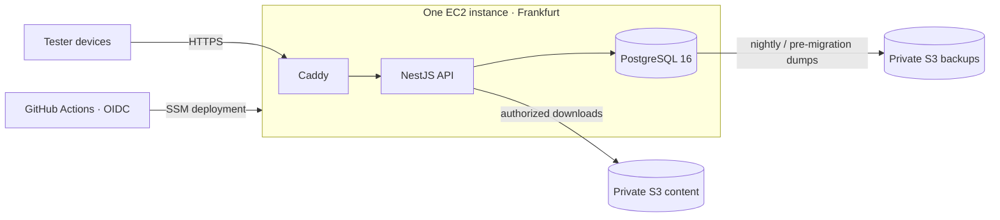

# Backend services

The `api` service and its supporting infrastructure. Rationale:
[ADR-0008](adr/0008-backend-nestjs-postgres.md)

**What the backend is for:** arbitrating sync, distributing content, proxying AI and TTS, and
verifying purchases. **What it is not for:** running a practice session. A learner can practise for
weeks with the API unreachable ([overview.md](overview.md#the-ten-rules), rule 2).

> **Status (2026-09-07): partially implemented; testing infrastructure selected, not provisioned.** The Nest service currently
> provides health, bundled content, in-memory sync through the shared Rust/WASM merge, and validated
> bundled AI scenes. Learning data does not connect to Postgres, Redis, MinIO, queues, a warehouse,
> or external AI/TTS services, and billing, analytics, TTS and workers remain unimplemented.
> Optional Google/Apple auth and PostgreSQL accounts now exist ([plan 88](google-apple-auth.md)).
> The target map and infrastructure below guide extension; they are not an inventory of running
> code.

---

## Current module map

```
apps/api/src/
├── main.ts                    # /v1 prefix, problem filter, production WASM startup gate
├── app.module.ts              # repository/provider/clock choices
├── ai/                        # bundled scenes, provider seam, validation, 2 routes
├── common/                    # clock, config, problem-details catalog/filter
├── content/                   # legacy and multilingual manifest/diff/pack, 6 routes
├── health/                    # liveness and WASM-aware readiness, 2 routes
├── integrations/              # tested Anthropic transport, not registered with Nest
└── sync/                      # push/pull/status, WASM adapter, memory repository, 3 routes
```

| Implemented seam  | Current adapter                                      | Extension path                                                              |
| ----------------- | ---------------------------------------------------- | --------------------------------------------------------------------------- |
| `SYNC_REPOSITORY` | `InMemorySyncRepository`, process-local and unscoped | Add a user-scoped Postgres repository and select it only in `app.module.ts` |
| `SCENE_PROVIDERS` | `StubSceneProvider`                                  | Register provider adapters; keep validation and fallback in `AiService`     |
| `SERVER_CLOCK`    | system wall clock                                    | Override in tests; persistence later supplies durable HLC state             |
| `config`          | one reader/default per environment variable          | Add accessors in `common/config.ts`, not scattered `process.env` reads      |

Plan [85](../../plans/85-backend-integration-contracts.md) supplies shared current/target/draft wire
schemas, OpenAPI and HTTP conformance tests. Plan
[66](../../plans/66-backend-contract-data-and-security.md) retains boundary integration, durable
repositories, safe defaults, and the image contract. Plans
[67](../../plans/67-anonymous-auth-and-account-lifecycle.md) and
[68](../../plans/68-sync-and-offline-convergence.md) add identity and safe convergence. Plan
[76](../../plans/76-roleplay-and-live-ai.md) adds a guarded live provider.

## Target module map

```
apps/api/src/
├── main.ts
├── app.module.ts
│
├── auth/                    # identity, tokens, anonymous claim
│   ├── auth.controller.ts   # POST /auth/{apple,google,magic-link,refresh,claim}
│   ├── auth.service.ts
│   ├── strategies/          # apple, google, magic-link
│   └── guards/              # JwtGuard, PlanGuard, DeviceGuard
│
├── sync/                    # the protocol
│   ├── sync.controller.ts   # POST /sync/{push,pull}
│   ├── merge.service.ts     # calls loro-core (WASM) — the SAME merge as the client
│   └── outbox.validator.ts
│
├── content/                 # catalog distribution
│   ├── content.controller.ts # GET /content/{manifest,diff,pack/:id}
│   ├── catalog.service.ts
│   └── audio.service.ts      # signed CDN URLs
│
├── ai/                      # LLM proxy — never a direct client→provider call
│   ├── ai.controller.ts      # POST /ai/{scene,coach,translate,enrich}
│   ├── scene.service.ts
│   ├── cache.service.ts      # Redis, keyed by (endpoint, params, content_version)
│   ├── budget.service.ts     # per-user and global spend caps
│   └── guard.service.ts      # prompt-injection + output validation
│
├── tts/                     # neural TTS proxy for learner-authored text
│   ├── tts.controller.ts     # POST /tts/render; never accepts recorded audio
│   └── tts.service.ts
│
├── billing/                 # receipt verification, entitlements
│   ├── billing.controller.ts # POST /billing/{verify,webhook}
│   └── entitlement.service.ts
│
├── account/                 # export, deletion
│   └── account.controller.ts # GET /account/export, DELETE /account
│
├── analytics/               # ingest → warehouse
│   └── ingest.controller.ts  # POST /analytics/batch
│
├── health/                  # GET /health, /health/ready
│
└── common/
    ├── db/                   # Drizzle client, transactions
    ├── redis/
    ├── queue/                # BullMQ producers
    ├── telemetry/            # OTel, structured logging
    ├── ratelimit/
    └── errors/               # the RFC 9457 problem-details mapper
```

```
apps/api/src/workers/         # separate process, same codebase
├── content-build/            # authored JSON → validated catalog + manifest
├── tts-render/               # catalog audio + f0/mfcc reference extraction
├── enrich/                   # LLM-assisted resp/gloss/example/hint drafting
├── reconcile/                # rebuild derived counters from append-only logs
├── analytics-etl/
└── notify/                   # server-driven pushes (rare — most are local)
```

**Why future workers are a separate process, same codebase:** they will share domain types and the
DB layer, but a slow content build must never contend with a learner's sync request. The worker tree
and alternate entrypoint do not exist yet.

---

## Module responsibilities

Unless a subsection says **current**, it specifies the target responsibility for a module that has
not landed.

### `auth` — identity slice implemented; remaining lifecycle is target

| Endpoint                                            | Purpose                                                                  |
| --------------------------------------------------- | ------------------------------------------------------------------------ |
| `POST /auth/apple` · `/auth/google`                 | Verify the provider token, find-or-create the user, issue Loro tokens    |
| `POST /auth/magic-link` · `/auth/magic-link/verify` | Email, no password                                                       |
| `POST /auth/refresh`                                | Rotate the refresh token (one-time use, reuse detection)                 |
| `POST /auth/claim`                                  | Bind an `anon_id` to an authenticated user — the anonymous-first upgrade |

Tokens: access JWT, 15 min, ES256, `sub` + `plan` + `device_id`; refresh, 90 days, rotating, stored
hashed. Detail: [security-privacy.md](security-privacy.md#authentication).

**`/auth/claim` is the delicate one.** It implements the sign-in merge from
[sync-protocol.md](sync-protocol.md#first-sign-in-on-a-device-with-local-data) and it must be
transactional: either the anon identity is bound and the merge is queued, or nothing changed.

<a id="sync"></a>

### `sync` — current skeleton, target protocol

Thin. All the logic is in the shared merge function.

Today `SyncService` calls the real WASM merge and rejects undeclared fields, but storage is one
process-wide `Map`. There is no authenticated principal or transaction, the repository key is only
`(entity, id)`, `pull` ignores `since`/`limit` and returns every row, and the server HLC has a fixed
logical counter/node id. The sketch below is target code: its transaction and `user.id` scoping are
not implemented. Until plans 66–68 land, this is a single-process development harness, not a safe
multi-user sync service.

```ts
@Post('push')
async push(@User() user: AuthUser, @Body() body: PushRequest): Promise<PushResponse> {
  return this.db.transaction(async tx => {
    const accepted: number[] = []
    const rejected: Rejection[] = []
    for (const op of body.ops) {
      const current = await tx.findRow(op.entity, op.entity_id, user.id)
      // loro-core, compiled to WASM. Byte-identical to the client's merge.
      const merged = mergeRow(current, op)
      if (merged.changed) await tx.upsert(op.entity, merged.row)
      accepted.push(op.seq)
    }
    return { accepted, rejected, server_hlc: this.hlc.tick() }
  })
}
```

> **The server runs the same merge code as the client**, via `loro-core` compiled to WASM. This is
> non-negotiable: two implementations of a conflict-resolution rule will diverge, and the divergence
> will be discovered as data loss. See [ADR-0002](adr/0002-shared-rust-core.md).

Target reconciliation of derived counters (`reps`, `plays`) from append-only logs runs as a nightly
worker job, so the `max` merge class is a fast path and the logs are the truth. No reconciliation
worker exists today.

### `content` — current bundled source, target distribution

| Endpoint                   | Notes                                                                  |
| -------------------------- | ---------------------------------------------------------------------- |
| `GET /content/manifest`    | `catalog_version`, pack index, checksums. Cacheable, ~2 KB, `ETag`     |
| `GET /content/diff?from=N` | Only phrases changed since version N                                   |
| `GET /content/pack/:id`    | Full pack, for prefetch                                                |
| Audio                      | Not served by the API — signed CDN URLs, content-addressed by `sha256` |

Today catalog data is loaded directly from `@loro/content`: manifest counts are real, diff returns
either nothing or the entire current catalog, and pack lookup uses `/content/pack?id=…`. It does not
emit cache headers or checksums and has no version history. Redis/Postgres/object storage,
historical diffs, CDN caching, and `/pack/:id` are target behavior.

### `ai` — current bundled scene seam, target pipeline

The only module with an external runtime dependency on the learner's path, and therefore the one
with the most guardrails. Detail: [ai-services.md](ai-services.md).

Today the registered stub provider returns bundled scenes and `AiService` validates provider output;
an unknown configured provider warns and falls back. There is no live provider, rate limiter,
budget, cache, persistence, repair pass, or streaming. The target request path is **rate limit →
budget check → cache lookup → provider → output validation → persist → respond**, with bundled
fallback at every failure boundary.

### `tts` — target

| Endpoint           | Purpose                                                                                                      |
| ------------------ | ------------------------------------------------------------------------------------------------------------ |
| `POST /tts/render` | Render a learner-authored phrase; cached and content-addressed, so a common phrase is rendered once globally |

Catalog audio is **not** rendered here — it's built by the `tts-render` worker at content build
time. Recorded learner audio never leaves the device; no backend endpoint may accept it.

<a id="billing"></a>

### `billing` — target

Receipt verification (StoreKit 2 / Play Billing) and entitlement resolution. Webhooks for renewals
and cancellations. **Entitlements are cached on the device with a grace period**, so a learner whose
network is down does not lose Plus features mid-trip.

### `account` — target

`GET /account/export` produces a JSON archive of everything (phrases, ratings, notes, logs, trips) —
a GDPR duty and a trust signal. `DELETE /account` cascades hard, and the deletion is verified by a
job that confirms zero rows remain.

---

## Testing infrastructure

[Plan 88](../../plans/88-low-cost-backend-infrastructure.md) selects this topology for a small
tester group. It is not provisioned, and starting PostgreSQL does not connect the current in-memory
API.



| Component                | Testing decision                                                                        |
| ------------------------ | --------------------------------------------------------------------------------------- |
| Compute                  | One On-Demand x86-64 `t3.small`, standard CPU credits                                   |
| Runtime                  | Docker Compose and systemd on Ubuntu 24.04 LTS; no builds on EC2                        |
| Persistent storage       | Encrypted gp3, 16 GiB root and separate retained 20 GiB data volume                     |
| Network                  | One public subnet and Elastic IP; only Caddy on 80/443 is public                        |
| Database                 | Local PostgreSQL 16; private container network and distinct application/migration roles |
| Assets / backups         | Private S3 buckets in Frankfurt; content adapters remain in plans 61/86                 |
| Secrets / administration | SSM SecureString and Systems Manager; temporary role credentials, no inbound SSH        |
| Operations               | CloudWatch/SNS, bounded logs, nightly backups and verified restores                     |
| Budget                   | $25–35/month planning target; verify regional prices and usage before provisioning      |

There is no Redis, worker tier, managed database, load balancer, NAT Gateway, CDN or extra permanent
environment in this phase. Future cache/jobs may be introduced only with a feature that consumes
them and an updated resource budget. AI remains stubbed; TTS is disabled.

Provision and test recovery first, then enable shared access after the plan-66/67 persistence,
validation, auth and tenant-isolation slices pass. Mobile sync needs its own device/convergence
work. Resource limits and acceptance checks live in plan 88; actual operations and evidence belong
in the [testing runbook](../runbooks/backend-testing.md).

<a id="deployment"></a>

## Deployment

Use one GitHub `testing` environment, manual deployment after required CI and an immutable ECR image
digest. Terraform owns infrastructure; release scripts update containers without replacing EC2. The
deployed image must contain the real WASM merge and pass exact-image tests.

Accept a short maintenance window: pull → stop API traffic/writes → verify backup → run compatible
migrations separately → start API → readiness and authenticated smoke checks → reopen HTTPS.
Rollback the image only when it supports the resulting schema. Never automatically restore a
database or reverse migrations over newer writes.

The existing deploy workflows contain placeholders; their green result is not deployment evidence.
See [CI/CD](../process/ci-cd.md#backend-deploys), [environments](../process/environments.md) and the
[deployment runbook](../runbooks/backend-testing.md#deploy-an-api-release).

<a id="slos"></a>

## Testing objectives and production decisions

The test host has one failure domain, planned downtime and no production availability guarantee.
Nightly backups target approximately a 24-hour recovery point and a two-hour recovery time, verified
by restore drills; there is no point-in-time recovery.

Keep the existing sync performance acceptance budget: p95 ≤800 ms for a 2,000-phrase library under
the plan-88 test load. Measure it; do not claim production latency or availability from a healthy
process, a placeholder workflow or cached unit tests.

Plan 73 uses testing evidence to choose production capacity, availability/recovery objectives,
retention and rollout. Managed services, replicas and uninterrupted cutover are future choices, not
assumed prerequisites or a pre-sized 100k-MAU deployment.

---

## Security posture

Detail in [security-privacy.md](security-privacy.md) and [threat-model.md](threat-model.md). The
backend-specific target measures:

| Measure                            |                                                                                                  |
| ---------------------------------- | ------------------------------------------------------------------------------------------------ |
| Every query is scoped by `user_id` | Enforced by a repository layer that requires it as a parameter; no raw `db.query` in controllers |
| Rate limits                        | Per-user and per-IP; strictest on `/ai/*` and `/auth/*`                                          |
| Input validation                   | Zod schemas from `packages/core`, shared with the client, so the contract can't drift            |
| No PII in logs                     | Structured logging with a redaction allowlist; `user_id` only, never email                       |
| Learner audio                      | Never accepted by the backend; recorded audio remains on device                                  |
| Errors                             | RFC 9457 problem details; no stack traces, no internal identifiers                               |
| Dependencies                       | Lockfile committed, automated updates, CI blocks on known-critical advisories                    |

What is enforced now is narrower: production bootstrap refuses to run without the WASM merge;
readiness observes merge availability; accepted sync fields must have a declared merge class;
provider scenes are validated; and the global exception filter emits problem details without stack
traces or internal error text. Auth, tenant scoping, request-schema boundary wiring, rate limits,
structured-log redaction, database isolation, and learner-audio handling are not implemented and
must not be credited as controls.

---

## Local development

The API runs on the host for fast reload and needs none of the compose services today. Use compose
only while building repository/cache/object-storage layers; starting it does not make the API
persistent because there is no database client or migration layer yet.

```bash
pnpm core-rs:build              # build the real WASM merge once
pnpm --filter @loro/api dev     # starts the API on :3000
curl localhost:3000/v1/health/ready

# Optional infrastructure for persistence work; unused by the current service
pnpm --filter @loro/api dev:up
pnpm --filter @loro/api dev:down
```

There are no `db:migrate` or `db:seed` package scripts. The current sync repository starts empty and
loses all rows at process restart.

AI scenes are stubbed locally by default (`AI_PROVIDER=stub`) and return bundled fallbacks. No live
provider is registered: setting `AI_PROVIDER=anthropic` only logs a warning and still returns a
bundled scene. There is no TTS controller or provider despite future TTS variables in
`.env.example`.
