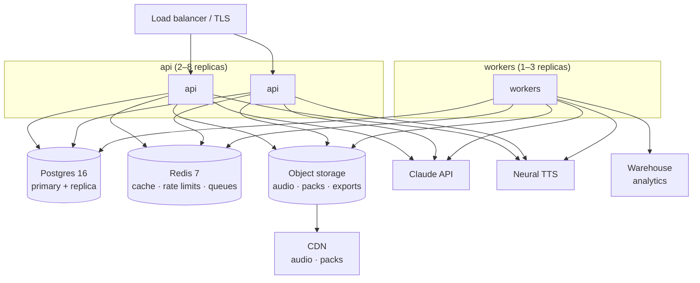

# Backend services

The `api` service and its supporting infrastructure. Rationale:
[ADR-0008](adr/0008-backend-nestjs-postgres.md)

**What the backend is for:** arbitrating sync, distributing content, proxying AI and TTS, and
verifying purchases. **What it is not for:** running a practice session. A learner can practise for
weeks with the API unreachable ([overview.md](overview.md#the-ten-rules), rule 2).

---

## Module map

```
apps/api/src/
├── main.ts
├── app.module.ts
│
├── auth/                    # identity, tokens, anonymous claim
│   ├── auth.controller.ts   # POST /auth/{apple,google,magic-link,refresh,claim}
│   ├── auth.service.ts
│   ├── strategies/          # apple, google, magic-link
│   └── guards/              # JwtGuard, PlanGuard, DeviceGuard
│
├── sync/                    # the protocol
│   ├── sync.controller.ts   # POST /sync/{push,pull}
│   ├── merge.service.ts     # calls loro-core (WASM) — the SAME merge as the client
│   └── outbox.validator.ts
│
├── content/                 # catalog distribution
│   ├── content.controller.ts # GET /content/{manifest,diff,pack/:id}
│   ├── catalog.service.ts
│   └── audio.service.ts      # signed CDN URLs
│
├── ai/                      # LLM proxy — never a direct client→provider call
│   ├── ai.controller.ts      # POST /ai/{scene,coach,translate,enrich}
│   ├── scene.service.ts
│   ├── cache.service.ts      # Redis, keyed by (endpoint, params, content_version)
│   ├── budget.service.ts     # per-user and global spend caps
│   └── guard.service.ts      # prompt-injection + output validation
│
├── tts/                     # neural TTS proxy
│   ├── tts.controller.ts     # POST /tts/render, POST /tts/voice-clone
│   └── tts.service.ts
│
├── billing/                 # receipt verification, entitlements
│   ├── billing.controller.ts # POST /billing/{verify,webhook}
│   └── entitlement.service.ts
│
├── account/                 # export, deletion
│   └── account.controller.ts # GET /account/export, DELETE /account
│
├── analytics/               # ingest → warehouse
│   └── ingest.controller.ts  # POST /analytics/batch
│
├── health/                  # GET /health, /health/ready
│
└── common/
    ├── db/                   # Drizzle client, transactions
    ├── redis/
    ├── queue/                # BullMQ producers
    ├── telemetry/            # OTel, structured logging
    ├── ratelimit/
    └── errors/               # the RFC 9457 problem-details mapper
```

```
apps/api/src/workers/         # separate process, same codebase
├── content-build/            # authored JSON → validated catalog + manifest
├── tts-render/               # catalog audio + f0/mfcc reference extraction
├── enrich/                   # LLM-assisted resp/gloss/example/hint drafting
├── reconcile/                # rebuild derived counters from append-only logs
├── analytics-etl/
└── notify/                   # server-driven pushes (rare — most are local)
```

**Why workers are a separate process, same codebase:** they share the domain types and DB layer, but
a slow content build must never contend with a learner's sync request. Deployed from the same image
with a different entrypoint.

---

## Module responsibilities

### `auth`

| Endpoint                                            | Purpose                                                                  |
| --------------------------------------------------- | ------------------------------------------------------------------------ |
| `POST /auth/apple` · `/auth/google`                 | Verify the provider token, find-or-create the user, issue Loro tokens    |
| `POST /auth/magic-link` · `/auth/magic-link/verify` | Email, no password                                                       |
| `POST /auth/refresh`                                | Rotate the refresh token (one-time use, reuse detection)                 |
| `POST /auth/claim`                                  | Bind an `anon_id` to an authenticated user — the anonymous-first upgrade |

Tokens: access JWT, 15 min, ES256, `sub` + `plan` + `device_id`; refresh, 90 days, rotating, stored
hashed. Detail: [security-privacy.md](security-privacy.md#authentication).

**`/auth/claim` is the delicate one.** It implements the sign-in merge from
[sync-protocol.md](sync-protocol.md#first-sign-in-on-a-device-with-local-data) and it must be
transactional: either the anon identity is bound and the merge is queued, or nothing changed.

### `sync`

Thin. All the logic is in the shared merge function.

```ts
@Post('push')
async push(@User() user: AuthUser, @Body() body: PushRequest): Promise<PushResponse> {
  return this.db.transaction(async tx => {
    const accepted: number[] = []
    const rejected: Rejection[] = []
    for (const op of body.ops) {
      const current = await tx.findRow(op.entity, op.entity_id, user.id)
      // loro-core, compiled to WASM. Byte-identical to the client's merge.
      const merged = mergeRow(current, op)
      if (merged.changed) await tx.upsert(op.entity, merged.row)
      accepted.push(op.seq)
    }
    return { accepted, rejected, server_hlc: this.hlc.tick() }
  })
}
```

> **The server runs the same merge code as the client**, via `loro-core` compiled to WASM. This is
> non-negotiable: two implementations of a conflict-resolution rule will diverge, and the divergence
> will be discovered as data loss. See [ADR-0002](adr/0002-shared-rust-core.md).

Reconciliation of derived counters (`reps`, `plays`) from the append-only logs runs as a nightly
worker job, so the `max` merge class is a fast path and the logs are the truth.

### `content`

| Endpoint                   | Notes                                                                  |
| -------------------------- | ---------------------------------------------------------------------- |
| `GET /content/manifest`    | `catalog_version`, pack index, checksums. Cacheable, ~2 KB, `ETag`     |
| `GET /content/diff?from=N` | Only phrases changed since version N                                   |
| `GET /content/pack/:id`    | Full pack, for prefetch                                                |
| Audio                      | Not served by the API — signed CDN URLs, content-addressed by `sha256` |

Catalog data is served from Redis (warm) with Postgres as the source. It's the same for every
learner, so it's aggressively cacheable at the CDN edge with a version-keyed path.

### `ai`

The only module with an external runtime dependency on the learner's path, and therefore the one
with the most guardrails. Detail: [ai-services.md](ai-services.md).

Every request goes: **rate limit → budget check → cache lookup → provider → output validation →
persist → respond.** A failure at any step returns a bundled fallback rather than an error.

### `tts`

| Endpoint                | Purpose                                                                                                      |
| ----------------------- | ------------------------------------------------------------------------------------------------------------ |
| `POST /tts/render`      | Render a learner-authored phrase; cached and content-addressed, so a common phrase is rendered once globally |
| `POST /tts/voice-clone` | v2. Requires `voice_clone_consent`; the only endpoint that accepts learner audio, per-use                    |

Catalog audio is **not** rendered here — it's built by the `tts-render` worker at content build
time.

### `billing`

Receipt verification (StoreKit 2 / Play Billing) and entitlement resolution. Webhooks for renewals
and cancellations. **Entitlements are cached on the device with a grace period**, so a learner whose
network is down does not lose Plus features mid-trip.

### `account`

`GET /account/export` produces a JSON archive of everything (phrases, ratings, notes, logs, trips) —
a GDPR duty and a trust signal. `DELETE /account` cascades hard, and the deletion is verified by a
job that confirms zero rows remain.

---

## Infrastructure



| Component | Choice                                         | Sizing at 100k MAU     |
| --------- | ---------------------------------------------- | ---------------------- |
| Compute   | Containers, 2 vCPU / 4 GB, HPA on p95 latency  | 2–8 replicas           |
| Postgres  | Managed 16, primary + read replica, PITR       | 4 vCPU / 16 GB, 200 GB |
| Redis     | Managed 7, AOF                                 | 2 GB                   |
| Storage   | S3-compatible                                  | ~50 GB                 |
| CDN       | Edge-cached, immutable content-addressed paths | ~2 TB/mo egress        |
| Queues    | BullMQ on Redis                                |                        |

Traffic profile is unusual and favourable: **sync is bursty and small, content is cacheable and
identical for everyone, and there is no per-session server work.** The expensive path is `ai/scene`,
and it's cached.

---

## Deployment

- **IaC** for everything. No console changes; a console change that isn't in code is an incident
  waiting to recur.
- **Blue-green** with health-gated cutover, automatic rollback on error-rate or latency regression.
- **Migrations run as a separate step before cutover** — expand/migrate/contract, so a deploy never
  requires a client release ([data-model.md](data-model.md#server-rules)).
- **Config via environment**, secrets from a managed secret store, never in the image.
- Environments and promotion: [`process/environments.md`](../process/environments.md).

## SLOs

| SLO                                  | Target                                          | Rationale                                                                        |
| ------------------------------------ | ----------------------------------------------- | -------------------------------------------------------------------------------- |
| `POST /sync/push` availability       | 99.9%                                           | A failure is invisible to the learner (retry), so this is about data freshness   |
| `POST /sync/push` p95                | ≤ 400 ms (≤ 800 ms with a 2 000-phrase library) |                                                                                  |
| `GET /content/manifest` p95          | ≤ 100 ms                                        | Cached                                                                           |
| `POST /ai/scene` p95                 | ≤ 3 s (cache hit ≤ 200 ms)                      | Streamed, so perceived latency is lower                                          |
| Availability, learner-facing overall | 99.9%                                           | **Not 99.99%** — the app works offline, so an outage degrades sync, not learning |
| Error budget policy                  | Burn > 50% in a week → feature work stops       |                                                                                  |

The deliberately modest availability target is a design dividend: offline-first means an outage is
an inconvenience, not an outage of the product.

---

## Security posture

Detail in [security-privacy.md](security-privacy.md) and [threat-model.md](threat-model.md). The
backend-specific measures:

| Measure                            |                                                                                                                   |
| ---------------------------------- | ----------------------------------------------------------------------------------------------------------------- |
| Every query is scoped by `user_id` | Enforced by a repository layer that requires it as a parameter; no raw `db.query` in controllers                  |
| Rate limits                        | Per-user and per-IP; strictest on `/ai/*` and `/auth/*`                                                           |
| Input validation                   | Zod schemas from `packages/core`, shared with the client, so the contract can't drift                             |
| No PII in logs                     | Structured logging with a redaction allowlist; `user_id` only, never email                                        |
| Learner audio                      | Accepted on exactly one endpoint (`/tts/voice-clone`), requires consent, processed and deleted within the request |
| Errors                             | RFC 9457 problem details; no stack traces, no internal identifiers                                                |
| Dependencies                       | Lockfile committed, automated updates, CI blocks on known-critical advisories                                     |

---

## Local development

`docker-compose.yml` brings up Postgres, Redis, and a MinIO S3 stand-in. The API runs on the host
for fast reload.

```bash
pnpm --filter api dev:up      # compose up: postgres, redis, minio
pnpm --filter api db:migrate
pnpm --filter api db:seed     # a demo user with the blueprint's 10 seeded phrases
pnpm --filter api dev
```

The seed reproduces `LORO_SEED` from the blueprint (`Loro.dc.html:2873–2884`) — 10 phrases with real
difficulties, tags, and rep counts — so every screen has plausible data on first run without anyone
tapping through onboarding.

AI and TTS providers are stubbed locally by default (`AI_PROVIDER=stub`), returning the bundled
fallback fixtures. Hitting real providers requires an explicit env change, which keeps local
development free and offline-capable.
