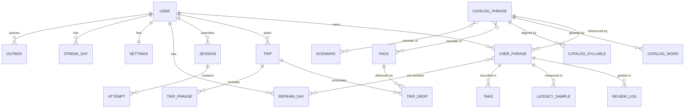

# Data model

Entities, the client schema (SQLite), the server schema (Postgres), and migrations.

**One schema definition.** Both databases are declared once in Drizzle (`packages/core/src/db/`),
with dialect-specific column types. This is the main reason the same ORM runs on both sides
([ADR-0008](adr/0008-backend-nestjs-postgres.md)).

**The core separation:** the **catalog** is immutable, versioned, shared content; **learner state**
is private, synced, per-user. They join on `phrase_id` and are never merged
([content-model.md](../product/content-model.md#separation-rule)).

---

## ERD



---

## Catalog — read-only, shipped

Replaced wholesale by content sync; never written by the app.

```sql
-- packages/content → shipped as JSON, materialised into SQLite on first run and on catalog updates.

CREATE TABLE catalog_phrase (
  id              TEXT PRIMARY KEY,          -- 'cafe1'. Immutable forever.
  lang            TEXT NOT NULL,             -- 'es-ES'
  es              TEXT NOT NULL,
  en              TEXT NOT NULL,
  theme           TEXT NOT NULL,
  emoji           TEXT NOT NULL,
  resp            TEXT,                      -- 'meh PO-neh oon kor-TAH-doh por fah-VOR'
  resp_ipa        TEXT,
  example_es      TEXT,
  example_en      TEXT,
  hint            TEXT,                      -- memory hook, authored
  note            TEXT,                      -- default coaching line for the labs
  register        TEXT,                      -- neutral | casual | formal
  cefr            TEXT,                      -- A1..B2
  audio_uri       TEXT,
  audio_sha256    TEXT,
  audio_ms        INTEGER,
  f0_native       TEXT,                      -- JSON: 14 normalised points
  deprecated_by   TEXT REFERENCES catalog_phrase(id),
  catalog_version INTEGER NOT NULL
);
CREATE INDEX idx_cat_theme ON catalog_phrase(theme);
CREATE INDEX idx_cat_lang  ON catalog_phrase(lang);

-- Accent-insensitive search support (Discover). Populated at materialisation time.
CREATE TABLE catalog_search (
  phrase_id TEXT PRIMARY KEY REFERENCES catalog_phrase(id),
  es_norm   TEXT NOT NULL,   -- lowercase, diacritics stripped
  en_norm   TEXT NOT NULL,
  theme_norm TEXT NOT NULL
);
CREATE INDEX idx_search_es ON catalog_search(es_norm);
CREATE INDEX idx_search_en ON catalog_search(en_norm);

CREATE TABLE catalog_word (
  phrase_id TEXT NOT NULL REFERENCES catalog_phrase(id),
  idx       INTEGER NOT NULL,
  es        TEXT NOT NULL,     -- '¿Dónde'   (may be a fragment)
  gloss     TEXT NOT NULL,     -- 'Where'
  say       TEXT,              -- 'dónde'    (what TTS should speak)
  PRIMARY KEY (phrase_id, idx)
);

CREATE TABLE catalog_syllable (
  phrase_id TEXT NOT NULL REFERENCES catalog_phrase(id),
  idx       INTEGER NOT NULL,
  t         TEXT NOT NULL,     -- '¿Dón'
  stress    REAL NOT NULL,     -- 0..1
  dur       REAL NOT NULL,     -- relative duration weight
  PRIMARY KEY (phrase_id, idx)
);

CREATE TABLE pack (
  id           TEXT PRIMARY KEY,      -- 'cafe'
  label        TEXT NOT NULL,         -- 'Café & ordering'
  emoji        TEXT NOT NULL,
  sub          TEXT,                  -- '8 phrases'
  promised_count INTEGER NOT NULL,    -- validated in CI against membership
  onboarding   INTEGER NOT NULL,      -- bool
  trip         INTEGER NOT NULL
);
CREATE TABLE pack_phrase (
  pack_id   TEXT NOT NULL REFERENCES pack(id),
  phrase_id TEXT NOT NULL REFERENCES catalog_phrase(id),
  ord       INTEGER NOT NULL,
  PRIMARY KEY (pack_id, phrase_id)
);

CREATE TABLE scenario (
  id    TEXT PRIMARY KEY,             -- 'dinner'
  label TEXT NOT NULL,
  emoji TEXT NOT NULL
);
CREATE TABLE scenario_phrase (
  scenario_id TEXT NOT NULL REFERENCES scenario(id),
  phrase_id   TEXT NOT NULL REFERENCES catalog_phrase(id),
  ord         INTEGER NOT NULL,       -- order matters: it's the arc of the real interaction
  PRIMARY KEY (scenario_id, phrase_id)
);
```

---

## Learner state — synced

### `user_phrase` — the central table

Every field a learner or an engine can change. Each is independently synced with per-field LWW
([sync-protocol.md](sync-protocol.md)).

```sql
CREATE TABLE user_phrase (
  id                TEXT PRIMARY KEY,        -- uuid; NOT the catalog id
  user_id           TEXT NOT NULL,
  phrase_id         TEXT,                    -- catalog ref, NULL for learner-authored
  -- learner-authored content (NULL when phrase_id is set)
  own_es            TEXT,
  own_en            TEXT,
  own_theme         TEXT,                    -- 'Imported' | 'Mine' | 'Captured'
  own_emoji         TEXT,
  source            TEXT NOT NULL,           -- starter|discover|scenario|browse|custom|import|capture|related|drop

  -- ── learner signals (the connective thread) ──
  difficulty        TEXT NOT NULL DEFAULT 'med',   -- easy | med | hard
  tags              TEXT NOT NULL DEFAULT '[]',    -- JSON array: pron|remember|useful|words
  loved             INTEGER NOT NULL DEFAULT 0,
  learned           INTEGER NOT NULL DEFAULT 0,
  note              TEXT,                          -- memory hook

  -- ── universal progress ──
  plays             INTEGER NOT NULL DEFAULT 0,
  reps              INTEGER NOT NULL DEFAULT 0,
  added_at          INTEGER NOT NULL,
  last_practiced_at INTEGER,
  graduated_at      INTEGER,

  -- ── FSRS (maintained by every engine) ──
  srs_stability     REAL,
  srs_difficulty    REAL,
  srs_due           INTEGER,
  srs_last_review   INTEGER,
  srs_lapses        INTEGER NOT NULL DEFAULT 0,
  srs_state         TEXT NOT NULL DEFAULT 'new',   -- new|learning|review|relearning

  -- ── Loop B ──
  reps_today        INTEGER NOT NULL DEFAULT 0,
  reps_today_day    TEXT,                          -- local_day 'YYYY-MM-DD' the counter belongs to
  automaticity      INTEGER NOT NULL DEFAULT 0,
  lock_in_days      INTEGER NOT NULL DEFAULT 0,    -- distinct days locked in; 4 → graduated

  -- ── Loop C (maintained from v1) ──
  rung              INTEGER NOT NULL DEFAULT 0,    -- 0..4, monotonic
  stumbles          INTEGER NOT NULL DEFAULT 0,

  -- ── prosody ──
  cue_level         INTEGER NOT NULL DEFAULT 0,    -- 0..3
  ax_perception     INTEGER NOT NULL DEFAULT 0,
  ax_recall         INTEGER NOT NULL DEFAULT 0,
  ax_production     INTEGER NOT NULL DEFAULT 0,

  -- ── sync ──
  updated_hlc       TEXT NOT NULL,
  field_hlc         TEXT NOT NULL DEFAULT '{}',    -- JSON: per-field HLC
  deleted_at        INTEGER,                        -- soft delete (tombstone)

  CHECK (phrase_id IS NOT NULL OR own_es IS NOT NULL)
);
CREATE UNIQUE INDEX idx_up_user_phrase ON user_phrase(user_id, phrase_id)
  WHERE phrase_id IS NOT NULL AND deleted_at IS NULL;
CREATE INDEX idx_up_due      ON user_phrase(user_id, srs_due)   WHERE deleted_at IS NULL AND learned = 0;
CREATE INDEX idx_up_active   ON user_phrase(user_id, learned)   WHERE deleted_at IS NULL;
CREATE INDEX idx_up_rung     ON user_phrase(user_id, rung)      WHERE deleted_at IS NULL;
CREATE INDEX idx_up_practice ON user_phrase(user_id, last_practiced_at) WHERE deleted_at IS NULL;
```

**Design notes**

- `id` is a client-generated uuid, not the catalog id. The unique index on `(user_id, phrase_id)`
  prevents adding the same catalog phrase twice — the blueprint's `addPhrase` guard
  (`Loro.dc.html:3602`), enforced by the database.
- **`reps_today_day` is what makes the daily counter safe.** Reading `reps_today` without checking
  that `reps_today_day == today` is a bug; the repository does the check and returns 0 on mismatch,
  so a stale counter can never inflate automaticity.
- `tags` as a JSON array rather than a join table: it's a fixed set of four values, always read
  whole, and per-field LWW on a scalar is far simpler than merging a set. If tags ever become
  user-definable, this changes.
- Soft deletes are required — a hard delete can't propagate through LWW sync.

### Logs — append-only, sync one-way (client → server)

```sql
CREATE TABLE review_log (
  id            TEXT PRIMARY KEY,
  user_phrase_id TEXT NOT NULL REFERENCES user_phrase(id),
  engine        TEXT NOT NULL,
  grade         TEXT NOT NULL,          -- again|hard|good|easy
  confidence    TEXT,                   -- forgot|shaky|ok|strong|instant
  stability_before REAL, stability_after REAL,
  interval_days REAL,
  reviewed_at   INTEGER NOT NULL,
  local_day     TEXT NOT NULL
);

CREATE TABLE latency_sample (
  id            TEXT PRIMARY KEY,
  user_phrase_id TEXT NOT NULL REFERENCES user_phrase(id),
  engine        TEXT NOT NULL,
  mode          TEXT NOT NULL,          -- echo|chorus|speed|cloze|call|cold|…
  rep_index     INTEGER NOT NULL,
  ms            INTEGER,                -- NULL = not measured. Never estimated.
  measured_at   INTEGER NOT NULL
);

CREATE TABLE take (                     -- prosody / pronunciation results. NEVER audio.
  id            TEXT PRIMARY KEY,
  user_phrase_id TEXT NOT NULL REFERENCES user_phrase(id),
  kind          TEXT NOT NULL,          -- prosody | pronunciation
  overall       INTEGER NOT NULL,
  syllable_scores TEXT,                 -- JSON int[]
  contour       TEXT,                   -- JSON: the learner's normalised contour, for the sparkline
  cue_level     INTEGER,
  fix_code      TEXT,                   -- which feedback template fired
  recorded_at   INTEGER NOT NULL
);
```

> **`take` stores numbers and a normalised contour — never audio, never a file path to audio.** The
> PCM buffer is released the moment scoring completes
> ([ADR-0011](adr/0011-analytics-and-privacy.md)).

### Sessions

```sql
CREATE TABLE session (
  id            TEXT PRIMARY KEY,
  user_id       TEXT NOT NULL,
  engine        TEXT NOT NULL,
  started_at    INTEGER NOT NULL,
  ended_at      INTEGER,
  local_day     TEXT NOT NULL,
  phrases_touched  INTEGER NOT NULL DEFAULT 0,
  phrases_produced INTEGER NOT NULL DEFAULT 0,
  offline       INTEGER NOT NULL DEFAULT 0,
  -- Resume support: a crash mid-wave must not lose the wave.
  state_json    TEXT
);

CREATE TABLE attempt (
  id            TEXT PRIMARY KEY,
  session_id    TEXT NOT NULL REFERENCES session(id),
  user_phrase_id TEXT NOT NULL,
  mode          TEXT NOT NULL,
  outcome       TEXT NOT NULL,          -- success|partial|skipped|failed
  latency_ms    INTEGER,
  hints_used    INTEGER NOT NULL DEFAULT 0,
  at            INTEGER NOT NULL
);
```

### Loop B day state

```sql
CREATE TABLE refrain_day (
  user_id   TEXT NOT NULL,
  local_day TEXT NOT NULL,
  set_ids   TEXT NOT NULL,              -- JSON: user_phrase ids, frozen for the day
  waves     TEXT NOT NULL,              -- JSON: [{ id, at, state }]
  PRIMARY KEY (user_id, local_day)
);
```

Frozen set membership is what makes "you always see today" true across restarts
([scheduling.md](scheduling.md#choosing-todays-set)).

### Trips

```sql
CREATE TABLE trip (
  id            TEXT PRIMARY KEY,
  user_id       TEXT NOT NULL,
  city          TEXT NOT NULL,
  country       TEXT NOT NULL,
  lang_variant  TEXT NOT NULL,          -- 'es-ES'
  arrival_date  TEXT NOT NULL,          -- local date, not a timestamp
  return_date   TEXT,
  trip_type     TEXT NOT NULL,          -- vacation|work|family
  target_count  INTEGER NOT NULL,
  state         TEXT NOT NULL,          -- planning|countdown|abroad|completed
  created_at    INTEGER NOT NULL,
  completed_at  INTEGER,
  updated_hlc   TEXT NOT NULL,
  field_hlc     TEXT NOT NULL DEFAULT '{}',
  deleted_at    INTEGER
);

CREATE TABLE trip_drop (
  id          TEXT PRIMARY KEY,
  trip_id     TEXT NOT NULL REFERENCES trip(id),
  day_index   INTEGER NOT NULL,          -- days remaining when it unlocks
  pack_id     TEXT NOT NULL,
  unlocks_on  TEXT NOT NULL,             -- local date
  state       TEXT NOT NULL,             -- locked|available|added|skipped
  added_at    INTEGER,
  updated_hlc TEXT NOT NULL
);

CREATE TABLE trip_phrase (
  trip_id            TEXT NOT NULL REFERENCES trip(id),
  user_phrase_id     TEXT NOT NULL,
  source             TEXT NOT NULL,      -- drop|manual|captured
  used_abroad_count  INTEGER NOT NULL DEFAULT 0,
  first_used_abroad_at INTEGER,
  PRIMARY KEY (trip_id, user_phrase_id)
);
```

`arrival_date` is a **local date string**, not a timestamp — the trip transitions must fire on the
learner's calendar day regardless of timezone ([scheduling.md](scheduling.md#day-boundaries)).

### Settings, streaks

```sql
CREATE TABLE settings (
  user_id            TEXT PRIMARY KEY,
  goal               TEXT,               -- trip|convo|move|curious
  level              TEXT,               -- beg|some|conf
  daily_minutes      INTEGER,            -- 5|10|20
  active_engine      TEXT,               -- NULL = assigned from goal
  engine_explicit    INTEGER NOT NULL DEFAULT 0,
  wave_times         TEXT NOT NULL DEFAULT '["08:00","13:00","19:00"]',
  reminder_time      TEXT,
  notifications      TEXT NOT NULL DEFAULT '{}',
  accent             TEXT NOT NULL DEFAULT 'Coral',
  theme              TEXT NOT NULL DEFAULT 'light',
  analytics_opt_out  INTEGER NOT NULL DEFAULT 0,
  cloud_asr_consent  INTEGER NOT NULL DEFAULT 0,
  voice_clone_consent INTEGER NOT NULL DEFAULT 0,
  updated_hlc        TEXT NOT NULL,
  field_hlc          TEXT NOT NULL DEFAULT '{}'
);

CREATE TABLE streak_day (
  user_id   TEXT NOT NULL,
  local_day TEXT NOT NULL,
  practised INTEGER NOT NULL DEFAULT 1,
  minutes   INTEGER NOT NULL DEFAULT 0,
  PRIMARY KEY (user_id, local_day)
);
```

Streak is **derived** from `streak_day`, never stored as a counter. A stored counter is how streaks
get corrupted by timezone travel and offline replay.

---

## Client-only tables — never synced

```sql
CREATE TABLE outbox (
  seq         INTEGER PRIMARY KEY AUTOINCREMENT,
  entity      TEXT NOT NULL,           -- user_phrase|trip|settings|review_log|…
  entity_id   TEXT NOT NULL,
  op          TEXT NOT NULL,           -- upsert|delete
  payload     TEXT NOT NULL,           -- JSON: changed fields + their HLCs
  hlc         TEXT NOT NULL,
  created_at  INTEGER NOT NULL,
  attempts    INTEGER NOT NULL DEFAULT 0,
  last_error  TEXT
);

CREATE TABLE analytics_queue (
  seq        INTEGER PRIMARY KEY AUTOINCREMENT,
  event_id   TEXT NOT NULL UNIQUE,     -- idempotency for offline replay
  name       TEXT NOT NULL,
  props      TEXT NOT NULL,
  client_ts  INTEGER NOT NULL
);

CREATE TABLE audio_cache (
  sha256      TEXT PRIMARY KEY,
  uri         TEXT NOT NULL,
  path        TEXT NOT NULL,
  bytes       INTEGER NOT NULL,
  last_used   INTEGER NOT NULL,
  pinned      INTEGER NOT NULL DEFAULT 0    -- today's set, trip set, stream queue
);

CREATE TABLE ai_cache (
  key        TEXT PRIMARY KEY,          -- hash(endpoint, params, content_version)
  payload    TEXT NOT NULL,
  created_at INTEGER NOT NULL,
  expires_at INTEGER
);

CREATE TABLE kv (k TEXT PRIMARY KEY, v TEXT NOT NULL);   -- catalog_version, flags, hlc counter
```

---

## Server schema (Postgres)

Same logical model, with server-side differences:

| Difference                                                         | Why                                            |
| ------------------------------------------------------------------ | ---------------------------------------------- |
| `TIMESTAMPTZ` instead of integer epochs                            | Native date maths for analytics                |
| `JSONB` instead of `TEXT` JSON                                     | Indexable, queryable                           |
| Real FK constraints with `ON DELETE CASCADE`                       | Account deletion must be complete and provable |
| `user` table with auth identities                                  | Doesn't exist on the client                    |
| `device` table — one row per installation                          | Sync bookkeeping, push tokens                  |
| Partitioning on `review_log`, `latency_sample`, `attempt` by month | These are the growth tables                    |
| Row-level `user_id` predicates on every query                      | Defence in depth against cross-tenant leaks    |
| No `outbox`, no `audio_cache`, no `analytics_queue`                | Client-only concerns                           |

```sql
CREATE TABLE "user" (
  id            UUID PRIMARY KEY,
  anon_id       TEXT UNIQUE,                -- pre-account identity, for lossless upgrade
  email         TEXT UNIQUE,
  apple_sub     TEXT UNIQUE,
  google_sub    TEXT UNIQUE,
  created_at    TIMESTAMPTZ NOT NULL DEFAULT now(),
  deleted_at    TIMESTAMPTZ,
  plan          TEXT NOT NULL DEFAULT 'free',
  plan_expires  TIMESTAMPTZ
);

CREATE TABLE device (
  id            UUID PRIMARY KEY,
  user_id       UUID NOT NULL REFERENCES "user"(id) ON DELETE CASCADE,
  platform      TEXT NOT NULL,
  app_version   TEXT NOT NULL,
  push_token    TEXT,
  last_sync_hlc TEXT,
  last_seen_at  TIMESTAMPTZ NOT NULL DEFAULT now()
);
```

---

## Migrations

Forward-only, numbered, and generated by Drizzle Kit but **always reviewed by hand** — a generated
migration that drops a column is a data-loss incident.

```
packages/core/src/db/migrations/
├── 0001_initial.sql
├── 0002_add_ladder_fields.sql
└── meta/_journal.json
```

### Client rules

1. **Forward-only.** No down migrations; a failed migration restores from the pre-migration backup.
2. **Backup first.** Copy the DB file before applying; delete the copy on success. A learner's
   phrase library is irreplaceable to them.
3. **Additive by default.** New columns are nullable or have defaults. Dropping a column takes two
   releases: stop writing it, then remove it a release later.
4. **Tested from every prior version.** CI keeps a fixture DB per released schema version and
   migrates each one to head.
5. **Idempotent.** Interrupted migrations resume; each step is wrapped in a transaction.
6. **App-version floor.** A DB at a schema version newer than the binary refuses to open and prompts
   for an app update, rather than silently misreading data (possible after an OTA rollback).

### Server rules

1. **Expand → migrate → contract**, so a deploy is never coupled to a client release.
2. Migrations run as a separate step before the new version takes traffic.
3. Any migration touching a growth table (`review_log`, `attempt`, `latency_sample`) is applied
   online — `CREATE INDEX CONCURRENTLY`, batched backfills.
4. Rollback plan documented in the PR, or the migration doesn't merge.

---

## Data volume

| Entity           | Per learner, 12 months | Notes                                                |
| ---------------- | ---------------------- | ---------------------------------------------------- |
| `user_phrase`    | 200–800 rows           | Ana (moving abroad) is the tail; design target 2 000 |
| `review_log`     | 5 000–20 000           | The growth table                                     |
| `latency_sample` | 10 000–40 000          | Refrain generates ~30/day                            |
| `take`           | 500–3 000              | Only if the labs are used                            |
| `attempt`        | 15 000–60 000          |                                                      |
| Audio cache      | 20–150 MB              | Capped, LRU, with pinned exemptions                  |
| **Client DB**    | **~30–80 MB**          | Well within comfort                                  |

**Client retention.** `latency_sample` and `attempt` are pruned locally after 90 days (aggregates
are kept). `review_log` is kept forever — it's what an FSRS re-optimisation needs. Server-side
retention: [security-privacy.md](security-privacy.md#retention).
