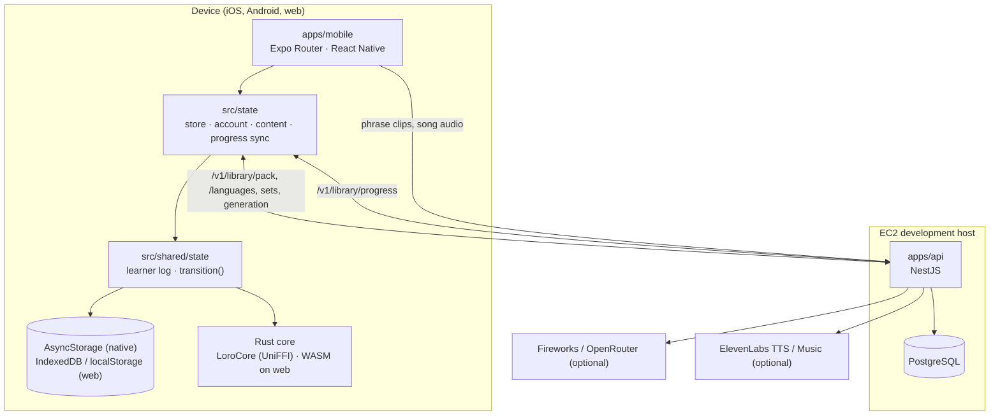

# Architecture overview

The system end to end, and where each part is described. [library.md](library.md) owns what the app
and the API exchange; [sync-protocol.md](sync-protocol.md) owns how progress merges.

## Shape

## The app (`apps/mobile`)

- **Routes** are in `app/` (expo-router): four tabs — Home, Explore, Create, Library — and the
  player, song, queue, make, account and shared-link (`/shared/<code>`) screens.
- **Shared, platform-neutral code** is in `src/shared/` (`@shared/*`): the API client and content
  cache, the content registry, the state machine and its persistence, copy (en, bg, ru) and the Make
  a set generator.
- **The connected layer** is `src/state/`: the React store, the account, the course's content, the
  one-time upload of sets made before sign-in, and progress sync. Songs play in `src/music/`.
- **Native replacements** live in `src/platform/`. On iOS and Android `metro.config.js` swaps them
  in for their shared originals by resolved path: progress storage and the key-value store
  (AsyncStorage), the refresh token (Keychain/Keystore), phrase clips (`expo-audio`), cues
  (haptics), touch feedback on the controls (haptics), provider sign-in (an auth session) and the
  Rust core (the `LoroCore` module). On the web the originals run.
- **State.** Learner progress is an append-only log plus a few last-writer-wins fields. Every change
  goes through `transition(state, event)`; the allowed events are in `state/chart.ts`. Numbers on
  screen come from `state/selectors.ts`. Only `state/clock.ts` reads the time (lint-enforced).
- **The Rust core.** FSRS runs in `packages/core-rs`, reached through one JSON `core_call` boundary
  ([ADR-0002](adr/0002-shared-rust-core.md), [fsrs-model.md](fsrs-model.md)). Scheduling has no
  JavaScript copy (`src/shared/core/fsrs.ts` only evaluates the recall curve for display); without
  the core (Expo Go) nothing schedules.
- **Content.** The app ships no phrases and no list of languages. It downloads both from the API,
  keeps them for offline use and installs them before learner state loads.
- **Sound** comes only from the server: a phrase plays the clip the server's voice rendered for it,
  at the learner's speed; a phrase without a clip says so instead of playing. Songs stream from the
  API. The app records nothing. On iOS and Android the one player plays on with the screen locked
  and shows on the lock screen and at the top of the notification shade (P3-11), with its grades:
  the `LoroMedia` Expo module (`modules/loro-media`; a media3 session and foreground service on
  Android, Now Playing on iOS), driven by `src/audio/lockScreen.ts`. A grade pressed there is the
  same `RATE` event as in the app.

## The API (`apps/api`)

NestJS on Node 22 with PostgreSQL through `pg` and handwritten SQL; see [backend.md](backend.md) for
its modules and [api.md](api.md) for its routes. The current app uses two modules: `auth` (email
code, Google, Apple) for sessions, and `library` for everything else — packs, languages, sets and
albums, sharing, reports, generation within daily limits, phrase clips, songs and progress. Without
a model key (`FIREWORKS_API_KEY`, `OPENROUTER_API_KEY`;
[ADR-0015](adr/0015-open-model-providers.md)) or a music provider, generation answers with labelled
fallbacks.

The API is deployed to a restricted EC2 development host
([ec2-deployment.md](../process/ec2-deployment.md)).

## Rules

1. **The device holds the learner's progress first.** Every rating is saved on the device before
   anything is sent; a signed-in device merges the account's copy into its own
   ([sync-protocol.md](sync-protocol.md)).
2. **A course opens offline** once its pack is on the device. Phrase clips and song audio come from
   the API; the app keeps no clip store of its own.
3. **Recorded audio never leaves the device** ([ADR-0011](adr/0011-analytics-and-privacy.md)).
4. **Every number shown to a learner is real** — measured or computed by the real model, never
   simulated.
5. **Numbers that must match across platforms are computed in Rust**
   ([ADR-0002](adr/0002-shared-rust-core.md)).
6. **No screen shames a missed day** ([copy-and-tone.md](../design/copy-and-tone.md)).
7. **AI is optional.** Every generation path has a labelled fallback; losing a provider never breaks
   a screen.

## Decision records

[ADR index](adr/README.md): the shared Rust core (0002), FSRS (0004), the NestJS/PostgreSQL backend
(0008) and the audio privacy promise (0011).
