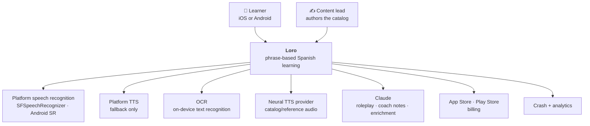

# Architecture overview

The system end to end. Read this before any other architecture document.

> **Current inventory — 2026-09-08 integration.** Eight learner routes plus Languages/Account and
> the shell use shared TypeScript engines with durable device/browser SQLite. Generated Rust
> WASM/UniFFI boundaries own canonical scheduling, selection, matching, clocks and merge. Native
> foreground TTS and strictly on-device ASR are implemented; Speak falls back to offline reveal.
> PostgreSQL stores accounts, refresh families and tenant-scoped sync, connected by the durable
> mobile outbox. Google/Apple/email identity is optional. See
> [persistent practice](../process/persistent-practice.md) and [the plans](../../plans/README.md).
>
> The diagrams include future surfaces: recorded-asset cache/background audio, production listening
> voices and shareable neural listening-file export, measured onset and
> DSP, widgets, independent content delivery, live AI and most remaining learner screens are still
> planned. Android compilation and an airplane-mode emulator smoke do not replace physical-device
> speech/convergence or full iOS acceptance.
>
> **Testing hosting:** plan 88 selects Frankfurt EC2, local PostgreSQL and private S3 at a
> $25–35/month target; plan 91 records the restricted EC2 deployment and plan 92 its read-only HTTPS
> preview. The new durable account/sync runtime needs separate deployment and operational evidence
> before shared access is enabled. Workers, Redis and a CDN are not required for this testing phase;
> see [backend hosting](backend.md#testing-infrastructure).

---

## Forces

What actually shapes this architecture, in priority order. Every significant decision traces back to
one of these.

| #   | Force                                                                                                                          | Consequence                                                                                                                                     |
| --- | ------------------------------------------------------------------------------------------------------------------------------ | ----------------------------------------------------------------------------------------------------------------------------------------------- |
| 1   | **A learner abroad has no network.** Survival mode is the product's most important moment.                                     | Offline-first is not a feature. The device is the source of truth; the server is a sync peer. [ADR-0003](adr/0003-offline-first-sqlite-sync.md) |
| 2   | **Speaking is the core loop.** Every practice surface has a mic.                                                               | ASR must work on-device with no network. [ADR-0005](adr/0005-on-device-asr-cloud-fallback.md)                                                   |
| 3   | **🔒 "Your audio stays on your device"** — printed on screen (`Loro.dc.html:1281`).                                            | Pitch extraction, alignment, and scoring run on-device. Recorded audio never uploads. [ADR-0011](adr/0011-analytics-and-privacy.md)             |
| 4   | **Scoring must be identical on supported devices** — equivalent derived fixtures must agree across iOS, Android, and bindings. | One implementation in Rust, shared; the server never receives a learner take. [ADR-0002](adr/0002-shared-rust-core.md)                          |
| 5   | **Three competing practice philosophies, unresolved.**                                                                         | The loop is a plug-in, and every engine maintains every progress signal. [ADR-0006](adr/0006-pluggable-practice-engines.md)                     |
| 6   | **23 dense, animated screens for a small team.**                                                                               | One UI codebase. [ADR-0001](adr/0001-cross-platform-react-native-expo.md)                                                                       |
| 7   | **Audio must survive backgrounding, calls, and headphone changes.**                                                            | A real native audio layer, not a JS player. [audio-speech.md](audio-speech.md)                                                                  |
| 8   | **The catalog changes far more often than the app.**                                                                           | Content ships independently of releases. [ADR-0009](adr/0009-content-pipeline-and-packs.md)                                                     |
| 9   | **AI is a garnish, never a dependency.**                                                                                       | Every AI path is cached, rate-limited, and has a bundled fallback. [ADR-0010](adr/0010-llm-roleplay-and-guardrails.md)                          |

---

## C4 · Level 1 — Context



Note what is **not** an external dependency of the learner's **daily practice** loop: the LLM, the
neural TTS provider, and the network itself. A learner can practise for weeks with none of them.
Plan 97 listening generation is the exception that **does** need the network on a cache miss; after
a successful cache, airplane-mode listen uses disk only. That companion is not a practice surface.

## C4 · Level 2 — Containers

```mermaid
graph TB
  subgraph device["📱 Device"]
    direction TB
    UI["<b>UI layer</b><br/>React Native · Expo Router<br/>Reanimated · Skia"]
    ENG["<b>Practice engines</b><br/>Stream · Refrain · SRS<br/>Prosody · Pron · Roleplay · Run"]
    DOM["<b>Domain services</b><br/>phrases · trips · progress<br/>content · settings"]
    CORE["<b>loro-core (Rust)</b><br/>FSRS · pitch/F0 · alignment<br/>GOP scoring · ladder · rank"]
    AUD["<b>Audio module</b> (Swift/Kotlin)<br/>AVAudioEngine · Oboe<br/>capture · playback · rate"]
    SPCH["<b>Speech module</b> (Swift/Kotlin)<br/>on-device ASR · TTS"]
    DB[("<b>SQLite</b><br/>phrases · state · schedules<br/>outbox · analytics queue")]
    FS[("<b>File cache</b><br/>audio clips")]
    WIDG["<b>Widgets</b><br/>WidgetKit · Glance"]
  end

  subgraph cloud["☁️ Cloud"]
    direction TB
    API["<b>api</b> (NestJS)<br/>auth · sync · content<br/>ai · tts · billing hooks"]
    PG[("<b>Postgres</b>")]
    RD[("<b>Redis</b><br/>cache · rate limits · jobs")]
    S3[("<b>Object storage</b><br/>audio · packs")]
    CDN["<b>CDN</b>"]
    WRK["<b>Workers</b><br/>content build · TTS render<br/>enrichment · analytics ETL"]
  end

  UI --> ENG --> DOM --> DB
  ENG --> CORE
  DOM --> CORE
  UI --> AUD
  ENG --> AUD
  ENG --> SPCH
  AUD --> FS
  DOM --> WIDG

  DB <-->|"delta sync<br/>HLC · per-field LWW"| API
  DOM -->|"catalog diff"| API
  FS <--|"prefetch"| CDN
  API --> PG
  API --> RD
  API --> S3 --> CDN
  WRK --> PG
  WRK --> S3
```

### Container responsibilities

| Container            | Owns                                                                          | Never does                                         |
| -------------------- | ----------------------------------------------------------------------------- | -------------------------------------------------- |
| **UI layer**         | Rendering, navigation, gestures, animation                                    | Business rules, scheduling maths, direct DB access |
| **Practice engines** | Selecting, sequencing, and evaluating practice; writing progress              | Rendering; deciding _which_ engine is active       |
| **Domain services**  | The phrase graph, trips, settings, content sync, the outbox                   | Presentation; scoring maths                        |
| **loro-core (Rust)** | Every number that must be reproducible — intervals, scores, ranks, rungs      | I/O, networking, persistence                       |
| **Audio module**     | The audio graph, capture, playback, rate, routing, interruptions, lock screen | Any learning logic                                 |
| **Speech module**    | ASR sessions and device TTS                                                   | Matching or scoring (that's `loro-core`)           |
| **SQLite**           | The source of truth for learner data                                          | Content authoring                                  |
| **api**              | Sync arbitration, content distribution, AI/TTS proxying, billing verification | Being required for a practice session              |
| **Workers**          | Content builds, TTS rendering, enrichment, analytics ETL                      | Serving learner requests                           |

---

## The ten rules

Non-negotiable invariants. A PR that breaks one needs an ADR, not a review comment.

1. **The device is the source of truth for learner data.** The server arbitrates sync; it does not
   own state. Every write succeeds locally first.
2. **Every practice surface works with no network.** If a feature can't degrade gracefully offline,
   it isn't in the daily loop.
3. **Recorded audio never leaves the device.** No consent exception, no cloud fallback, no
   "anonymous quality sampling".
4. **Every number shown to a learner is real.** Latency is measured. Scores come from real signal
   processing. No simulated values, ever — not even as a placeholder behind a flag.
5. **Every engine maintains every progress signal**, including the ones it doesn't display. FSRS
   state, `rung`, and `automaticity` must be current whichever loop is active. Current explicit
   conformance exemptions are implementation debt, not evidence that an engine is complete.
6. **Nothing enters a learner's stream without an explicit tap.** Not a suggestion, not an import,
   not an AI generation.
7. **All reproducible maths lives in `loro-core`.** If two platforms could disagree about a number,
   the number is computed in Rust.
8. **Content ships independently of the app.** A phrase fix needs no release.
9. **AI has a bundled fallback on every learner-visible path.** Losing the LLM degrades roleplay to
   curated scenes and open chat to authored topic/reply graphs; it never breaks a screen.
10. **No screen shames a missed day.** This is an architectural rule because it constrains the
    notification scheduler, the widget content, and the streak model — not just copy.

---

## Request paths

### A practice session (the common case — no network involved)

```
tap Start wave
  → repository: load today's frozen set + phrase state
  → RefrainEngine.plan/next(context)
      → loro-core: mode for rep index, automaticity
  → AudioModule.play(clip, rate)          [local cache]
  → SpeechModule.listen()                  [on-device ASR]
  → loro-core: match(transcript, target) → revealed words, latency
  → RefrainEngine.record(attempt, context) → ProgressDelta
  → mutation boundary: applyDelta + outbox append   [single SQLite tx]
  → UI updates from the DB (single source)
Later, on connectivity:
  → SyncService flushes the outbox
```

Zero network calls on the hot path. The outbox is drained opportunistically.

### An optional conversation surface

```
tap Roleplay
  → cache lookup: scene for (theme, level, tag-profile, content_version)
      hit  → play immediately
      miss → api POST /ai/scene  (streamed)
               → Redis check → Claude → validate → persist → stream
      offline or error or over budget → bundled fallback scene

tap Open chat
  → load the local thread + bundled topic/reply graph
  → learner speaks through on-device ASR or types Spanish
      recorded PCM remains in native memory; JS receives text only
  → when allowed and online: api POST /chat/turn
      → bounded recent text context → validate guarded reply/feedback
      offline or error or over budget → continue through the authored graph
  → persist the local thread outside the ordinary sync outbox
```

Roleplay and open chat are supplementary. Neither provider path chooses the practice queue, writes
progress, or gates the deterministic daily loop. Open chat follows the two authored surfaces and
state machine in `Loro Chat.dc.html:95–449` and `Loro Chat.dc.html:456–714`; its prototype regex
corrections, canned recognition, timer-driven replies, browser speech synthesis, text-derived ids,
and fabricated due interval (`Loro Chat.dc.html:514`, `529–596`) are demonstrations, not production
mechanisms.

### Content update

```
launch (or every 24 h)
  → GET /content/manifest
  → local catalog_version < remote?
      → GET /content/diff?from=N        [phrase deltas only]
      → apply in one tx, bump version
      → enqueue audio prefetch for newly relevant packs
```

---

## Cross-cutting concerns

| Concern              | Approach                                                                                                              | Detail                                                        |
| -------------------- | --------------------------------------------------------------------------------------------------------------------- | ------------------------------------------------------------- |
| **State management** | Zustand slices for ephemeral UI state; the DB (via live queries) for everything durable. No duplicated truth.         | [mobile-app.md](mobile-app.md#state)                          |
| **Navigation**       | Expo Router, file-based, typed routes. Deep links for widgets and notifications.                                      | [mobile-app.md](mobile-app.md#navigation)                     |
| **Error handling**   | Errors are values in the domain layer; boundaries at the screen level; a session never dies from a recoverable error. | [mobile-app.md](mobile-app.md#errors)                         |
| **Feature flags**    | Local defaults, remote overrides, per-engine gating. Flags resolve offline.                                           | [`process/experimentation.md`](../process/experimentation.md) |
| **Migrations**       | Forward-only, numbered, tested against a fixture DB from every prior version.                                         | [data-model.md](data-model.md#migrations)                     |
| **Time**             | HLC for sync ordering; device local date for day boundaries and trip transitions (so they work offline).              | [sync-protocol.md](sync-protocol.md#time)                     |
| **i18n**             | UI strings in ICU message format from day one, even while English-only.                                               | [`process/localization.md`](../process/localization.md)       |
| **Observability**    | Structured logs, OTel traces on the API, client crash + event pipeline, learning-quality telemetry.                   | [observability.md](observability.md)                          |
| **Security**         | Short-lived access tokens, rotating refresh, device-keychain storage, no PII in analytics.                            | [security-privacy.md](security-privacy.md)                    |

---

## Technology summary

Versions are the pins chosen at authoring time — **re-verify at kickoff**
([`process/onboarding.md`](../process/onboarding.md)).

### Mobile

| Concern         | Choice                                                     | Why                                                                          |
| --------------- | ---------------------------------------------------------- | ---------------------------------------------------------------------------- |
| Framework       | React Native 0.81 + Expo SDK 54, New Architecture          | One codebase for 23 screens; Expo Modules for native work                    |
| Language        | TypeScript 5.6, `strict`                                   |                                                                              |
| Navigation      | Expo Router                                                | Typed, file-based, deep-link native                                          |
| Animation       | Reanimated 4 + Gesture Handler                             | The warming card, sheets, and press feedback run at 60 fps off the JS thread |
| Custom graphics | React Native Skia                                          | Pitch contours, waveforms, forgetting curve, ladder histogram                |
| State           | Zustand + live SQLite queries                              | Small, no boilerplate, no cache-invalidation layer                           |
| Local DB        | SQLite (`op-sqlite`) + reviewed SQL migrations             | Synchronous JSI access behind the existing `SqlDriver` contract              |
| Native audio    | Custom Expo Module — AVAudioEngine (iOS) / Oboe (Android)  | Rate control, capture, interruption handling, lock screen                    |
| Speech          | Custom Expo Module — SFSpeechRecognizer / SpeechRecognizer | On-device Spanish ASR                                                        |
| Shared maths    | `loro-core` (Rust) via UniFFI                              | Identical numbers on both platforms                                          |
| Widgets         | WidgetKit + ActivityKit (iOS), Glance (Android)            | Native only; no cross-platform option exists                                 |
| Testing         | Vitest, React Native Testing Library, Maestro              | [`process/testing-strategy.md`](../process/testing-strategy.md)              |

### Backend

| Concern        | Choice                                              | Why                                                     |
| -------------- | --------------------------------------------------- | ------------------------------------------------------- |
| Runtime        | Node 22 LTS                                         |                                                         |
| Framework      | NestJS 11                                           | Module boundaries that survive growth; team familiarity |
| DB             | Postgres 16 + Drizzle                               | Durable tenant-scoped server storage                    |
| Cache / queues | Redis 7 + BullMQ, deferred                          | Add only with an implemented consumer and budget        |
| Storage / CDN  | Private S3; CDN deferred                            | Authorized content downloads through plans 61/86        |
| AI             | Anthropic Claude                                    | Roleplay, coach notes, content enrichment               |
| TTS            | Managed neural TTS                                  | Catalog/reference audio at build time; on-demand listening-class clips (plan 99) |
| Auth           | Apple / Google / email magic link; own JWT issuance | Anonymous-first upgrade path                            |
| Deploy         | One EC2, Compose, Terraform; maintenance deploys    | [backend.md](backend.md#deployment)                     |

### Shared

| Package                  | Contents                                                                   |
| ------------------------ | -------------------------------------------------------------------------- |
| `packages/core`          | Domain types, engine contracts, validation schemas — shared by app and API |
| `packages/core-rs`       | The Rust core                                                              |
| `packages/design-tokens` | Tokens extracted from the blueprint, plus generators                       |
| `packages/content`       | Catalog schema and data                                                    |

---

## What we deliberately did not do

| Rejected                          | Why                                                                                                                                                                                                                       |
| --------------------------------- | ------------------------------------------------------------------------------------------------------------------------------------------------------------------------------------------------------------------------- |
| **Flutter**                       | Better for custom graphics, but it isolates the codebase from the team's TS/Node work and from `packages/core` sharing with the API. [ADR-0001](adr/0001-cross-platform-react-native-expo.md)                             |
| **Fully native iOS + Android**    | Best audio access and feel, roughly double the UI cost for 21 dense screens. Rejected on team size.                                                                                                                       |
| **Server-side scoring**           | Simpler to build, but breaks force #1 (offline) and force #3 (the privacy promise). Non-starter.                                                                                                                          |
| **Supabase / Firebase**           | Faster to stand up; the sync semantics we need (per-field LWW over a phrase graph with an outbox) aren't a good fit, and the content pipeline would end up custom anyway. [ADR-0008](adr/0008-backend-nestjs-postgres.md) |
| **CRDTs for sync**                | Correct and elegant, but our conflict domain is small scalar fields on one owner's rows. Per-field LWW with HLC is far less machinery for the same result. [ADR-0003](adr/0003-offline-first-sqlite-sync.md)              |
| **A single "best" practice loop** | The blueprint left it open on purpose, and we don't have the data. [ADR-0006](adr/0006-pluggable-practice-engines.md)                                                                                                     |
| **GraphQL**                       | The client mostly syncs and fetches content diffs. REST plus a delta endpoint is a better fit and cheaper to cache.                                                                                                       |
| **Cloud ASR**                     | Recorded audio never leaves the device; reveal mode is the unavailable fallback.                                                                                                                                          |

---

## Architecture decision records

| #                                                    | Decision                               | Status   |
| ---------------------------------------------------- | -------------------------------------- | -------- |
| [0001](adr/0001-cross-platform-react-native-expo.md) | React Native + Expo                    | Accepted |
| [0002](adr/0002-shared-rust-core.md)                 | A shared Rust core via UniFFI          | Accepted |
| [0003](adr/0003-offline-first-sqlite-sync.md)        | Offline-first SQLite with delta sync   | Accepted |
| [0004](adr/0004-fsrs-scheduler.md)                   | FSRS as the scheduling algorithm       | Accepted |
| [0005](adr/0005-on-device-asr-cloud-fallback.md)     | On-device ASR with a reveal fallback   | Accepted |
| [0006](adr/0006-pluggable-practice-engines.md)       | Pluggable practice engines             | Accepted |
| [0007](adr/0007-audio-pipeline.md)                   | A native audio module, not a JS player | Accepted |
| [0008](adr/0008-backend-nestjs-postgres.md)          | NestJS + Postgres over a BaaS          | Accepted |
| [0009](adr/0009-content-pipeline-and-packs.md)       | Content ships independently of the app | Accepted |
| [0010](adr/0010-llm-roleplay-and-guardrails.md)      | LLM roleplay with hard guardrails      | Accepted |
| [0011](adr/0011-analytics-and-privacy.md)            | Privacy posture and the audio promise  | Accepted |
| [0012](adr/0012-state-management.md)                 | Zustand + live SQLite queries          | Accepted |
| [0013](adr/0013-design-tokens-pipeline.md)           | Design tokens as generated code        | Accepted |
| [0014](adr/0014-monorepo-tooling.md)                 | pnpm workspaces + Turborepo            | Accepted |
