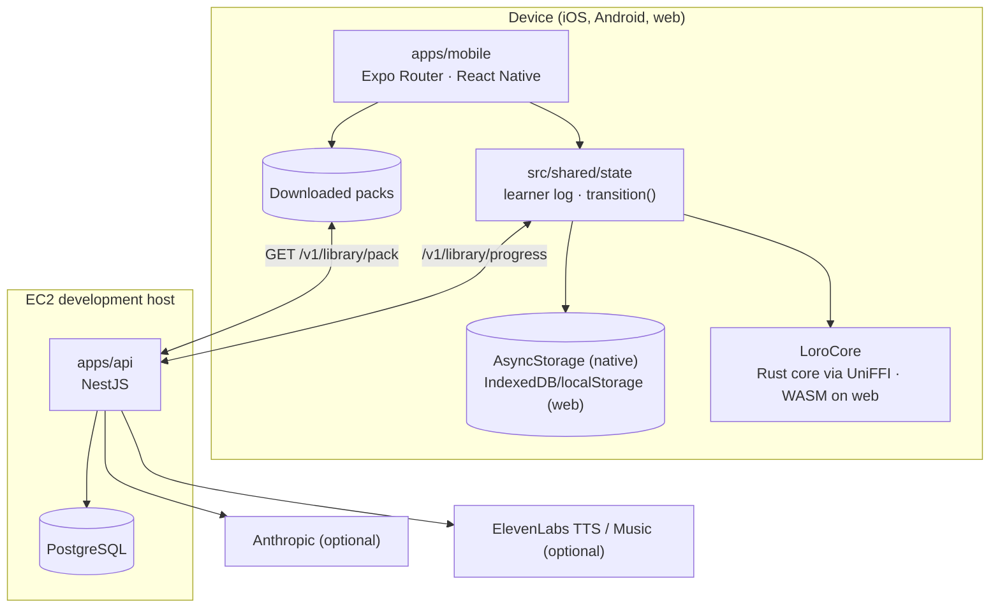

# Architecture overview

The system end to end. Read this first; [library.md](library.md) has the detail of what the app and
the API exchange.

## Shape

## The app (`apps/mobile`)

- **Routes** are in `app/` (expo-router): four tabs — Home, Explore, Create, Library — plus the
  player, song, queue, make and account screens.
- **Shared, platform-neutral code** is in `src/shared/` (`@shared/*`): content types, the state
  machine, persistence, copy (en, bg, ru), notes and the phrase generator.
- **Native replacements** live in `src/platform/` and are swapped in by `metro.config.js`: storage
  (AsyncStorage instead of browser storage), phrase clips (`expo-audio` instead of an `<audio>`
  element), cues, secrets, OAuth and the Rust core.
- **Sound** comes only from the server (plan 108): every phrase plays the clip its voice recorded
  (`/library/speech`), at the learner's speed. There is no device voice; a phrase without a clip
  says so instead of playing.
- **State.** Learner progress is an append-only log plus a few last-writer-wins fields. Every change
  goes through `transition(state, event)`; the allowed events are in `state/chart.ts`. Numbers on
  screen come from `state/selectors.ts`. Only `state/clock.ts` reads the time (lint-enforced).
- **The Rust core.** FSRS runs in `packages/core-rs`, reached through one JSON `core_call` boundary:
  the `LoroCore` Expo module (`modules/loro-core`, UniFFI) on iOS/Android, the committed WASM build
  on the web. There is no JavaScript FSRS; without the core (Expo Go) nothing schedules.
- **Content.** The app ships no phrases. It downloads each course's pack from the API, keeps it for
  offline use and installs it before learner state loads.
- **Audio.** The app plays phrases (server clips when available, else the device voice) and songs.
  It records nothing.

## The API (`apps/api`)

NestJS on Node 22 with PostgreSQL through `pg` and handwritten SQL; see [backend.md](backend.md).
The `library` module is what the current app uses: packs, sets and albums, sharing, reports,
generation within daily limits, phrase clips, songs and progress. Auth (email code, Google, Apple)
issues the sessions it relies on. Without `ANTHROPIC_API_KEY` or a music provider, generation uses
labelled fallbacks.

The API is deployed to a restricted EC2 development host
([ec2-deployment.md](../process/ec2-deployment.md)).

## Rules

1. **The device is the source of truth for learner data.** Every write succeeds locally first; the
   server keeps a copy for the account and merges.
2. **Practice works offline** once a course's pack is on the device.
3. **Recorded audio never leaves the device** ([ADR-0011](adr/0011-analytics-and-privacy.md)).
4. **Every number shown to a learner is real** — measured or computed by the real model, never
   simulated.
5. **Numbers that must match across platforms are computed in Rust**
   ([ADR-0002](adr/0002-shared-rust-core.md)).
6. **No screen shames a missed day** ([copy-and-tone.md](../design/copy-and-tone.md)).
7. **AI is optional.** Every generation path has a labelled fallback; losing a provider never breaks
   a screen.

## Decision records

[ADR index](adr/README.md): the shared Rust core (0002), FSRS (0004), the NestJS/PostgreSQL backend
(0008) and the audio privacy promise (0011).
