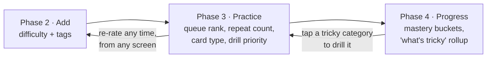

# The learning model

The pedagogy the whole app exists to serve. Everything in
[`architecture/scheduling.md`](../architecture/scheduling.md) implements what's described here.

---

## The connective thread

The blueprint states its own central mechanic in a callout on the front page:

> **THE CONNECTIVE THREAD** — Difficulty and "what's tricky" tags, set while adding in Phase 2,
> reshape the practice queue in Phase 3 and roll up into your stats in Phase 4. —
> `Loro.dc.html:117–120`

and reinforces it for the advanced loops:

> All four read from the **same tagged stream** — "what's tricky" steers the roleplay topics, the
> forgetting-curve intervals, and which sounds the pronunciation lab drills first. —
> `Loro.dc.html:838`

This is a **learner-declared difficulty model**. Almost every other app infers difficulty from error
rates, which needs many trials before it's useful. Loro asks, at the moment of adding, and gets a
usable signal from trial zero.



The loop closes in both directions. Ratings are editable from six different screens, and the
progress screen's tag rollup is tappable straight into a targeted drill.

---

## The two signals

### 1. Difficulty — one of three, always set

| Value  | Label shown   | Meaning to the learner    | Effect                                                                         |
| ------ | ------------- | ------------------------- | ------------------------------------------------------------------------------ |
| `easy` | **Easy**      | "I've basically got this" | Fewer repeats (2), drifts to the back of the queue (rank +4), longer intervals |
| `med`  | **Learning**  | Default                   | 3 repeats, neutral rank                                                        |
| `hard` | **Difficult** | "This one fights me"      | More repeats (4), jumps the queue (rank −6), shorter intervals                 |

Note the labels: the middle state is _"Learning"_, not _"Medium"_. It's a status, not a rating. And
`hard` is _"Difficult"_, describing the phrase, not the learner.

### 2. Tags — "What's tricky about it?" · multi-select, optional

| Tag        | Label            | What it means                     | What it changes                                                                                                   |
| ---------- | ---------------- | --------------------------------- | ----------------------------------------------------------------------------------------------------------------- |
| `pron`     | Pronunciation    | The sounds are the problem        | Review card becomes _say it out loud_ with auto-play on reveal; prioritised in the pronunciation and prosody labs |
| `remember` | Hard to remember | The meaning won't stick           | Memory hook is surfaced on reveal; hook suggestions are pushed harder                                             |
| `useful`   | Very useful ⭐   | "I will definitely need this"     | Higher retention priority; more likely to seed roleplay scenes and survival decks                                 |
| `words`    | Tricky words 🔤  | Specific lexical items trip me up | Word-by-word drilling; cloze targets those words                                                                  |

Tags are deliberately about **the nature of the difficulty**, not its magnitude. Magnitude is
difficulty's job. This separation is what lets the same "Difficult" rating route to completely
different drills.

### Love (♥) — the third, quieter signal

Not difficulty and not a tag: a _want_. Loved phrases get rank −3 in the stream (surface more often)
and are counted separately in the stream header. It exists because learners have phrases they simply
enjoy saying, and honouring that is cheap motivation.

---

## Mastery states

Two independent axes, and it matters that they're independent.

### Axis 1 — Retention maturity (Loop A / progress screen)

Bucketed from reps and the learned flag (`Loro.dc.html:2828`):

| Bucket       | Rule              | Colour    |
| ------------ | ----------------- | --------- |
| **New**      | `reps == 0`       | `#a8a196` |
| **Learning** | `reps ≥ 1`        | `#c99236` |
| **Strong**   | `reps ≥ 3`        | `#5b89ab` |
| **Mastered** | `learned == true` | `#3f7d5d` |

`learned` is set by the learner (Mark learned, ✓ Learned in the stream) **or** automatically by
grading `Easy` at `reps ≥ 3`. Learned phrases leave the active stream but stay in review.

### Axis 2 — Automaticity (Loop B)

A per-phrase, per-day measure of how effortlessly it comes out:

```
automaticity = min(100, round(reps_today / 6 × 100))
```

100% = **locked in for today**. Four days of locking in = **graduated**, out of rotation, banked.

The two axes measure different things and neither substitutes for the other. A phrase can be
`Strong` on retention and still take 1.8 seconds to produce. Loop A fixes the first; Loop B fixes
the second.

### Axis 3 — The ladder (Loop C)

A permanent, five-rung skill depth per phrase (`Loro.dc.html:3429–3435`):

| #   | Rung                | You can…                                              |
| --- | ------------------- | ----------------------------------------------------- |
| 0   | **Accumulated**     | recognise and repeat it                               |
| 1   | **Bent**            | change its form — question, past tense, negation      |
| 2   | **Transferred**     | use it in a context it wasn't taught in               |
| 3   | **Pressure-tested** | produce it fast, distracted, or under social pressure |
| 4   | **Deployed**        | use it spontaneously, unprompted, for real            |

The ladder is a genuine pedagogical hierarchy — it's Bloom's taxonomy for a phrase — and it only
ever goes up. **"Nothing lost — you only climb or hold."**

---

## The three loops as three pedagogical bets

|                 | Loop A · the engine                        | Loop B · the ritual             | Loop C · the run                |
| --------------- | ------------------------------------------ | ------------------------------- | ------------------------------- |
| Optimises       | Retention across breadth                   | Automaticity through depth      | Sustained engagement            |
| Unit of work    | A card                                     | A phrase × 6 reps               | A run                           |
| Scheduling      | Hidden (FSRS)                              | **Visible** — you see today     | Hidden but _revealed as a draw_ |
| Feedback signal | Interval growth, curve                     | **Effort dropping**             | Rung climbing                   |
| Failure mode    | Review debt piles up; learner falls behind | Breadth too slow for a deadline | Novelty wears off               |
| Best for        | Ana (moving abroad)                        | Diego (conversations)           | Sam (curious)                   |

They are not compatible philosophies, and the blueprint says so:

> Loop A optimises retention across a growing library; Loop B builds **automaticity through depth**.
> Same phrase, rotating _manner_ each rep, on a beat — and the thing that moves on screen is
> **effort dropping**, not a score. — `Loro.dc.html:1307`

We don't resolve this by argument. See [practice-loops.md](practice-loops.md).

---

## Principles behind the mechanics

### Production over recognition

The gate in Speak-to-progress — _Next stays locked until you've produced the whole phrase, not just
recognised it_ (`Loro.dc.html:743`) — is a pedagogical position, not a UI detail. Recognition runs
far ahead of production in every learner, and only production transfers to speech. Every speaking
screen has a real gate.

### The reward is the removal of help

The prosody lab's cue ladder inverts normal game feedback. Levelling up doesn't give you more; it
takes away the model audio, then the text, then the meaning, then the time. The celebration says so
out loud: _"Next time you get less help. That's the point."_ (`Loro.dc.html:1257`)

This makes the reward structure honest — the thing being rewarded is independence.

### Overlearning is the point, not waste

Loop B's target is 6 reps regardless of whether rep 1 was perfect (`Loro.dc.html:1536`, `3361`).
Stopping at first success produces recall that survives the session and dies overnight. Reps past
first success are what build automaticity, and the falling-latency chart is what makes them feel
worthwhile rather than tedious.

### Variety of _manner_, not of content

Loop B repeats the same five phrases all day. What changes is the manner: Echo → Chorus → Speed →
Cloze → Call → Cold. Each mode taxes a different retrieval path (imitation, synchrony, compression,
generation, translation, free recall), so six reps of one phrase are six different cognitive events,
not one event six times.

### Retrieval disguised as ritual

Loop C's spine — _"Re-fire your chain: recite what's in rotation — retrieval disguised as a
warm-up"_ (`Loro.dc.html:1609`) — is spaced retrieval practice presented as a warm-up. The learner
experiences it as ceremony; it's the most effective part of the run.

### Use it the instant it's learned

Loop C folds each newly met phrase onto the end of the recited chain immediately
(`Loro.dc.html:1620`). No gap between intake and use.

### Never an empty app

Onboarding seeds real phrases from real packs. The Discover list always has "Popular starters".
Every empty state routes forward. A learner should never see a blank surface with an instruction.

### Never punish

There is no streak-loss screen, no red badge, no "you've fallen behind". The roguelike loop states
the principle for the whole product: _you only climb or hold._ Guardrail metrics in
[metrics.md](metrics.md) watch for us drifting from this.

---

## Where the blueprint's numbers came from — and what's real

The blueprint contains working formulae. Some are **contracts** (must be preserved) and some are
**display models** (illustrative, replaced by the real engine). Getting this wrong would ship a toy.

| Mechanic               | Blueprint                                                         | Production                              | Status                    |
| ---------------------- | ----------------------------------------------------------------- | --------------------------------------- | ------------------------- |
| Stream repeat count    | `hard 4 · med 3 · easy 2`                                         | same                                    | ✅ contract               |
| Stream queue rank      | `plays + (hard −6, easy +4) + (loved −3)`                         | same, plus a due-date term              | ✅ contract, extended     |
| Review deck order      | `reps + (hard −5, easy +3)`                                       | replaced by FSRS due dates              | 🔁 display model          |
| Review intervals       | fixed `<5m / ~10m / 1d–1wk / 5d`                                  | FSRS-computed, **shown as real values** | 🔁 display model          |
| Retention curve        | `R(t) = 0.5^(t/S)`                                                | FSRS forgetting curve, same shape       | ✅ visualisation contract |
| Confidence multipliers | `0.35 / 0.9 / 1.7 / 2.7 / 4.3`                                    | FSRS grade → stability                  | 🔁 display model          |
| Automaticity           | `min(100, reps/6 × 100)`                                          | same                                    | ✅ contract               |
| Latency                | `max(0.5, 2.0 − reps × 0.26)`                                     | **measured for real**                   | ⚠️ must be real           |
| Cue level-up threshold | melody score ≥ 88                                                 | tunable, starts at 88                   | ✅ contract, tunable      |
| Skill axes advance     | `prod +max(3,(s−p)×0.3)`, `recall +6 if cue≥2 else +2`, `perc +1` | same shape, tuned                       | ✅ contract               |
| Pronunciation scores   | seeded PRNG                                                       | forced alignment + GOP                  | ⚠️ must be real           |
| Ladder need score      | `stale×2 + stumbles`                                              | same                                    | ✅ contract               |
| Draw eligibility       | unlocked ∧ deck has a phrase at that rung                         | same                                    | ✅ contract               |
| Fluency % (roleplay)   | `60 + best_ratio × 40`                                            | same                                    | ✅ contract               |

The three ⚠️ rows are the honesty line. A fake pronunciation score or a fake latency number would
make the two most differentiated screens in the product into theatre. See
[`architecture/prosody-dsp.md`](../architecture/prosody-dsp.md).

---

## Open pedagogical questions

Tracked in [decisions/open-questions.md](../decisions/open-questions.md):

- **Q-01** Is 6 reps the right Loop B target, or should it adapt to measured latency plateau?
- **Q-02** Should 4 days of lock-in be the graduation rule, or should graduation require a _cold_
  lock-in on the final day?
- **Q-03** Does learner-declared difficulty stay accurate over weeks, or do learners stop re-rating?
  If they stop, we need a drift correction from real performance.
- **Q-04** Should the ladder (Loop C) become the universal depth model even if Loop C itself doesn't
  ship? It's the most pedagogically defensible of the three progress models.
