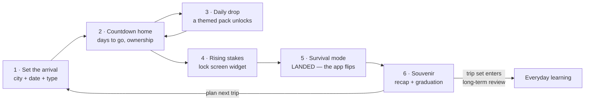

# The trip arc

`Loro.dc.html:1887–2059` · six screens, one storyboard.

> When you're learning for a real date, the whole app reorganises around the countdown.

The trip arc is the strongest thing in the product. It's the only feature that turns a learning app
into a tool with a deadline, and it maps exactly onto the primary persona
([personas.md](personas.md#1-mara--a-trip-coming-up--the-primary-persona)).

---

## The arc



Three distinct regimes, not one feature:

| Regime        | When               | The app's job                                              |
| ------------- | ------------------ | ---------------------------------------------------------- |
| **Countdown** | date set → arrival | Build readiness, make it visible, escalate                 |
| **Survival**  | while abroad       | Be instantly useful, offline, and capture what's heard     |
| **Souvenir**  | after return       | Convert the trip into durable memory, hand off to everyday |

---

## Regime 1 — Countdown

### What "readiness" means

Not lessons, not minutes. **Phrases owned**: `38 / 100`.

The denominator is the trip's target set — the union of every drop scheduled between now and
arrival, plus anything the learner adds themselves. The numerator counts phrases at `reps ≥ 3` or
`learned` (i.e. `Strong` or `Mastered` in
[learning-model.md](learning-model.md#axis-1--retention-maturity-loop-a--progress-screen)).

This is why the countdown card shows a progress bar and not a streak: readiness is a stock, not a
flow.

### The daily drop

Each morning a themed pack unlocks. One notification, one tap to add, one tap into the stream.

**The escalation principle** (`Loro.dc.html:1981`): survival basics first, "sound local" extras as
the date nears. Concretely — what happens _first on the trip_ is taught first, then
highest-frequency daily interactions, then contingencies, then polish.

Default 12-day schedule and the full pack list: [content-model.md](content-model.md#trip-drops).

**Scaling to other trip lengths**

| Days  | Approach                                                                            |
| ----- | ----------------------------------------------------------------------------------- |
| 1–3   | Survival basics + Airport & taxi only, in one drop. No escalation; there's no time. |
| 4–7   | Compressed: Airport, Survival, Hotel, Café, Getting around, Eating out, Review      |
| 8–20  | The default one-pack-per-day schedule, padded with review-only days                 |
| 21–60 | Two drops per week; the intervening days are normal practice on the trip set        |
| 60+   | Trip mode stays dormant (a countdown chip on the normal home) until day 20          |

**Invariants**

- **No new phrases on the final day.** Review only.
- A missed drop is never lost — it stays available and merges into the next day's set. It does not
  stack as debt or nag.
- The learner can always pull a future drop forward ("I want the pharmacy set now").

### Rising stakes — the widget

`Loro.dc.html:1988–2007`. The countdown lives outside the app, on the lock screen, all day: a
readiness ring, days-to-go, `You own 84 of 100 phrases`, `16 left — finish the essentials today`,
and a phrase of the moment that plays in one tap.

**🔒 Copy constraint: urgency, not guilt.** The widget states facts about readiness and never about
the learner's failure. `16 left — finish the essentials today` ✅ · `You've missed 2 days` ❌ ·
`Your streak is at risk` ❌.

Platform mapping in
[`architecture/widgets-notifications.md`](../architecture/widgets-notifications.md).

---

## Regime 2 — Survival mode

**The flip is the feature.** On the arrival date the app's whole purpose changes, and it says so:
_"¡BIENVENIDO A MADRID! / Survival deck is live / Reordered for what you need first · works
offline."_

### What changes

|                | Countdown                     | Survival                    |
| -------------- | ----------------------------- | --------------------------- |
| Home surface   | Countdown card + today's drop | Survival deck, need-ordered |
| Primary action | Add today's drop              | **Play a phrase right now** |
| Capture        | Buried                        | **Promoted to position 2**  |
| Drops          | Daily                         | Paused                      |
| Practice       | Scheduled                     | On demand only              |
| Network        | Assumed                       | **Assumed absent**          |

### Need ordering

The deck is not alphabetical or by theme; it is ordered by **what you probably need in the next
hour**. Inputs, in priority order:

1. **Hours since landing** — the first 3 hours are taxi, hotel, wifi. Days 2+ shift to café, dining,
   shopping.
2. **Local time of day** — 8–11 café; 13–15 and 20–23 dining; 10–20 shopping and directions.
3. **Trip type** — Work → logistics and small talk; Family → warmth; Vacation → café and
   sightseeing.
4. **Recently played** — demote what was just used.
5. **The learner's `useful` tags** — always near the top.

All five inputs are available offline. **Nothing on this screen may require a network.**

### Capture

Photograph a sign, a menu, a form. OCR it, show the extracted lines, let the learner pick which to
bank. Translation is attempted when there's a network and deferred when there isn't — an
un-translated captured phrase is still worth banking, because the learner knows what it meant at the
time and can fill it in later.

### Offline requirements

Everything in [`architecture/offline.md`](../architecture/offline.md) applies, but survival mode is
the acceptance test: **airplane mode, fresh app launch, no cache warm-up, must be fully usable in
under 2 seconds.** Audio for the whole trip set is prefetched before the arrival date, and the
prefetch is verified — the app must not discover a missing file in a taxi rank.

---

## Regime 3 — Souvenir

Two jobs: make the trip feel like it counted, and don't let the learning evaporate.

**The recap** — `47 phrases used in real life`, plus new captured · essentials % · streak. That
headline number must be **real**, counted from survival-deck plays and captures while abroad. A
fabricated or estimated number here would poison the most emotionally loaded screen in the product.

**The graduation** — 🎓 _"Graduated to your library / All 100 now in spaced review"_, then the
handoff: _"Loro will resurface these over the coming weeks so Madrid stays with you — and they're
ready for your next trip."_

Mechanically, on trip end:

1. Every trip phrase gets FSRS state initialised from its actual trip performance (plays,
   automaticity, reps) rather than as new material.
2. The trip's pack membership is preserved, so "plan next trip" can re-prioritise instantly.
3. The trip becomes a read-only record: dates, city, phrases, the recap numbers.
4. The active loop resumes as the home surface.

**This is the retention hinge for the whole business.** A learner whose trip ends and whose app
becomes purposeless will churn. The souvenir screen's only real job is to make the next session make
sense.

---

## Data model

Detail in [`architecture/data-model.md`](../architecture/data-model.md).

```
trip
  id, user_id, destination_city, destination_country, lang_variant,
  arrival_date, return_date?, trip_type, target_phrase_count,
  state: planning | countdown | abroad | completed,
  created_at, completed_at

trip_drop
  trip_id, day_index, pack_id, unlocks_on,
  state: locked | available | added | skipped, added_at

trip_phrase
  trip_id, phrase_id, source: drop | manual | captured,
  used_abroad_count, first_used_abroad_at
```

State machine:

```
planning ──(build countdown)──▶ countdown ──(arrival date reached)──▶ abroad
                                    │                                   │
                                    │                          (return date or +14d)
                                    ▼                                   ▼
                              (date passed while                    completed
                               app closed) ─────────────────────────────▲
```

Transitions are computed on launch from the device date, so they work offline. The
`abroad → completed` transition uses the return date if set, otherwise arrival + 14 days, and is
always overridable by the learner ("I'm home").

---

## Interaction with the practice loops

The trip arc **layers on top of** whichever engine is active; it does not replace it
([practice-loops.md](practice-loops.md)).

| Active loop     | How the trip changes it                                                                                          |
| --------------- | ---------------------------------------------------------------------------------------------------------------- |
| **Refrain (B)** | Today's five are drawn from the trip set first. Drops feed the daily set instead of a general queue.             |
| **SRS (A)**     | Trip phrases get priority in the due queue and shorter initial intervals — the deadline compresses the schedule. |
| **Run (C)**     | The spine's new phrase comes from today's drop; finishers target trip phrases.                                   |
| **Stream**      | Playlist is the trip set, ordered by the drop schedule.                                                          |

The countdown replaces the _home screen_, not the _practice screen_. A learner keeps the loop they
chose.

---

## Edge cases

| Case                                                         | Behaviour                                                                                                                                     |
| ------------------------------------------------------------ | --------------------------------------------------------------------------------------------------------------------------------------------- |
| Date set in the past or today                                | Skip countdown, go straight to survival mode                                                                                                  |
| Trip cancelled                                               | Trip set stays in the library as a normal pack; countdown removed; no data lost                                                               |
| Trip extended                                                | Drop schedule recomputes forward; already-added drops untouched                                                                               |
| Two overlapping trips                                        | Not supported in v1. Setting a new trip archives the current one after a confirm                                                              |
| Learner is a local, not a traveller (goal = "moving abroad") | Same machinery, but survival mode never ends and drops continue weekly — ⚠️ **Q-07**, see [open-questions.md](../decisions/open-questions.md) |
| No network for the entire countdown                          | Drops are prefetched at trip creation, so the whole countdown works offline                                                                   |
| Device timezone changes on landing                           | Local time is used for need ordering; the arrival transition uses the destination's date                                                      |
