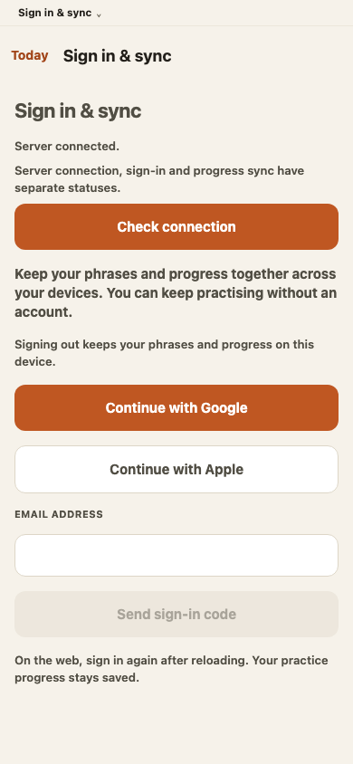
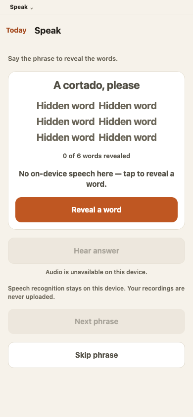

# Aggregate runtime review — 2026-09-08

These captures show the production web export from runtime commit
`85a005709accf7b5c89a748e216c738588726616`, at a 390 × 844 viewport in English. The existing browser
state fixtures supply the Account provider/readiness transport; no live identity provider or
production account was used. Both pages loaded without JavaScript page errors.

## Optional sign-in

Google, Apple and email share the Account surface. Connection readiness is separate from sign-in and
sync. Local progress remains available without an account, and the browser explains that its session
credentials have page lifetime.

## Speak without on-device recognition

The browser exposes the reveal path and unavailable audio state. Hidden words, reveal counts and
disabled Next accurately reflect the initial state. This screenshot does not establish native
microphone, recognition or speaker acceptance.

See [plan 94](../../../plans/94-persistent-practice-and-account-integration.md) for the complete
validation evidence and remaining native/service gates.
