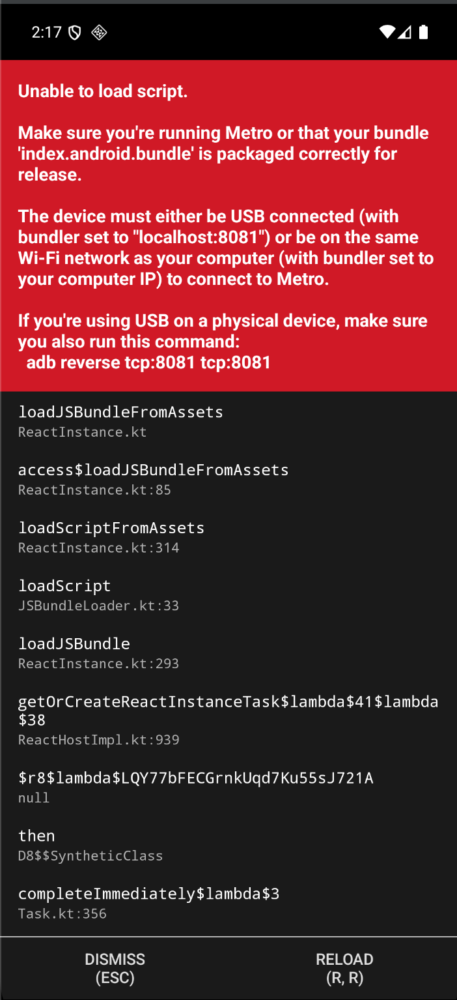
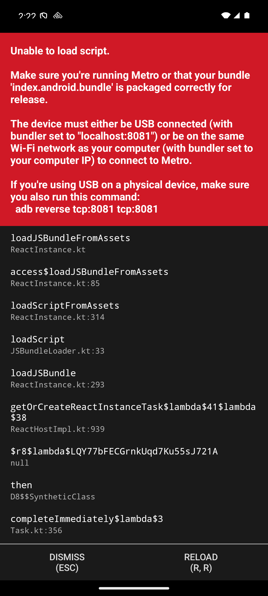

# Android emulator: Loro cannot load its JavaScript bundle

- **Bug ID:** ANDROID-2026-09-09-01
- **Status:** Open — reproduced on cold launch; missing bundle confirmed in the installed debuggable
  Loro APK. Launching the separately installed Loro Preview is a verified workaround.
- **Impact:** Blocks entry to every learner screen on the reported emulator installation.
  Distribution-wide impact and data loss are not established.
- **Requirement / owner:** F-03 (offline practice); Android build and device acceptance in
  [plan 58](../../plans/58-native-workspace-and-device-ci.md).
- **Investigated source:** `42f4d574dc1b` (this checkout). The installed APK's source commit and
  exact build command are unknown; do not attribute the binary to this commit without build
  evidence.

## Reported behavior

Opening Loro in the Android emulator displays React Native's red error screen instead of the app:

```text
Unable to load script.

Make sure you're running Metro or that your bundle
'index.android.bundle' is packaged correctly for release.
```

The visible stack starts at `loadJSBundleFromAssets` (`ReactInstance.kt`), followed by
`access$loadJSBundleFromAssets` (`ReactInstance.kt:85`), `loadScriptFromAssets`
(`ReactInstance.kt:314`), `loadScript` (`JSBundleLoader.kt:33`) and `loadJSBundle`
(`ReactInstance.kt:293`). The screen offers Dismiss and Reload.

Evidence: user screenshot named `Screenshot 2026-09-09 at 14.17.11.png`, retained unchanged below.
Its Metro/USB instructions are generic diagnostic text, not proof of the underlying cause.



## Live observations on 2026-09-09

Read-only checks initially returned:

```text
$ adb devices -l
emulator-5554 device product:sdk_gphone64_arm64 model:sdk_gphone64_arm64 device:emu64a transport_id:9

$ adb shell dumpsys activity activities | rg 'mResumedActivity|topResumedActivity'
topResumedActivity=ActivityRecord{13105396 u0 app.loro.android/.MainActivity t18}

$ adb shell pm list packages | rg loro
package:app.loro.android.preview
package:app.loro.android
```

`adb reverse --list` returned no mappings. `lsof -nP -iTCP:8081 -sTCP:LISTEN` returned no listener.
These checks establish the state at inspection time, not necessarily at screenshot time. They do not
rule out a differently configured remote Metro server.

After a brief disconnect, the user reopened the emulator and investigation continued:

| Property                           | Affected Loro            | Loro Preview comparison               |
| ---------------------------------- | ------------------------ | ------------------------------------- |
| Package                            | `app.loro.android`       | `app.loro.android.preview`            |
| Version / code                     | `0.1.0` / `1`            | `0.1.0` / `1`                         |
| Manifest                           | `DEBUGGABLE`             | Non-debuggable                        |
| Last update (device output)        | `2026-09-07 16:23:47`    | `2026-09-08 15:11:58`                 |
| APK size                           | 58,065,669 bytes         | 45,533,373 bytes                      |
| `assets/index.android.bundle`      | Absent                   | Present, 2,477,900 bytes uncompressed |
| Launch with no host Metro listener | Red script-loading error | Onboarding renders                    |

The emulator is `Pixel_8_API_36`, Android 16 / API 36, `sdk_gphone64_arm64`. Each installed package
reported one `base.apk`; both were pulled and inspected as ZIP archives.

APK SHA-256 values:

```text
Loro:         dbc8fc91e3264841b6c8e11ac72b145d4e1a271a515eafdd439be8ea81f53842
Loro Preview: 046201e53620f89b78b5895a88852a82854e7f0fa8a4cb1190890bf015617fdf
```

On the affected package, `am force-stop` followed by `am start -W` reproduced the exact error.
`am start` returned `Status: timeout`, `LaunchState: UNKNOWN (-1)`, `WaitTime: 10522`; process
`3529` logged the asset-loading exception at device time `09-09 14:22:01.547`. The
[retained logcat excerpt](evidence/2026-09-09-android-script-load/cold-launch-logcat.txt) contains
only the affected process's React Native error lines.



Preview returned `Status: ok`, `LaunchState: COLD`, `TotalTime: 759` and rendered onboarding. This
proves startup without the host Metro server, not full offline practice, current-source acceptance
or server connectivity. Networking was not disabled for this comparison.


No app data was cleared, APK replaced or Metro configuration changed. Preview was left open.

## Expected behavior and diagnosis

A standalone testing APK must cold-launch without Metro, including offline. A development APK
requires a reachable Metro server if its variant omits bundled JavaScript.
[React Native's Gradle plugin documentation](https://reactnative.dev/docs/react-native-gradle-plugin)
confirms that variants listed in `debuggableVariants` skip JavaScript bundling and require Metro.

**Confirmed failure layer:** React Native could not load JavaScript; startup did not reach the
learner UI. The asset-loading stack points to bundle loading, not an Account/API readiness error.

**Immediate cause confirmed:** the affected debuggable binary has no embedded JavaScript bundle, and
its runtime attempts asset loading and fails while no host Metro server is listening on 8081. It
cannot function as a standalone installation in this state. The installed Preview has its bundle and
starts successfully.

**Remaining uncertainty:** why this particular development binary was installed/launched for this
test, which source built it, and whether its Metro configuration would work when a matching server
is available. No release-packaging regression was reproduced. Missing bundling is expected for
normal Metro-dependent debug variants; using that artifact for standalone testing is the confirmed
workflow mismatch. A separate loader/configuration defect has not been ruled out.

Relevant source at the investigated commit:

- [`apps/mobile/package.json`](../../apps/mobile/package.json): `android` invokes
  `expo run:android`; `start` invokes `expo start`.
- [`apps/mobile/app.config.ts`](../../apps/mobile/app.config.ts): `LORO_LOCAL_APK=1` selects the
  separate Loro Preview name and package.
- [`scripts/apk-local.mjs`](../../scripts/apk-local.mjs): assembles `:app:assembleRelease`, rejects
  a debuggable manifest or wrong package, and requires `assets/index.android.bundle`. This checks
  packaging; it does not establish that the affected APK passed those checks or can boot.

## Reproduction

Precondition: keep the affected APK identified above installed on this emulator, with no Metro
server listening on the host's port 8081 and no ADB reverse mappings. Exact original build/install
commands remain unknown.

```bash
adb -s emulator-5554 shell am force-stop app.loro.android
adb -s emulator-5554 shell am start -W -n app.loro.android/.MainActivity
```

Actual: the red script-loading screen appears; app-scoped logcat records
`java.lang.RuntimeException: Unable to load script` in `loadJSBundleFromAssets`.

## Workaround and closure criteria

For standalone testing, open the installed **Loro Preview** application. This exact command was
verified to reach onboarding without starting Metro:

```bash
adb -s emulator-5554 shell am start -W -n app.loro.android.preview/.MainActivity
```

For source development, identify the source that built the debug APK, start matching Metro, verify
its `/status` endpoint and configure emulator access to its actual port. This recovery path was not
exercised; `adb reverse` alone cannot start Metro.

Before closing the underlying workflow issue, document and verify the intended emulator launch path
and correlate its APK with source metadata. Any future standalone build must retain the existing
bundle/manifest checks and pass an emulator cold-launch smoke without Metro. Full offline practice
and persistence acceptance remain separate gates.

No implementation files changed. See the [local APK runbook](../process/local-apk.md) for the
existing standalone build path.
