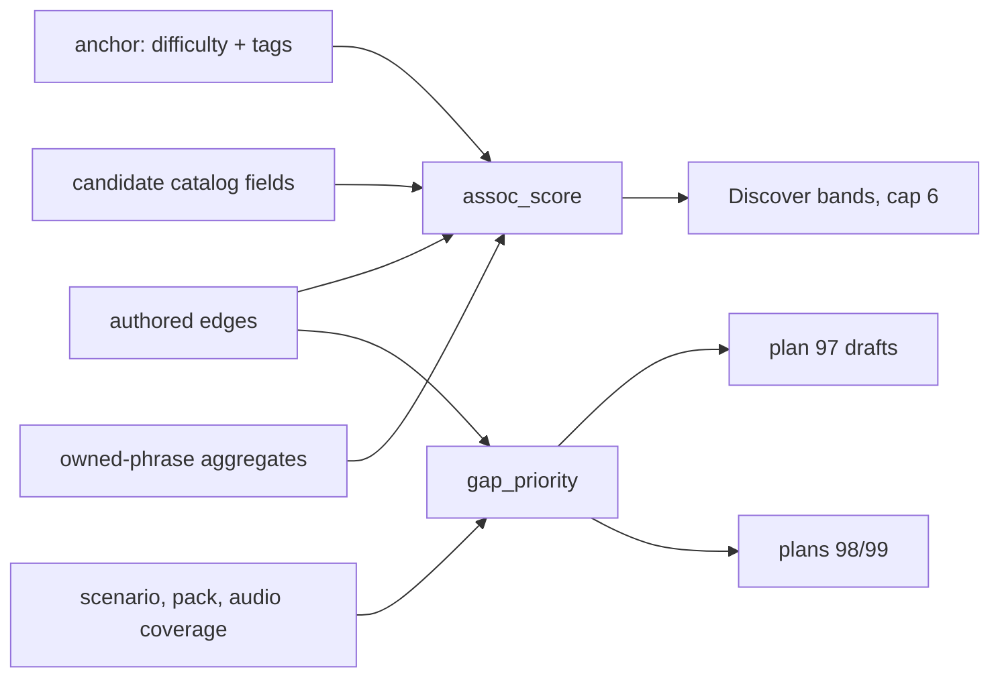

# Weighted phrase and sound graph

- **Requirement IDs:** `P2-04`, `P2-06`, `P2-24`, `AI-02`, `AS-01`, `AS-07`
- **Milestone:** M2/M3 content and Discover association
- **Status:** 🟡 Authored `scenario_next` edges and Rust `assoc_score` / `assoc_order` land.
  Remaining: regenerate bindings if they drift, Discover wiring and artifact copy, `gap_priority`
  CLI. Nothing external blocks those slices. Q-15 still gates production pronunciation audio; Q-21
  still gates live Discover suggest; Q-22 still gates share-out-of-app.
- **Depends on:** 60 for the Rust maths boundary (not the policy); 61 for catalog publication; 97
  for authoring-time drafts; 98 for reference render; 99 for listening-class render; 87 for new
  linguistic edges
- **Number allocation:** Highest assigned ID across this checkout (including archive) was 100.
  Active [`100-ui-design-system.md`](100-ui-design-system.md) collides with archived hygiene 100
  (unresolved; do not reuse or drop either). This plan is **101**. The next new plan is 102.
- **Blueprint:** `Loro.dc.html:2303–2310` (association bands and cap), `2325` (custom keeps theme),
  `2369` (context `More like “{anchorEs}”`). Do not edit the authored artifact.
- **Reviewed:** 2026-09-12 against current `origin/main`. Three review passes corrected the inputs,
  the delivery seam and the product law before this file was written.

## Outcome

Discover “more like that” ranks **inside** the authored same-theme-first bands using a deterministic
Rust score. The score reads the **anchor phrase’s** declared difficulty and tags (the connective
thread, thrown away today), authored edges that cannot be derived from existing fields, and catalog
fields on **unowned** candidates. A separate authoring score lists missing neighbors and audio
without publishing them. Stream rank, FSRS, Refrain selection, chat topic graphs and the 98/99 audio
stacks stay the owners they already are.

## Why this is a new owner

| Existing owner                                                                | What it already covers                                   | Why it cannot absorb this                                                                        |
| ----------------------------------------------------------------------------- | -------------------------------------------------------- | ------------------------------------------------------------------------------------------------ |
| [60](archive/2026-09-09/60-authoritative-core-maths.md)                       | Numbers live in Rust; Stream/FSRS/Refrain                | Owns the boundary, not this policy. Association is not an engine.                                |
| [97](97-generative-discover-and-phrase-reach.md)                              | Own-phrase suggest, drafts, add-handoff                  | Does not rank catalog neighbors or store edges. Runtime catalog generation stays forbidden.      |
| [61](archive/2026-09-09/61-content-and-audio-assets.md)                       | Catalog rows, signed packs, one-voice reference identity | Phrase remains the atom; this plan adds edges and a generate _queue_, not a second audio object. |
| [98](98-voice-and-tts-integration.md) / [99](99-batch-phrase-audio-export.md) | Reference TTS and listening-class cache                  | Consume the queue; do not grow a second client.                                                  |
| [82](archive/2026-09-09/82-guided-chat-domain-and-service.md)                 | Chat topic/reply graphs                                  | Different graph: conversation nodes, not catalog phrases.                                        |

Today [`useSuggestions.ts`](../apps/mobile/app/_add/useSuggestions.ts) is theme-only after add.
[`add.tsx`](../apps/mobile/app/add.tsx) holds `draft.difficulty` and `draft.tags` and calls
`anchorOn(theme)` only. Scenario order already exists as an implicit arc in
[`scenarios.json`](../packages/content/es-ES/scenarios.json). Catalog rows have no edges. Most audio
is missing.

## Product and privacy boundary

- The phrase stays the atom ([content-model.md](../docs/product/content-model.md)). A sound is an
  attribute (`audio: {uri, sha256, ms}`), never a second node type and never PCM in the graph.
- ADR-0002 owns the number. The score is an integer contract, golden-tested like
  [`stream_rank`](../packages/core-rs/src/rank.rs).
- ADR-0010 still forbids runtime catalog generation. Drafts go through plan 97; human review before
  merge. Runtime Discover may only offer **own-phrase** candidates (Q-21).
- Association does **not** belong on `LoroCoreFacade`. That interface is “the subset of loro-core an
  **engine** may use” ([`engines/types.ts`](../packages/core/src/engines/types.ts)). Discover is a
  route. Call the existing `coreCall` seam. `jsCoreFacade` is already an alias of `rustCoreFacade` —
  do not grow a second algorithm.
- Phase 1 persists no per-learner edge weights. No new sync columns, no `fieldPolicy` change, no
  `INSERT OR REPLACE`.
- Recorded audio never enters this feature. Telemetry may carry ids, booleans, counts — never phrase
  text.

## Verified starting point

- Association bands: same-theme first, then the rest, cap 6 (`Loro.dc.html:2306–2310`).
- Context label in the artifact is `More like “{anchorEs}”` (`2369`). The app and
  [`add.spec.ts`](../apps/mobile/e2e/add.spec.ts) assert `More like Dining`. Artifact wins.
- Discover `pool` is **unowned** catalog phrases. Candidates have no difficulty, tags, FSRS due,
  mastery, automaticity or reps. Feeding candidate learning state into this score would be a
  constant and would silently do nothing.
- Custom add keeps the previous theme (`2325`). Own-phrases have no catalog node.
- Course ids: `cafe1` on `es-ES`; `bg-BG:cafe1` / `ru-RU:cafe1` otherwise
  ([`multilingual.ts`](../packages/content/src/multilingual.ts)). Only `es-ES/phrases.json` exists.
- The app reads [`bundledCatalog`](../packages/content/src/catalog.ts);
  [`fs.ts`](../packages/content/src/fs.ts) serves authoring CLIs. A new artifact must ship in both.
- `scenarioShapeCheck` already warns outside 4–6 phrases; pack `targetCount` and `audioCheck`
  already exist. Reuse them.
- The bridge fails closed with `CoreError::InvalidInput`. `coreCall` is synchronous.

## Remaining work

1. [x] Land this plan, index row, next-ID bump and durable spec pointers.
2. [x] Author `packages/content/es-ES/graph.json` (and schema). Seed **only** `scenario_next` from
       existing scenario `phrases[]`. Derive same-theme adjacency; do not store a theme clique.
3. [x] Wire the artifact through `Catalog` / `bundledCatalog` / `loadCatalogFromDisk` /
       `LearningCatalog`. Add one `ALL_CHECKS` entry: ends resolve, unique `(from,to,relation)`,
       `prerequisite` acyclic when present, no cross-locale edge. Bundled and disk catalogs must
       expose identical edges.
4. [x] Implement Rust `assoc_score` (module such as `packages/core-rs/src/graph.rs`) with exact
       integer fixtures. Add one typed `bridge.rs` op. Regenerated bindings are their own commit.
5. [ ] Discover: `anchorOn` stores catalog phrase id, `anchorEs`, difficulty and tags. Association
       branch calls `coreCall` inside the existing `useMemo` (never on the per-keystroke search
       path). Query, browse and scenario branches stay as they are. Copy becomes
       `More like “{phrase}”` with ICU in `en.json`, `bg.json` and `ru.json`. Update E2E.
6. [ ] Content CLI `gap_priority`: report arc orphans, thin scenarios, short packs and missing
       audio. Phrase gaps emit plan-97 drafts; audio gaps enqueue 98 (`AS-01`) or 99 (`AS-07`). No
       second TTS client, no JS PCM, no catalog mutation.

## Two scores, different inputs

Discover candidates are unowned. The useful signals at add time are the **anchor’s** declared
difficulty and tags — already in `draft` and currently discarded. Candidate learning state belongs
to a later consumer that ranks **owned** phrases.

```
assoc_score   — Discover, runtime:   anchor + edges + catalog + profile
gap_priority  — content CLI:         coverage + connectivity; no learner state
(deferred)    — owned-phrase rank:   due / mastery / automaticity / ladder + these edges
```



## Storage

- **Node** = catalog phrase id. No nested sound object, no readiness flags.
- **Edge** = `{ from, to, relation, weight }` with authored confidence `1..=100`.
- **Stored seed relation:** `scenario_next` only.
- **Derived, never stored:** same-theme adjacency. A stored clique is O(n²) — fine at 31 starters,
  ~45k edges at the ~600-phrase launch target, shipped in the binary.
- **Later authored, each waiting on data most starters lack:** `reply`, `lexical`, `contrast`,
  `prerequisite`, `register_shift`.
- Keys use the catalog id the course joins on.

## Logic 1 — `assoc_score` (Discover, runtime)

Bands first, authored and never crossed:

1. Unowned same-theme candidates, ascending `assoc_score`.
2. Then unowned rest-of-catalog, same score, until 6 total.

Ascending, lower comes sooner — the same convention and bounded-offset discipline as `stream_rank`.
Base is 0. A candidate with no signal keeps authored catalog order. Stable sort; final tiebreak is
authored catalog order; no RNG.

**Relation to the anchor** (0 when no edge):

| Relation         | Offset | Why                                                                |
| ---------------- | ------ | ------------------------------------------------------------------ |
| `scenario_next`  | −8     | Continues the arc of a real interaction — strongest authored claim |
| `reply`          | −6     | Question/answer pair                                               |
| `contrast`       | −4     | Minimal pair / sound family                                        |
| `lexical`        | −4     | Shared glossed words                                               |
| `prerequisite`   | −3     | Authored complexity step                                           |
| `register_shift` | −2     | Same move, different register                                      |

Authored confidence adds `−(weight / 25)` (1..100 → 0..−4). Total relation influence is bounded at
−12.

**Anchor difficulty** (what the learner just declared about the phrase they added):

- `hard` — consolidate: −2 on `contrast` and `lexical`; +2 on a candidate one CEFR level above the
  anchor
- `easy` — progress: −2 on `scenario_next`; −1 on a candidate one CEFR level above
- `med` — 0

**Anchor tags**, from
[learning-model.md](../docs/product/learning-model.md#2--tags--whats-tricky-about-it--multi-select-optional):

- `pron` −3 on `contrast`; −1 when the candidate has `respIpa` or `syl`
- `words` −3 on `lexical`
- `remember` −2 when the candidate has a `teaching.hint`
- `useful` −3 on `scenario_next`

**Candidate catalog fields:**

- has `audio` −1 (♪ preview works). This is the only audio term, so a missing clip never hides a row
- register differs from the anchor +1

**Learner profile** (aggregates over owned phrases, **band B only**):

- already owns 3 or more in that theme +1 (mild anti-tunnelling)
- candidate CEFR more than one level above the learner’s highest owned +3

**Bounds:**

- every non-relation term is at most |3|
- bands apply before scoring, so no term can move a candidate across a band
- missing CEFR / edge / audio: defined defaults; never guessed pedagogy; never a fabricated clip
- no previous catalog id: do not call the scorer (keep today’s popular-starters path)
- own-phrase anchor: all relation terms are 0; bands still apply
- invalid or empty ids: `CoreError::InvalidInput`, no substituted order
- `+ Add all N` adds the visible set, so this order changes what Add-all adds — stated deliberately

## Logic 2 — `gap_priority` (content CLI, authoring time)

No learner state. Deterministic order over signals that already exist, plus the one signal only the
graph can give:

- a scenario under the 4–6 rule — reuse `scenarioShapeCheck`
- a pack below `targetCount` — reuse the existing backlog warning
- **arc orphans:** a phrase with no `scenario_next` in or out
- a phrase with no `audio` — reuse `audioCheck`

Output is a report. Phrase gaps become drafts through
[`phraseDrafts.ts`](../packages/content/src/phraseDrafts.ts) / plan 97. Audio gaps enqueue plan 98
or plan 99. Q-15 and Q-22 unchanged.

## Deferred by name (phase 2)

Ranking **owned** phrases — where FSRS due, mastery, automaticity and ladder rung actually apply —
reuses these edges with a third score and its own owner. Persisted per-learner edge weights would
need merge classes and stay out of phase 1. Popular-starters identity (`Loro.dc.html:2311` vs
today’s `pool.slice(0, 6)`) is not this plan.

## Acceptance criteria

- `content:validate` errors on broken, duplicate or cross-locale edges. Bundled and disk catalogs
  expose identical edges.
- Rust fixtures assert **exact scores**, not just order, the way
  `the_rank_offsets_are_exactly_the_blueprints` does: each relation, each anchor difficulty, each
  tag, CEFR step, register and audio term, plus accumulation.
- Same-theme still precedes other themes; cap stays 6; ties keep authored catalog order; invalid ids
  fail closed.
- A `hard` + `pron` anchor and an `easy` anchor produce demonstrably different six rows from the
  same catalog.
- `gap_priority` lists arc orphans, thin scenarios, short packs and missing audio without publishing
  anything.
- Airplane / stub TTS: text association works; missing sound stays missing.
- Discover context reads `More like “{phrase}”` with ICU in en/bg/ru. E2E association updated for
  copy and in-band order. No new learner-visible STATE unless one actually appears.
- No learner-facing string literal in `apps/mobile/app/**`. No colour literals. No `useLocale`
  hoist.

## Commit sequence

1. `docs(docs): add 101 phrase and sound graph (P2-04)` — this file, index, durable pointers
2. `feat(content): authored scenario_next edges, schema and check (P2-06)`
3. `feat(core-rs): association score and bridge op (P2-04, P2-24)`
4. `chore(core-rs): regenerate bindings`
5. `feat(mobile): graph-ranked association and artifact copy (P2-04)`
6. `feat(content): gap_priority generate queue (AI-02, AS-01, AS-07)`

## Out of scope

Replacing Stream or FSRS; scoring practice with an LLM; chat reply graphs; music (plan 96); sharing
listening files (Q-22); persisted learner weights; popular-starters identity; own-phrase nodes;
stored same-theme edges; a new Discover destination (Q-17).
